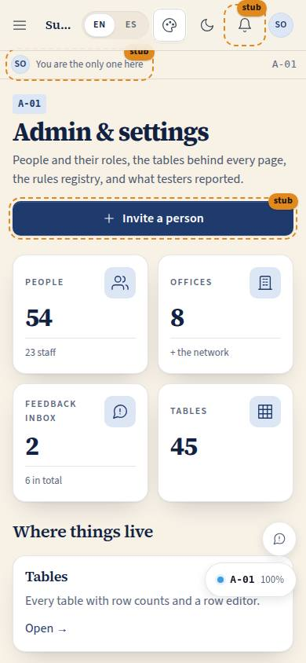
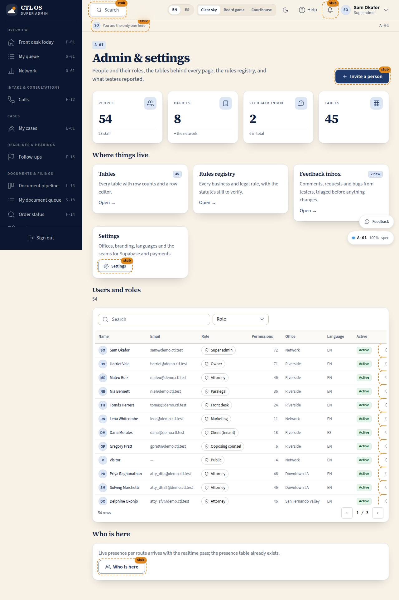

# A-01 · Admin home

## Purpose

Everything the firm administers in one place: the people in the system with their roles, offices and permission counts; links to the tables behind every page and to the rules registry; the feedback inbox; the settings seams; and who is on the system right now.

## Screenshots

| 390 | 1280 |
| --- | --- |
|  |  |

## Sections (layout order)

1. PageHeader — "Invite a person".
2. StatTiles — people, offices, feedback (new), tables.
3. JumpTo — cards for the table library (`/#/dev/tables`), the rules registry (`/#/dev/rules`), the feedback inbox (`/#/admin/feedback`) and settings.
4. UsersAndRoles — DataTable: name, email, role, permission count, office, language, active; filter staff / clients / opposing counsel; "Change role" and activate / deactivate per row.
5. Presence.

## Data

| Table | Read / write | Notes |
| --- | --- | --- |
| `users` | read / write | `active` toggled by id |
| `tenants` | read | office short names and the office count |
| `feedback` | read | the count of new rows |
| `presence` | read | exists; live presence is the realtime pass |

## Rules

- `RULE-SYS-02` — writes by id through the provider.
- `RULE-SYS-03` — annotations are triaged before anything changes (the inbox link leads to A-05).

## Actions (manifest)

| Id | Intent | Permission | Params | Live |
| --- | --- | --- | --- | --- |
| `admin.openTables` | open the table library | `tables.read` | — | yes |
| `admin.openRules` | open the rules registry | none | — | yes |
| `admin.openFeedback` | open the feedback inbox | `feedback.read` | — | yes |
| `admin.inviteUser` | invite a person to an office with a role | `staff.write` | `email: string, role: string, tenantId: id` | stub |
| `admin.changeRole` | change what role a person has | `roles.write` | `id: id, role: string` | stub |
| `admin.toggleUserActive` | turn a person's access on or off | `staff.write` | `id: id` | yes |
| `admin.openPresence` | show who is on the system right now | `audit.read` | — | stub |

## Logic

- The permission count per person is `ROLE_PERMISSIONS[role].length` — permissions derive from the role, and no page compares roles inline.
- Deactivating writes `active = false`; it does not delete anyone.
- Changing a role is deliberately not wired in Pass 1: it would rewrite the demo, and the settings-roles pass owns invitations, roles and Supabase Auth.

## Components

PageHeader, StatTile, Section, Card, DataTable, Badge, Chip, Button, Avatar, Placeholder.

## Placeholders

Invite → settings & roles pass. Change role → settings & roles pass. Settings → settings & roles pass. Presence → the realtime pass.

## Real vs mock

Real: the people list from `users`, the counts, the links, the active toggle. Mock: the rows; auth is a seam (Supabase Auth later).

## Inputs and responsive check (P-01, P-03)

Checked at 360–3840, light and dark. The user table becomes cards under 768 px with email, permissions and language hidden on the card; the role chip ellipsizes. Every row action is a 44 px button with a label, not an icon-only affordance.

## Changelog

- `docs/changelog/0007-role-homes.md`

## Resumen en español

La página de administración: las personas y sus roles y oficinas, enlaces a las tablas y al registro de reglas, la bandeja de comentarios, los ajustes y quién está conectado.
