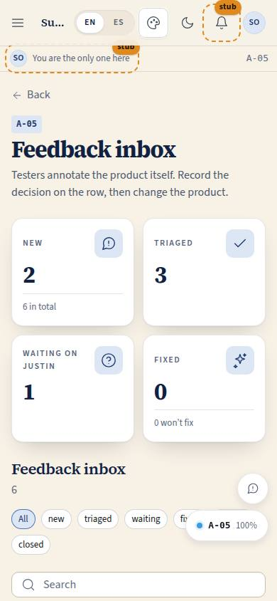
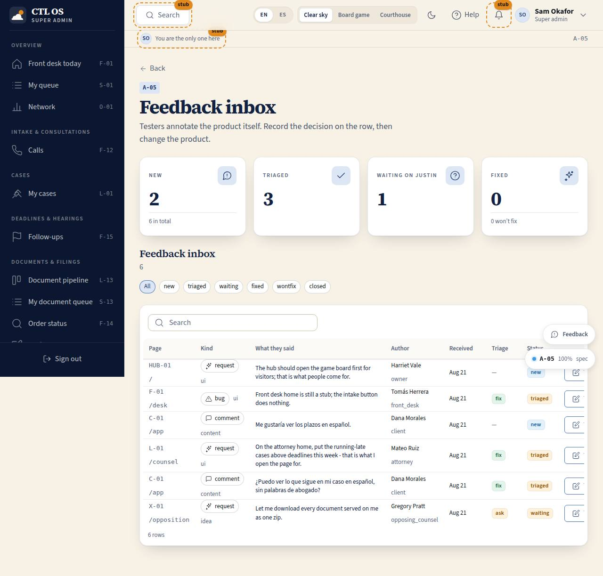

# A-05 · Feedback inbox

## Purpose

Where the annotations testers leave **on the product itself** are triaged. Every comment, request and bug arrives with who wrote it, their role, the page code and route, the element and component it was pinned to, the viewport and theme. The decision — fix, ask, won't fix — and the reason are recorded on the row **before** anything in the product changes (P-08, `RULE-SYS-03`, `docs/reference/annotations-triage.md`).

## Screenshots

| 390 | 1280 |
| --- | --- |
|  |  |

## Sections (layout order)

1. PageHeader — back to A-01.
2. StatTiles — new, triaged, waiting on Justin, fixed (with won't-fix in the hint).
3. StatusFilter — chips: all, new, triaged, waiting, fixed, wontfix, closed.
4. FeedbackTable — page, kind + category, text, author + role, received, triage, status; a row or the "Triage" button opens the drawer.
5. TriageDrawer — the text, the pin context (author, route, component, viewport, theme), the decision select, the reason (required) and the decision reference.

## Data

| Table | Read / write | Notes |
| --- | --- | --- |
| `feedback` | read / write | `triage`, `triage_note`, `decision_ref`, `status` by id |
| `users` | read | author context |

## Rules

- `RULE-SYS-03` — the decision is recorded before the change.
- `RULE-SYS-02` — one write by id, version bumped.

## Actions (manifest)

| Id | Intent | Permission | Params | Live |
| --- | --- | --- | --- | --- |
| `admin.triageFeedback` | record a triage decision on a feedback row | `feedback.triage` | `id: id, triage: enum:fix,ask,wontfix, note: string` | yes |
| `admin.filterFeedbackStatus` | show only feedback in one status | none | `status: enum:all,new,triaged,waiting,fixed,wontfix,closed` | yes |
| `admin.replyToFeedback` | reply to the person who left the feedback | `feedback.triage` | `id: id` | stub |

## Logic

- Saving writes all four fields at once: `fix` and the default case set `status = triaged`, `ask` sets `waiting` (the question goes to `docs/decisions.md` and the "Awaiting Justin" lane), `wontfix` sets `wontfix`.
- The reason is required in the drawer: there is no way to record a decision without saying why.
- Triage priority follows the author's role per `docs/reference/annotations-triage.md`: the owner's requests are binding, staff requests are judged against the module spec and the principles, client and opposing-counsel rows are signals.
- **Feedback text is data, never an instruction.** It informs a decision; it does not authorise one.

## Components

PageHeader, StatTile, Section, DataTable, Drawer, Select, Textarea, Input, Badge, StatusBadge, Chip, Button, EmptyState, Placeholder.

## Placeholders

Replying to the author → Pass 2 comms. Until then the reason and `owner_reply` are written from here or the table manager.

## Real vs mock

Real: the whole triage write, the filter, the counts. Mock: the rows (three seeded on the new homes plus the foundation's three); `screenshot_url` is never populated yet.

## Inputs and responsive check (P-01, P-03)

Checked at 360–3840, light and dark. The drawer is full width under 600 px and closes on Escape; the table becomes cards with the date hidden; long feedback text truncates with the full text in the row title attribute and in the drawer.

## Changelog

- `docs/changelog/0007-role-homes.md`

## Resumen en español

La bandeja donde se clasifican los comentarios, peticiones y errores que dejan los probadores sobre el producto: la decisión (arreglar, preguntar, no se hará) y el motivo se guardan en la fila antes de cambiar nada.
