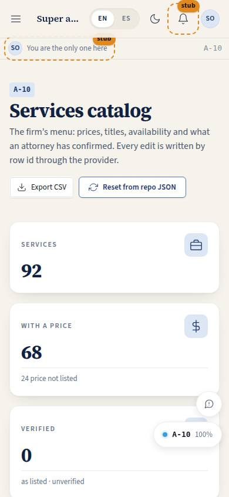
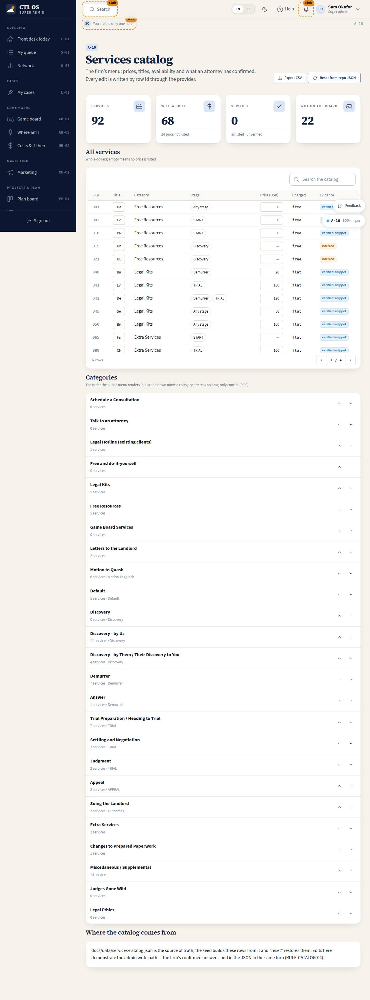

# A-10 · Catalog admin

## Purpose

Where the firm corrects its own menu. Every price in CTL OS today is "as listed on the current site" with an unknown crawl date, so the single most valuable thing the owner can do in this system is sit with this table and say which figures are right. Each row edits in place through the provider, the verified toggle removes the unverified badge everywhere that price appears, and "reset from repo JSON" puts the repository file back in charge.

## Screenshots

| 390 | 1280 |
| --- | --- |
|  |  |

Dark: `../screenshots/A-10/390-dark.jpg`, `../screenshots/A-10/1280-dark.jpg`.

## Sections (layout order)

1. **PageHeader** — title, the one-line explanation, export CSV and reset from repo JSON.
2. **StatTiles** — services, services with a price, verified, not on the board.
3. **ServicesTable** — every service: SKU (or "no SKU listed"), title (inline edit), category, stage chips, price in whole dollars (inline edit), how it is charged, evidence, verified toggle, on-the-menu toggle, and a link to the public page. Search in the toolbar, 25 per page, cards under 900 px.
4. **CategoryManager** — the categories in menu order with their service counts and up / down buttons.
5. **SourceNote** — where the catalog comes from and what an edit here means.

## Data

| Table | Read / write | Notes |
| --- | --- | --- |
| `services` | read + write | `title`, `price_cents`, `verified`, `active`. Read-only for now: `icon`, `time_expectation`, `client_inputs`, `deliverable_format`, `stage_scope` — they arrive from the repo JSON and the live-scrape pass, and a reset restores them |
| `service_categories` | read + write | `sort_order` (and everything on a reset) |

## Rules

- `RULE-CATALOG-01` — the verified toggle is the only thing that removes the "as listed · unverified" badge.
- `RULE-CATALOG-02` — the "not on the board" tile counts the services with no `stage_node_ids`, so the gap is visible.
- `RULE-CATALOG-04` — `docs/data/services-catalog.json` is the source of truth; edits here demonstrate the admin write path, and the firm's confirmed answers land in the JSON in the same turn.

## Actions (manifest)

| Id | Intent | Permission | Params | Live |
| --- | --- | --- | --- | --- |
| `catalog.search` | find a service by name or SKU | `store.read` | `q: string` | yes |
| `catalog.editPrice` | set the price of a service | `store.write` | `sku: string`, `priceCents: number` | yes |
| `catalog.editTitle` | rename a service | `store.write` | `sku: string`, `title: string` | yes |
| `catalog.toggleActive` | take a service off the public menu or put it back | `store.write` | `sku: string` | yes |
| `catalog.toggleVerified` | confirm that a price matches the live site | `store.write` | `sku: string` | yes |
| `catalog.moveCategory` | move a category up or down the menu | `store.write` | `slug: string`, `direction: enum` | yes |
| `catalog.resetFromRepo` | restore the catalog from the repository file | `store.write` | — | yes |
| `catalog.exportCsv` | download the whole catalog as a spreadsheet | `store.read` | — | yes |
| `catalog.openService` | see how one service looks to a visitor | `store.read` | `sku: string` | yes |

## Logic

- Inline fields are uncontrolled and commit on blur or Enter, so a keystroke never fights a re-render from the change feed.
- Price is entered in whole dollars and stored in cents; an empty field stores `null`, which renders as "price not listed", never `$0`.
- Every write goes through `useData().update(table, id, patch)`, so `version` and `updated_at` move (P-14).
- Reset walks the repo JSON, patches only rows that differ, and reports the count.
- Category order is swapped by exchanging `sort_order` between neighbours — two writes, no drag (P-03).
- Deleting a service is deliberately absent: a SKU the firm stops selling is set inactive so old invoices still resolve.

## Components

`PageHeader`, `Section`, `Card`, `DataTable`, `StatTile`, `SearchInput`, `Input`, `Toggle`, `Button`, `IconButton`, `Badge`, `Chip`, `Icon`, `Toast`.

## Placeholders

None. Every control on this page writes.

## Real vs mock

Writes are real against the mock provider (localStorage), broadcast through the change feed, and lost on a reseed — which is the point of "reset from repo JSON". When Supabase lands, the same calls hit Postgres under the RLS intent recorded on the tables (owner / super admin write, everyone reads).

## Inputs and responsive check (P-01, P-03)

Checked at: 360, 390, 768, 1280, 1920, 2560, 3840, light and dark. The table scrolls horizontally inside its own container (a `position: relative` on `.datatable-scroll` keeps absolutely positioned descendants such as `.sr-only` from escaping the clip and inflating the page width); under 900 px each row renders as a card with labelled cells. Every toggle and inline field is keyboard reachable and named.

## Changelog

- `docs/changelog/_pending/catalog.md` (0.1.1)

## Resumen en español

La tabla donde el bufete corrige su propio menú: precio y título editables en línea, un interruptor "verificado" que quita la etiqueta de "sin verificar" en todo el producto, orden de categorías, exportación a CSV y restauración desde el JSON del repositorio.
