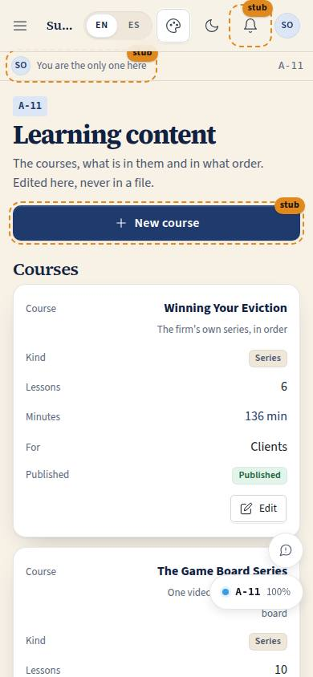
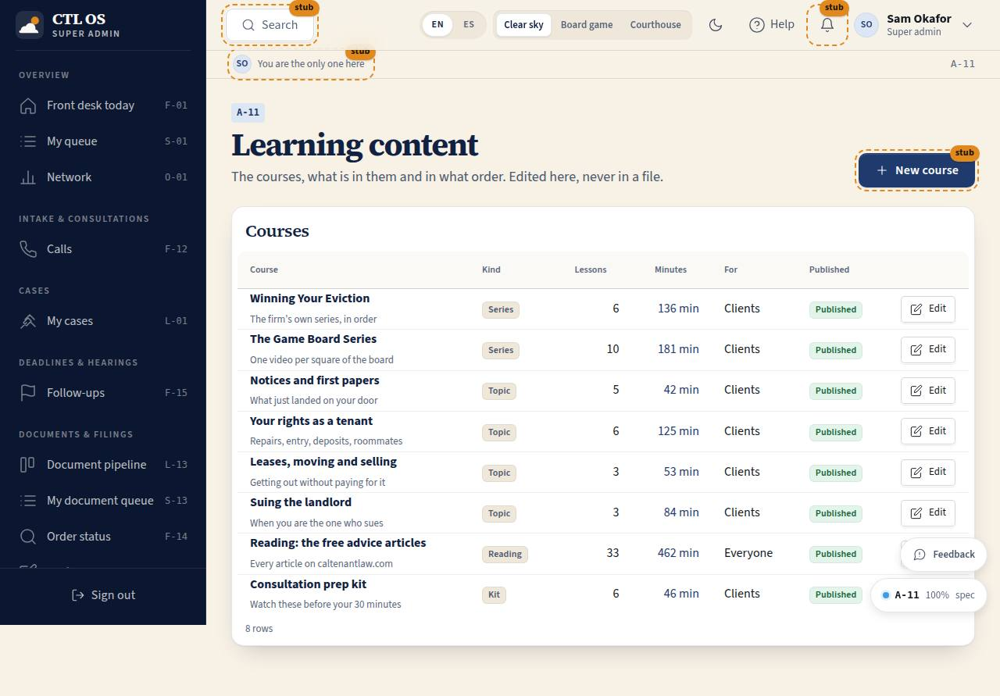

# A-11 · Learning content

## Purpose

Where the firm owns its own curriculum. The courses, what is in them, in what order, which lessons are required, when each one unlocks, who the course is for and whether it is published — all edited in the product with buttons and selects, never by dragging and never in a file (P-07, P-03).

## Screenshots

| 390 | 1280 |
| --- | --- |
|  |  |

## Sections (layout order)

1. PageHeader with **New course** (Placeholder).
2. **Courses table** — course and subtitle, kind, lesson count, minutes, audience, published.
3. **Course drawer** — title and subtitle (saved on blur), audience select, published toggle, then the ordered lesson list: Move up / Move down, a Required toggle, an unlock-rule select and Remove per lesson.
4. **Add a lesson from the library** — search, a select of everything not already in the course (videos and articles), and the first four as cards with an Add button.

## Data

| Table | Read / write | Notes |
| --- | --- | --- |
| `courses` | read + write | Title, subtitle, audience, published, estimated minutes |
| `course_lessons` | read + write + delete | Order, required, unlock rule |
| `lessons` | read | The library to pick from; never edited here |

## Rules

- `RULE-LEARN-03` — the unlock rule is what makes a lesson dim on C-40 / C-41, and `at_stage` uses the lesson's own `teaches_stage_node_ids`.
- `RULE-LEARN-06` — the firm's order is the firm's; this page is where the firm corrects our cut.
- `RULE-LEARN-07` — publishing changes where a course is listed, never whether the lessons are free.

## Actions (manifest)

| Id | Intent | Permission | Params | Live |
| --- | --- | --- | --- | --- |
| `learning.editCourse` | edit the course {course} | `lessons.write` | `id: id` | yes |
| `learning.setCourseTitle` | rename this course to {title} | `lessons.write` | `id, title` | yes |
| `learning.togglePublished` | publish or unpublish this course | `lessons.write` | `id: id` | yes |
| `learning.setAudience` | make this course for {audience} | `lessons.write` | `id, audience: enum` | yes |
| `learning.moveLesson` | move this lesson up or down in the course | `lessons.write` | `id, dir: enum` | yes |
| `learning.toggleRequired` | make this lesson required or optional | `lessons.write` | `id: id` | yes |
| `learning.setUnlockRule` | open this lesson {rule} | `lessons.write` | `id, rule: enum` | yes |
| `learning.addLessonToCourse` | add {lesson} to this course | `lessons.write` | `courseId, lessonId` | yes |
| `learning.removeLessonFromCourse` | take this lesson out of the course | `lessons.write` | `id: id` | yes |
| `learning.searchLibrary` | find the lesson {words} | — | `q: string` | yes |

## Logic

- Every edit is an update by row id through the provider, so `version` and `updated_at` move and a second editor is not silently overwritten (P-14).
- Move up / down swaps the two rows' `order_index`: no drag anywhere, and the same two buttons work from a keyboard and a d-pad.
- Adding or removing a lesson recomputes the course's `estimated_minutes`, so a card never has to join to show a length.
- Choosing "At its board square" copies the lesson's own `teaches_stage_node_ids` into the row.

## Components

`PageHeader`, `DataTable`, `Drawer`, `SearchInput`, `Select`, `Input`, `Toggle`, `Button`, `Badge`, `LessonCard`, `EmptyState`, `Placeholder`, `DocPreview`, `FeedbackButton`.

## Placeholders

- **New course** — a new course needs the firm's own words, not ours; a later content pass.
- **Edit the lesson itself** (title, video id, the square it teaches) — the library is the firm's own scrape (D-043); editing it needs a decision about what the source of truth then is.

## Real vs mock

Real: every edit writes to the mock database and shows up on C-40 / C-41 immediately. Mocked: nothing.

## Inputs and responsive check (P-01, P-03)

Checked at 360, 390, 768, 1280, 1920, 2560, 3840. Nothing is drag-only; the drawer is full width under 600; selects are native and labelled; the row controls wrap instead of overflowing.

## Changelog

- `docs/changelog/0023-learning.md`

## Resumen en español

El constructor de cursos: la tabla de cursos y un panel para editar título, público, publicación y las lecciones (subir, bajar, obligatoria, cuándo se abre, quitar, agregar desde la biblioteca). Sin arrastrar y sin tocar archivos.
