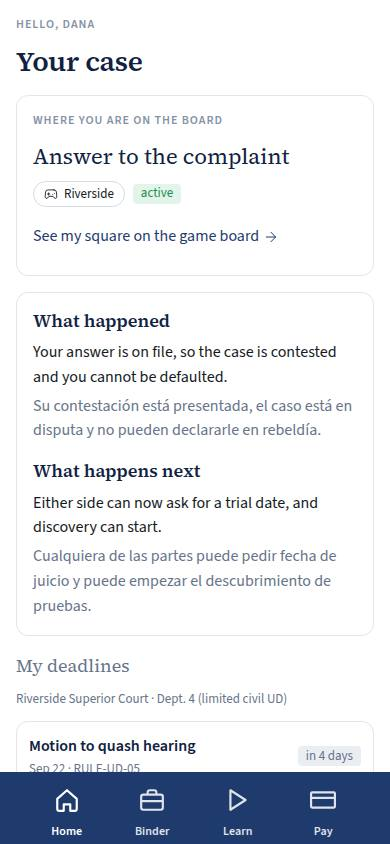
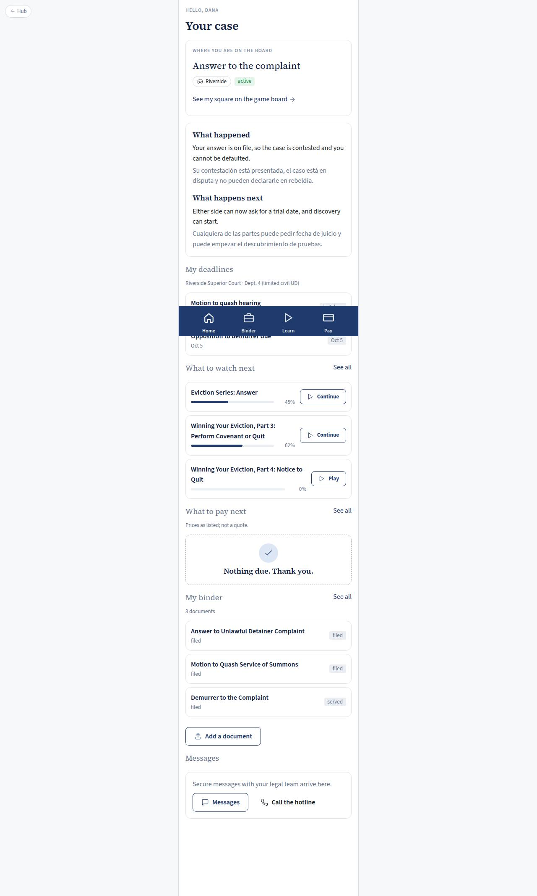

# C-01 · Client home

## Purpose

The tenant opens one screen and knows where they stand. It answers four questions in the order a frightened person asks them: where am I on the eviction game board, what just happened and what happens next (in plain English and plain Spanish, no words of art), what is due, and what do I watch and pay next. Everything else in the client app hangs off this screen.

## Screenshots

| 390 | 1280 |
| --- | --- |
|  |  |

Dark: `../screenshots/C-01/390-dark.jpg`, `../screenshots/C-01/1280-dark.jpg`.

## Sections (layout order)

1. Greeting — first name, page title.
2. CasePosition — the board square in words, the county, the case status, a "running late" badge when the case is flagged, and the link to the square on the game board (`/#/board/case/<id>`, GB-02).
3. WhatHappenedWhatNext — two short paragraphs per question, English then Spanish, from `src/data/schema/boardStages.ts`.
4. MyDeadlines — up to four pending deadlines, soonest first, each with a relative label ("in 5 days", "3 days late") and the rule id it came from.
5. WatchNext — the next three unfinished lessons with progress bars, lessons mapped to the current square first.
6. PayNext — invoices with status `due`, each one SKU-priced, with the total; prices "as listed".
7. MyBinder — the three most recent documents plus "Add a document".
8. Messages — messages and the hotline.

## Data

| Table | Read / write | Notes |
| --- | --- | --- |
| `cases` | read | `client_user_id = me`; a super admin previewing the app sees the demo client's case |
| `deadlines` | read | pending rows of my case, ordered by `due_at` |
| `documents` | read | my case, newest first in the list |
| `invoices` | read | status `due` |
| `lessons` | read | ordered by `order` |
| `lesson_progress` | read | `client_user_id = me` |

## Rules

- `RULE-UD-01` — the response window drives the first deadline and its relative label.
- `RULE-UD-04` — the 5-day notice to vacate is one of the squares this screen explains.
- `RULE-INTAKE-01` — consultations and hotline blocks are prepaid and time-boxed; the amounts shown are as listed.

## Actions (manifest)

| Id | Intent | Permission | Params | Live |
| --- | --- | --- | --- | --- |
| `client.openCase` | show me where my case is on the game board | `cases.read_own` | — | yes |
| `client.openBinder` | open my binder of documents | `documents.read_own` | — | yes |
| `client.openLearn` | open the videos I should watch next | none | — | yes |
| `client.openPay` | open what I owe | none | — | yes |
| `client.uploadDocument` | add a document or photo to my binder | none | — | stub |
| `client.openMessages` | open my messages with the legal team | `messages.read` | — | stub |
| `client.callHotline` | start a paid hotline call with an attorney | `consultations.book` | — | stub |

## Logic

- My case = `cases` where `client_user_id` is the signed-in user; with no case the screen becomes one EmptyState pointing at the free videos.
- The plain-language pair comes from the board square, not from a status enum, so the words change as the case moves.
- A past due date renders danger, within three days warn, otherwise neutral (`dueTone`).
- "Watch next" prefers lessons whose `stage_node_id` equals the current square, then falls back to the lowest-order unfinished lesson.
- The total due is the sum of `amount_cents` where status is `due`; no total is ever presented as a quote.

## Components

Card, Section, Badge, StatusBadge, ProgressBar, Button, Chip, EmptyState, Placeholder, Icon, BottomNav (from PhoneShell).

## Placeholders

- Add a document → Pass 2 discovery gathering (T-071).
- Messages → Pass 2 comms (T-080).
- Call the hotline → Pass 2 hotline (T-065).
- Play / continue a lesson → Pass 2 learning (T-078).

## Real vs mock

Real: every tile reads the provisional ops tables through the `DataProvider`; the board link, the binder / learn / pay navigation, and (on C-03) marking a lesson watched are real writes. Mock: the rows themselves (`src/data/seed/ops.ts`), and the localStorage provider behind them. When Supabase lands the queries stay the same and the RLS intents on `cases`, `deadlines`, `documents` and `invoices` become policies.

## Inputs and responsive check (P-01, P-03)

Checked at: 360, 390, 768, 1280, 1920, 2560, 3840 in light and dark. The PhoneShell keeps a single column; on large screens the column centres and `--scale` lifts the type, so it stays a phone screen rather than a stretched one. Tab order follows the sections; every row keeps a 44 px target; nothing is hover-only (Placeholder tooltips show on focus and on tap).

## Changelog

- `docs/changelog/_pending/homes.md`

## Resumen en español

La pantalla principal del inquilino: en qué casilla del tablero está su caso, qué pasó y qué sigue en lenguaje sencillo (inglés y español), sus plazos, el siguiente video y lo que falta pagar. Todo con precios "según la lista", nunca una cotización.
