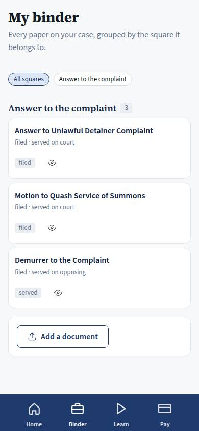
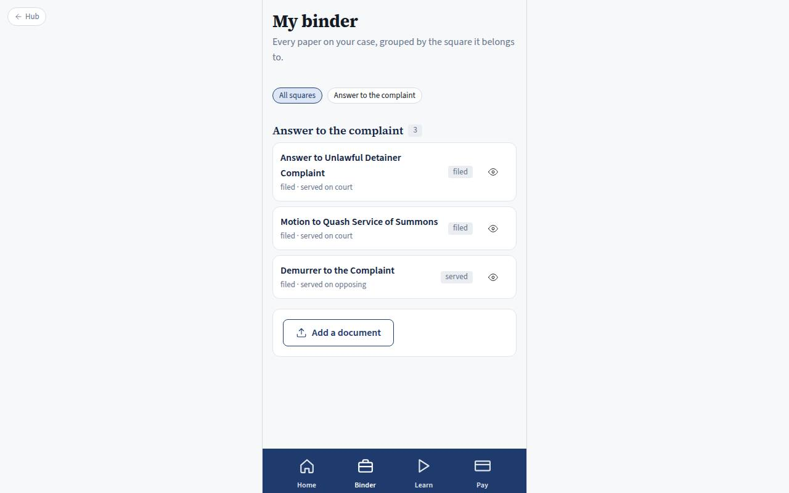

# C-02 · Client binder

## Purpose

Every paper on the tenant's case in one place, grouped by the board square it belongs to, so nothing has to be hunted for in an email inbox: what we filed, what was served, the evidence, and what the tenant uploaded.

## Screenshots

| 390 | 1280 |
| --- | --- |
|  |  |

## Sections (layout order)

1. PageHeader.
2. StageFilter — one chip per square present in the binder, plus "All squares".
3. DocumentGroups — a heading per square, then the documents with kind, status and who it was served on.
4. UploadCard — "Add a document".

## Data

| Table | Read / write | Notes |
| --- | --- | --- |
| `cases` | read | to resolve my case id |
| `documents` | read | my case, grouped by `stage_node_id` |

## Rules

- `RULE-UD-01` — the answer and the papers around it are the squares most binders start at.

## Actions (manifest)

| Id | Intent | Permission | Params | Live |
| --- | --- | --- | --- | --- |
| `client.filterBinderStage` | show only the documents of one board square | none | `stageNodeId: string` | yes |
| `client.openDocument` | open one of my documents | `documents.read_own` | `id: id` | stub |
| `client.uploadDocument` | add a document or photo to my binder | none | — | stub |

## Logic

- Groups are built from the distinct `stage_node_id` values of my documents; documents with no square (evidence, uploads) fall into one "Not tied to a square" group.
- Status badges use the shared status vocabulary (`toneFor`), so draft / review / filed / served read the same here as on staff pages.

## Components

PageHeader, Card, Chip, StatusBadge, Badge, EmptyState, Placeholder, Icon.

## Placeholders

Opening a document → Pass 2 binder (T-070). Uploading → Pass 2 discovery gathering (T-071).

## Real vs mock

Real: the grouping, the filter and the counts. Mock: the documents, and there is no file behind a row yet — T-070 adds storage and a viewer.

## Inputs and responsive check (P-01, P-03)

Checked at 360–3840, light and dark. Chips wrap instead of scrolling off; each row is a 44 px target; the eye button carries an `aria-label` with the document title.

## Changelog

- `docs/changelog/_pending/homes.md`

## Resumen en español

La carpeta del inquilino: todos los papeles del caso agrupados por la casilla del tablero, con su estado y a quién se notificaron.
