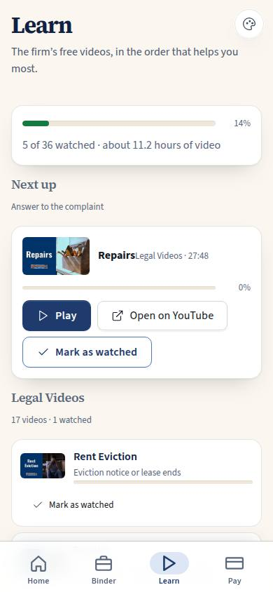
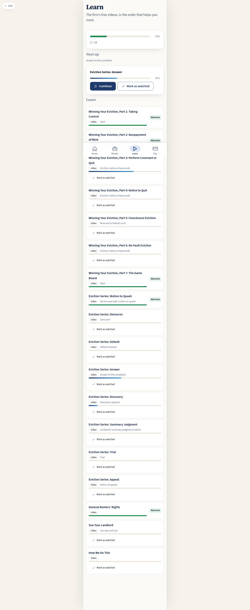

# C-03 · Client learning

> **Superseded by C-40 (2026-09-20).** The learning module (`src/modules/learning`) now owns `/app/learn` with the
> LMS: C-40 learn, C-41 the journey through the board's phases, C-42 the in-app player that measures what was
> actually watched, plus L-40 (what clients have watched, for counsel) and A-11 (the course builder). The route and
> the `ClientLearnPage` import were removed from `src/modules/client/index.ts` in the same commit; `LearnPage.tsx`
> and `clientLearnSpec` stay in the client module as the record of what C-03 was. Nothing here is current: read
> `docs/pages/C-40.md`.

## Purpose

The firm's free curriculum as a path instead of a playlist: the real video library of caltenantlaw.com/pre-consultation-videos (33 videos in the page's own order and three groups: Legal Videos, Winning Your Eviction Series, The Game Board Series, plus three videos embedded on article pages only; `docs/data/videos.json`, scraped live 2026-09-18, D-043), with lengths, the firm's own thumbnails, what the tenant has already watched, and which one matters at their square of the board right now. The firm's own argument is "rather than pay a lawyer to tell you the same information, watch the videos" — this screen is that argument, with progress.

## Screenshots

| 390 | 1280 |
| --- | --- |
|  |  |

## Sections (layout order)

1. PageHeader.
2. Overall progress — watched / total and the hours of video in the library.
3. NextUp — the lesson to watch now: thumbnail, group, length, the square it explains; Play (in-app player is T-078, a Placeholder), Open on YouTube (real), Mark as watched (real).
4. GroupSections — one section per group (Legal Videos, Winning Your Eviction Series, The Game Board Series, Embedded on articles only) with a row per lesson: thumbnail, title, length, square and a progress bar.
5. Source line — library, order, groups and lengths as posted on caltenantlaw.com on 2026-09-18.

## Data

| Table | Read / write | Notes |
| --- | --- | --- |
| `lessons` | read | 36 rows seeded from `docs/data/videos.json`: `order` = the page order, `group` / `group_order`, `duration_seconds` (35 of 36; YouTube gave none for one), `youtube_url`, `illustration_id` (the scraped thumbnail), `teaches_stage_node_ids` |
| `illustrations` | read | the firm's video thumbnails by key (`video:<slug>`) |
| `lesson_progress` | read / write | `watched_pct`, `completed_at` by id; inserted when there is no row yet |
| `cases` | read | the current square, to pick what matters now |

## Rules

- `RULE-SYS-02` — the write goes through the provider by id, with `version` bumped.

## Actions (manifest)

| Id | Intent | Permission | Params | Live |
| --- | --- | --- | --- | --- |
| `client.playLesson` | play a lesson video | none | `id: id` | stub |
| `client.markLessonWatched` | mark a lesson as watched | none | `id: id` | yes |

## Logic

- Next up = the lowest-order unfinished lesson, preferring lessons whose `stage_node_id` equals the case's square.
- Marking watched writes `watched_pct = 100` and `completed_at = now`; running it twice is harmless.

## Components

PageHeader, Card, Section, ProgressBar, Button, Badge, Chip, Placeholder, Icon.

## Placeholders

Playing a video → Pass 2 learning (T-078), which brings the player, watched state from playback, the drip rules (C-41) and the TV-remote path.

## Real vs mock

Real: progress, the ordering and the write. Mock: the lesson rows (T-077 brings the real video ids, prerequisites and the 2025 refresh).

## Inputs and responsive check (P-01, P-03)

Checked at 360–3840, light and dark. Every progress bar is labelled for screen readers; "Mark as watched" is a real 44 px button, never a hover affordance.

## Changelog

- `docs/changelog/0007-role-homes.md`

## Resumen en español

El currículo gratuito del bufete como un camino: los videos en orden, lo que el inquilino ya vio y cuál importa en su casilla del tablero.
