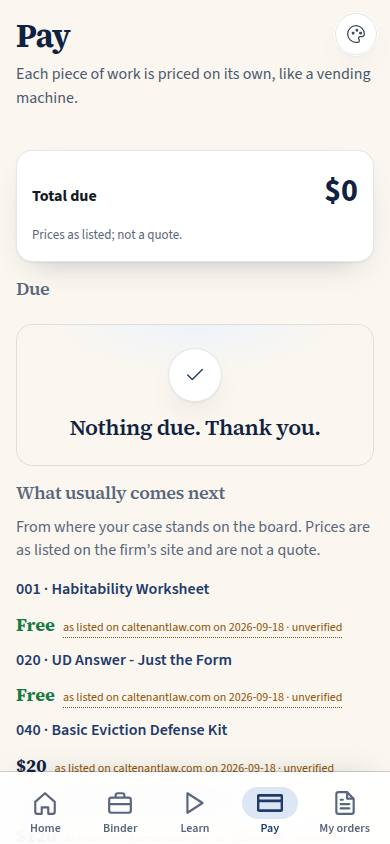
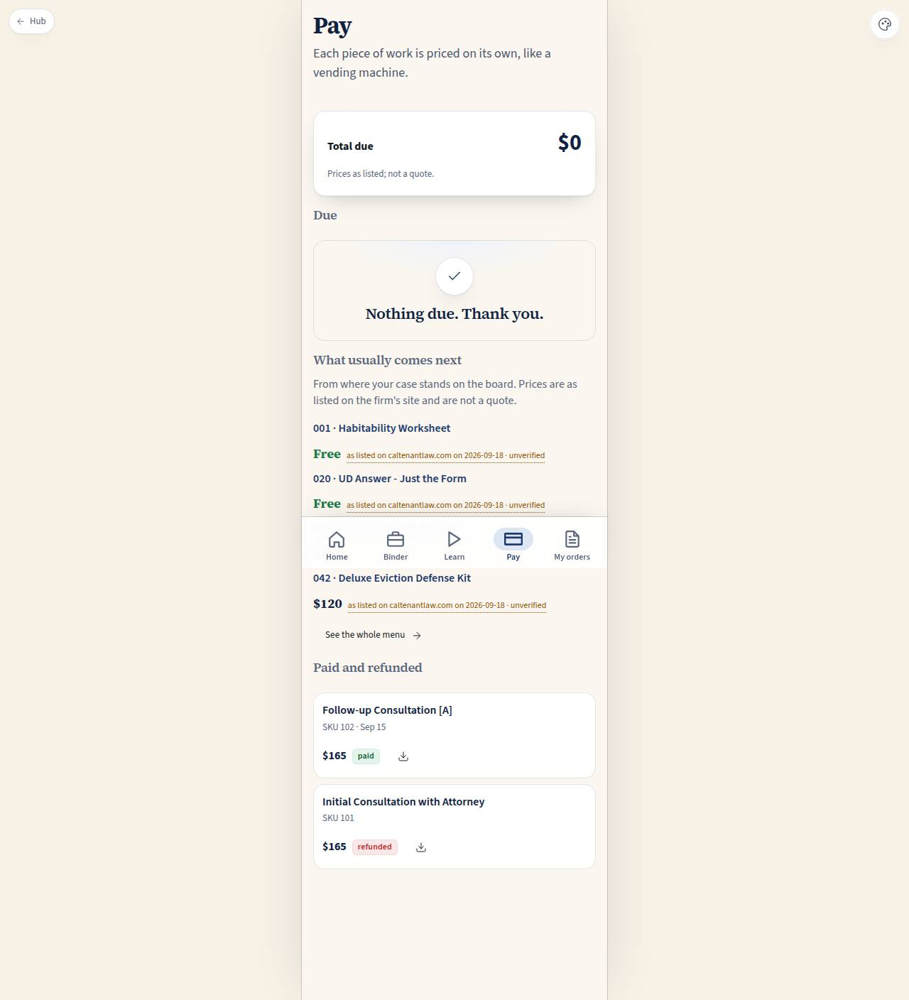

# C-04 · Client payments

## Purpose

What the tenant owes and what they have already paid, piece by piece. The firm sells unbundled work ("like a legal vending machine, so you control the costs"), so every line is one SKU at the price listed on the site — never a quote, never a bundle.

## Screenshots

| 390 | 1280 |
| --- | --- |
|  |  |

## Sections (layout order)

1. PageHeader.
2. TotalDue — the sum, with the "as listed" caveat under it.
3. DueList — each item with its SKU and amount, and a "Pay" control.
4. HistoryList — paid and refunded items newest first, with receipts.
5. AsListedNote.

## Data

| Table | Read / write | Notes |
| --- | --- | --- |
| `cases` | read | to resolve my case id |
| `invoices` | read | split by status `due` / `paid` / `refunded` |

## Rules

- `RULE-INTAKE-01` — consultations are prepaid, time-boxed blocks; the store SKUs price everything else.

## Actions (manifest)

| Id | Intent | Permission | Params | Live |
| --- | --- | --- | --- | --- |
| `client.payInvoice` | pay one item on my account | `store.buy` | `id: id` | stub |
| `client.openReceipt` | open the receipt for something I paid | `payments.read` | `id: id` | stub |

## Logic

- Total due = sum of `amount_cents` where status is `due`.
- Amounts render with `money()`; the copy says "as listed" in both languages wherever a price appears.

## Components

PageHeader, Card, Section, Badge, StatusBadge, Button, EmptyState, Placeholder.

## Placeholders

Paying and receipts → the payments seam (Stripe / PayPal). No card data exists anywhere in this demo.

## Real vs mock

Real: the split, the totals, the SKU labels from the store catalog in `docs/reference/firm-site-digest.md` §4. Mock: the invoice rows; payment is not wired and will not be until the seam is filled.

## Inputs and responsive check (P-01, P-03)

Checked at 360–3840, light and dark. Amounts use tabular numerals so columns line up; the download button carries an `aria-label`.

## Changelog

- `docs/changelog/0007-role-homes.md`

## Resumen en español

Lo que el inquilino debe y lo que ya pagó, concepto por concepto, con precios "según la lista" del sitio del bufete. Pagar todavía no está conectado.
