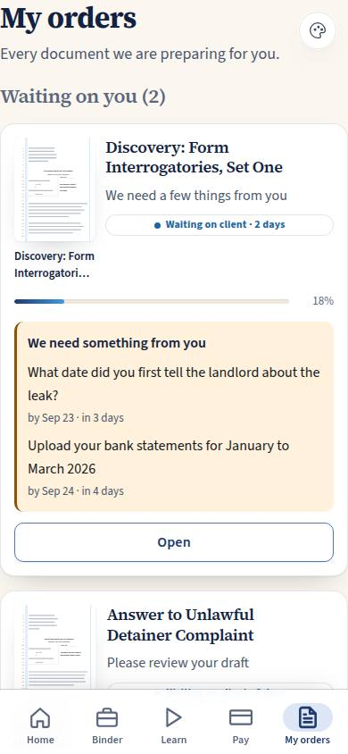
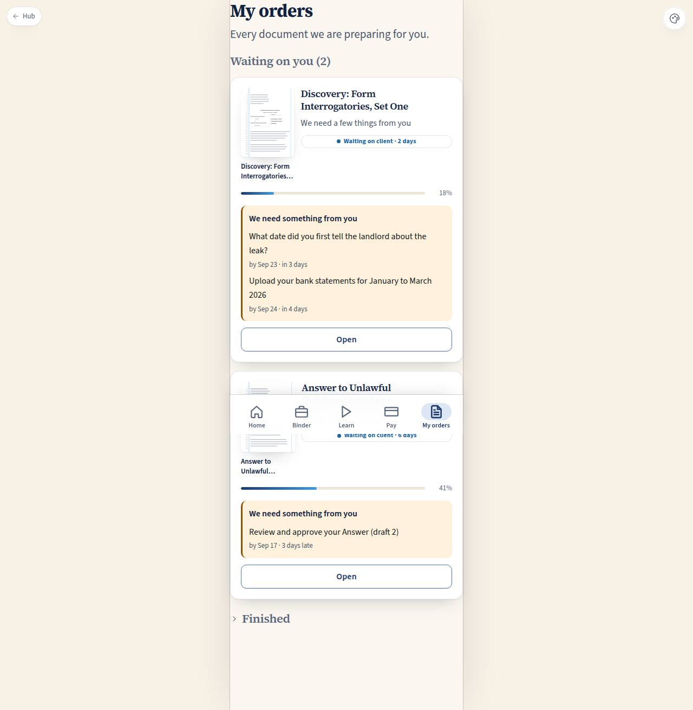

# C-11 · My orders (and C-11a · My order)

## Purpose

The client's own version of the pipeline. C-11 lists every document being prepared for them with anything we need from them at the very top; C-11a (`/app/orders/:orderId`) explains one document in plain words and gives the client the only two things they are ever asked to do — answer what we asked, and approve the draft or tell us what to change.

Two routes, one page family: the list is `C-11`, the detail carries the code `C-11a` so screenshots and specs stay one-to-one with a route.

## Screenshots

| 390 | 1280 |
| --- | --- |
|  |  |

Spanish and dark were checked at 390 during the build.

## Sections (layout order)

**C-11:** Header · Waiting on you (N) · We are working on these · Finished (collapsed) · EmptyState.
**C-11a:** Back link and title · status card (DocPreview, client label, progress) · Your steps (client stepper) · What happens next · Your draft is ready to read (only in client review) · What we need from you · Who is working on it · dates.

## Data

| Table | Read / write | Notes |
| --- | --- | --- |
| `orders` | read / update | only this client's rows; the client's own approve / request-changes patch |
| `order_stage_events` | read / insert | the dates on the stepper; the client's own move |
| `client_requests` | read / update | answering closes the request |
| `users`, `tenants` | read | the attorney's name and the office |

## Rules

- `RULE-PIPE-03` — the client sees only `stagesFor('client')` with `clientLabel`s and the collapse through `clientStageFor()`. No internal stage name, no revision count, no supervisor, no `notes`, ever.
- `RULE-PIPE-02` — "waiting on you" is derived from the stage, so the loud block and the count cannot disagree with the board.
- `RULE-PIPE-07` — the open requests are what the block lists.
- `RULE-PIPE-01` / `RULE-PIPE-08` — Approve and Request changes go through `applyTransition` and write the event; a client holds no `orders.advance`, so the page writes the pair directly on their own order rather than borrowing a staff permission.

## Actions (manifest)

| Id | Intent | Permission | Params | Live |
| --- | --- | --- | --- | --- |
| `client.openOrder` | see everything about one of my documents | `orders.read_own` | `orderId: id` | yes |
| `client.openServices` | see the documents the firm can prepare for me | `store.read` | — | yes |
| `client.answerRequest` | answer what my attorney asked me | `orders.read_own` | `requestId: id, answer: string` | yes |
| `client.approveDraft` | approve my draft | `orders.read_own` | `orderId: id` | yes |
| `client.requestChanges` | ask for changes to my draft | `orders.read_own` | `orderId: id, note: string` | yes |
| `client.openUpload` | add the photo or document my attorney asked for | `evidence.write` | `requestId: id` | stub |
| `client.openOrders` | go back to all my documents | `orders.read_own` | — | yes |

The client actions are namespaced `client.*` like the rest of the tenant app, not `pipeline.*`: the vocabulary a client speaks is their own app's.

## Logic

- The signed-in tenant, or the demo client (`usr_client`) when a super admin previews the app — the same rule `useMyCase` uses.
- Approve writes `approved_by_client` and closes the open review or approval request with "Approved". Request changes opens a Modal whose note is stored both on the event and as the answer on the request, then moves the order to `client_requested_changes`.
- A drafting loop revisits stages, so a step still ahead of the current one never shows the old date it once had.
- In `client_review` the draft is rendered as a large DocPreview: the client reads the document, not a status line.
- A brand-new client with no orders gets a real empty state that says what will appear here and links to the menu.

## Components

Card, Section, Button, Badge, ProgressBar, Textarea, Modal, EmptyState, Placeholder, DocPreview, **StageStepper**, **WaitingOnPill**, Icon.

## Placeholders

- "Upload it" on an item or signature request — wrapped in a Placeholder while the binder add flow (`/app/binder/add?request=`) is built this pass; the link is already correct.

## Real vs mock

Real: orders, requests, events, the client's own two moves. Mocked: nothing. Payments link out to C-04.

## Inputs and responsive check (P-01, P-03)

Checked at 360, 390, 768, 1280, 1920, 2560, 3840 (the PhoneShell centres the app on wide screens). The stepper is vertical here, so it reads as a list at every width. Answering is a labelled Textarea and a submit button; Approve and Request changes are 44 px buttons; the modal traps focus and closes on Escape. **Spanish is complete on this page** — a tenant may never read the English.

## Changelog

- `docs/changelog/_pending/pipeline.md`

## Resumen en español

La versión del cliente: cada documento que preparamos para él, con lo que necesitamos de él arriba del todo, y una página por documento que explica en palabras sencillas en qué paso va, qué sigue, quién lo trabaja, y los dos únicos botones que le tocan: responder lo que le pedimos y aprobar el borrador o pedir cambios. Nunca ve notas internas, número de revisión ni nombres de etapas internas.
