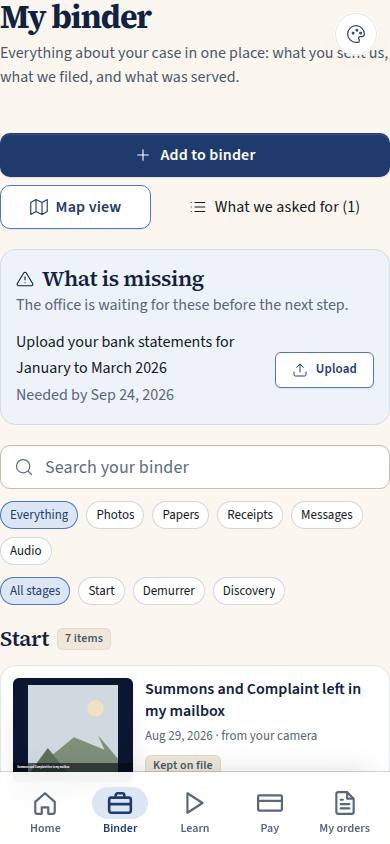
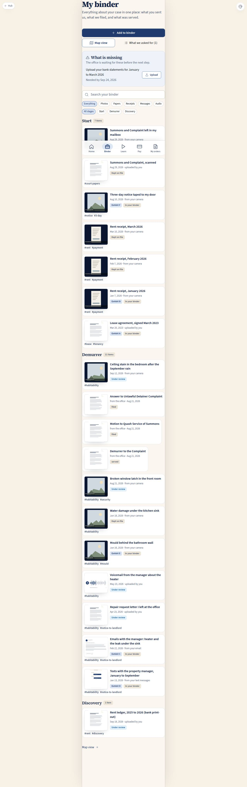

# C-20 · My binder (and C-20a the binder map)

## Purpose

The tenant opens one screen and sees everything about their case as objects they recognise: the photo of the notice taped to the door, the lease, the rent receipts, the emails and texts with the landlord, and what the firm filed and served. It is organised by the stage of the case, the exhibits carry their letters, and anything the office is still waiting for sits at the top with an Upload button. **C-20 replaces C-02** (the client module's binder route and spec were removed in the same commit; `docs/pages/C-02.md` is marked superseded).

`/app/binder/map` (page code **C-20a**) is the same objects laid along a horizontal track of the case stages: the 2D objects view of `docs/reference/graph-gallery-views.md`, no three.js, keyboard navigable, with zoom buttons.

## Screenshots

| 390 | 1280 |
| --- | --- |
|  |  |

Working shots from this pass live in the worker's scratchpad (`binder/c20-390.png`, `c20-1280.png`, `c20map-390.png`, `c20-detail-360.png`, `c20-dark2-390.png`, `c20-es2-390.png`, `c20-3840.png`); `npm run screenshots -- --codes=C-20` regenerates the committed set.

## Sections (layout order)

1. **PageHeader** — "My binder" and one line of what it is.
2. **Actions** — "Add to binder" (the one primary action), "Map view", "What we asked for (n)".
3. **What is missing** — open `client_requests` of kind `item`, soonest due first, each with an Upload button that opens C-21 at that request.
4. **Search and filters** — a search box, kind chips (everything / photos / papers / receipts / messages / audio) and phase chips.
5. **Phase sections** — the board phases in board order, each a grid of `EvidenceCard` tiles (client evidence) and firm documents.
6. **Item detail** — a Modal with the drawing, both dates, where it came from, the fingerprint, the conversation when it is one, and the chain of custody.

C-20a: PageHeader · toolbar (zoom out, zoom in, list view, add) · phase jump chips · the track of bands · the same item Modal.

## Data

| Table | Read / write | Notes |
| --- | --- | --- |
| `evidence_items` | read | `client_user_id = me` only (RULE-EVID-01) |
| `evidence_messages` | read | the thread behind an email / text item |
| `evidence_connections` | read | shown on C-22, read here for completeness |
| `documents` | read | what the firm filed and served on this case |
| `client_requests` | read | the "What is missing" strip |
| `cases` | read | which case is mine |

## Rules

- `RULE-EVID-01` — the page reads only the signed-in client's items; a super admin previewing sees the demo client's binder.
- `RULE-EVID-02` — statuses are shown in the client's words (in your binder / under review / kept on file / needs your attention); the client never sets one.
- `RULE-EVID-04` — the item detail shows both dates, the source and the SHA-256, plus the chain of custody.
- `RULE-EVID-06`, `RULE-PIPE-07` — an open item request is what the strip lists; answering it is C-21.

## Actions (manifest)

| Id | Intent | Permission | Params | Live |
| --- | --- | --- | --- | --- |
| `binder.search` | find something in my binder | `evidence.read_own` | `q: string` | yes |
| `binder.filterKind` | show only photos in my binder | `evidence.read_own` | `group: string` | yes |
| `binder.filterPhase` | show only what belongs to the answer | `evidence.read_own` | `phase: string` | yes |
| `binder.clearFilters` | show my whole binder again | `evidence.read_own` | — | yes |
| `binder.openItem` | open the photo of the notice | `evidence.read_own` | `id: id` | yes |
| `binder.closeItem` | close this item | `evidence.read_own` | — | yes |
| `binder.openAdd` | add something to my binder | `evidence.write` | — | yes |
| `binder.openRequests` | show what the office asked me for | `orders.read_own` | — | yes |
| `binder.openMap` | show my binder as a map | `evidence.read_own` | — | yes |
| `binder.openDocument` | open the answer we filed | `documents.read_own` | `id: id` | stub (T-072) |
| `binder.mapZoom` (C-20a) | zoom into my binder map | `evidence.read_own` | `direction: in\|out\|reset` | yes |
| `binder.mapFocusPhase` (C-20a) | take me to discovery on the map | `evidence.read_own` | `phase: string` | yes |
| `binder.openList` (C-20a) | go back to the list | `evidence.read_own` | — | yes |

## Logic

- Evidence rows and firm documents are normalised into one `BinderObject` shape (`src/modules/binder/lib.ts`), so the sections, the search and the map all work on the same list.
- Sections are board phases in board order (`docs/game-board/nodes.json` through `boardStages`); anything without a square lands in "Other squares".
- Search matches the title, description, tags and exhibit letter; kind chips group photos, papers, receipts, messages and audio.
- The map lays each band left to right; the arrow keys move focus (left/right inside a band, up/down between bands, Home/End to the ends), Enter opens, and zoom is two buttons applying a CSS scale to the track.

## Components

`PageHeader`, `SearchInput`, `Chip`, `Card`, `Section`, `Badge`, `StatusBadge`, `Button`, `IconButton`, `Modal`, `EmptyState`, `Placeholder`, `Icon`, plus the two new organisms **`EvidenceCard`** and (on C-21 / C-22) **`UploadSheet`**, and `DocPreview` for every drawing.

## Placeholders

- Opening the original of a firm document (`binder.openDocument`) — T-072 file storage, Pass 3.

## Real vs mock

Real: the whole binder, the phase grouping, search and filters, the item detail with dates, source, hash and chain of custody, the map and its keyboard navigation. Mock: the preview images are small generated SVG data URLs in the seed and small JPEG data URLs for anything uploaded in the browser; the original bytes are never stored, because storage is a seam. When Supabase Storage lands the same rows gain a real file URL and the Placeholder becomes a download.

## Inputs and responsive check (P-01, P-03)

Checked at 360, 390, 768, 1280, 1920, 2560, 3840 (light and dark, English and Spanish). Tiles reflow from one column to a grid; the map scrolls horizontally with a trackpad, a finger or the keyboard and never needs a drag. Every tile is one button with the item's name, at least 44 px; chips and buttons are 44 px; the "needs your attention" state is a red border plus words, never colour alone. Note (shell-level, not this page): the customer surface renders in PhoneShell's centred column at every width, so a 4K screen shows the phone column centred - the same for every C-xx page.

## Changelog

- `docs/changelog/0024-binder.md`

## Resumen en español

C-20 es la carpeta del cliente: todo lo del caso como objetos reconocibles, agrupados por la etapa del tablero, con las pruebas etiquetadas, lo que falta arriba y un solo botón principal para agregar. C-20a muestra lo mismo como un mapa horizontal de etapas, navegable con el teclado y con botones de zoom. Sustituye a C-02.
