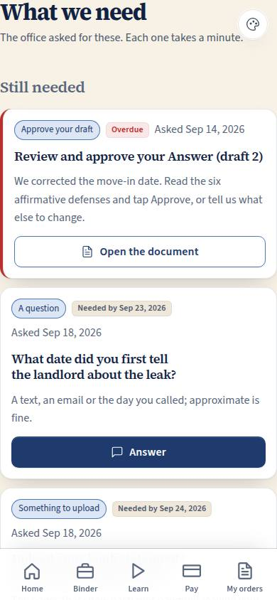
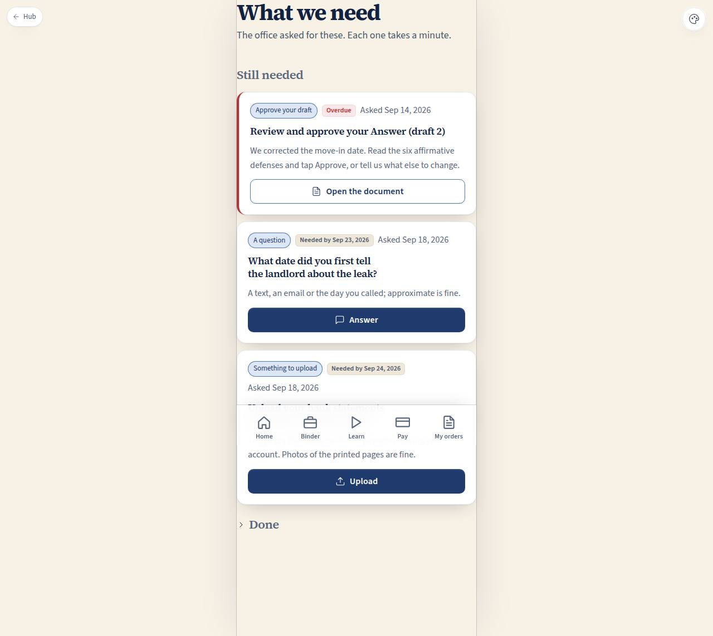

# C-21 · What we need from you

## Purpose

One checklist of everything the office has asked this tenant for - a document or photo, an answer to a question, a draft to read, an approval, a signature, a payment - with the upload sheet one tap away. Uploading answers the request in the same action, so an order stops waiting on the client without anyone making a phone call.

## Screenshots

| 390 | 1280 |
| --- | --- |
|  |  |

Working shots this pass: `binder/c21-390.png`, `binder/c21-sheet-390.png` (the UploadSheet open).

## Sections (layout order)

1. **PageHeader** — "What we need".
2. **Still needed** — open requests, soonest due at the top: kind chip, due badge (overdue in words and colour), the prompt, why we need it, and the one action that fits the kind.
3. **Upload sheet** (Drawer) — for `item` requests.
4. **Answer box** — for `question` requests, inline under the card.
5. **Done** — received and answered requests, collapsible, each showing what was uploaded or what was answered.

## Data

| Table | Read / write | Notes |
| --- | --- | --- |
| `client_requests` | read + write | `status`, `answer`, `answered_at`, `evidence_item_id` on the client's own rows |
| `evidence_items` | read + insert | the upload lands here with `status = new` and `request_id` |
| `orders` | read | review / approval / signature / payment hand off to the order page |
| `cases` | read | which case is mine |

## Rules

- `RULE-EVID-01` — only my own requests and my own uploads.
- `RULE-EVID-04` — the file is hashed and downscaled in the browser before the row is written; the chain of custody starts with "received from the client in answer to a request".
- `RULE-EVID-06`, `RULE-PIPE-07` — the upload sets the request to `received` with `answered_at` and `evidence_item_id` in the same action.

## Actions (manifest)

| Id | Intent | Permission | Params | Live |
| --- | --- | --- | --- | --- |
| `binder.openUpload` | upload the rent ledger they asked for | `evidence.write` | `requestId: id` | yes |
| `binder.upload` | save this file to my binder and answer the request | `evidence.write` | `requestId: id` | yes (opens the sheet; the sheet's save writes) |
| `binder.answerQuestion` | answer the question the office asked | `orders.read_own` | `requestId: id, text: string` | yes (writes directly when `text` is given) |
| `binder.openOrder` | open the draft they want me to approve | `orders.read_own` | `id: id` | yes (hands off to the pipeline module's order page) |
| `binder.openBinder` | open my binder | `evidence.read_own` | — | yes |

## Logic

- Open requests first, sorted by due date; then received and answered, newest first.
- `?request=<id>` opens that request straight away (the "What is missing" strip on C-20 links here with it).
- An item request writes one `evidence_items` row per file (`source` camera for a photo, otherwise upload), then flips the request; a question writes `answer` + `status = answered`; review / approval / signature / payment navigate to `/app/orders/:id`.
- Overdue is computed from `due_at` and shown as the word "Overdue" plus a red badge and a red left border.

## Components

`PageHeader`, `Card`, `Section`, `Chip`, `Badge`, `StatusBadge`, `Button`, `Textarea`, `EmptyState`, `Toast`, `Icon`, **`UploadSheet`**, **`EvidenceCard`**.

## Placeholders

None on this page: every control writes. (The channel a request was sent on - app, email, SMS - is recorded but real delivery is the Pass 3 comms seam.)

## Real vs mock

Real: the checklist, the upload with hashing and downscaling, the request flip, the question answer. Mock: no file bytes leave the browser; the order pages this links to belong to the pipeline module.

## Inputs and responsive check (P-01, P-03)

Checked at 360, 390, 768, 1280, 1920, 2560, 3840, light and dark, English and Spanish. One card per row on a phone; each card has exactly one primary action at 44 px full width. The upload sheet is reachable and completable by keyboard alone (buttons instead of drag and drop, labelled fields, a footer whose primary action is last).

## Changelog

- `docs/changelog/_pending/binder.md`

## Resumen en español

C-21 es la lista de lo que la oficina pidió al inquilino: subir algo, responder una pregunta, revisar o aprobar un borrador, firmar o pagar. Subir un archivo lo guarda en la carpeta y marca la petición como recibida en la misma acción, así el pedido deja de esperar al cliente.
