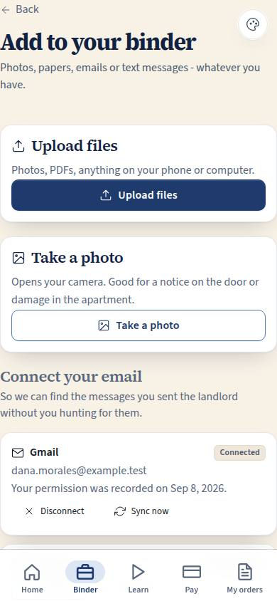
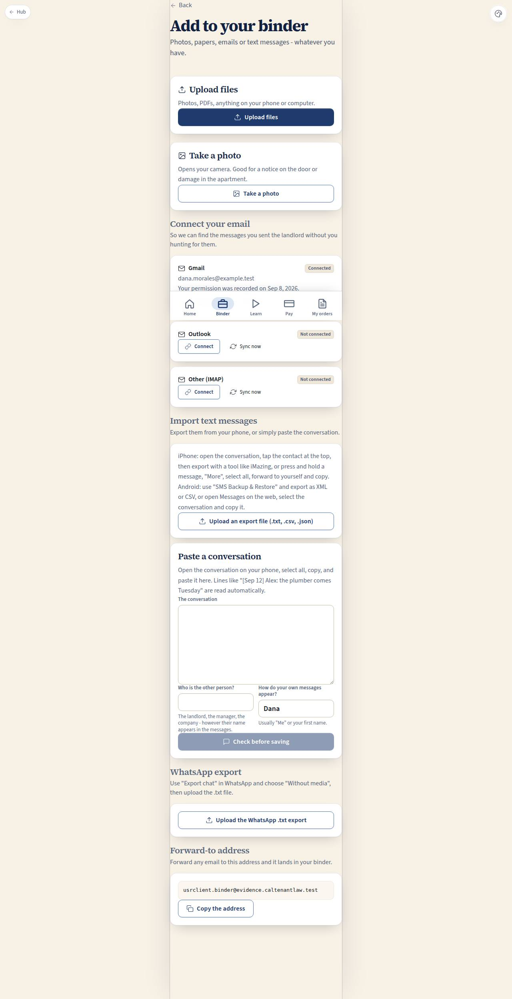

# C-22 · Add to your binder

## Purpose

Every way evidence gets in, on one screen, and effortless on a phone: upload files, take a photo, connect a mailbox after a plain-language consent step, import or paste text messages, drop in a WhatsApp export, or forward an email to a personal address. This is Justin's ask - "the client's ability to upload evidence, or connect their email and text messages" - made real for the parts we can do in the browser today, with the provider work honestly marked as not wired.

## Screenshots

| 390 | 1280 |
| --- | --- |
|  |  |

Working shots this pass: `binder/c22-390.png`, `binder/c22-es-390.png`, `binder/c22-import-390.png` (the review step after pasting a conversation).

## Sections (layout order)

1. **PageHeader**; when `?request=<id>` is set, the request being answered sits at the top.
2. **Upload files** — opens the UploadSheet.
3. **Take a photo** — the same sheet with the camera button (`capture="environment"` opens the camera on a phone).
4. **Connect your email** — Gmail, Outlook, other IMAP; each shows its connection status and consent date; connecting opens the consent step; "Sync now" is a Placeholder.
5. **Import text messages** — iPhone and Android instructions, an export upload (.txt, .csv, .json), and "Paste a conversation" with the two naming fields.
6. **WhatsApp export** — the standard "Export chat / Without media" .txt file.
7. **Forward-to address** — a per-client address, Placeholder until the mailbox exists.
8. **Check before saving** — a Modal with the message count, the date range, the participants and the first twelve messages.

## Data

| Table | Read / write | Notes |
| --- | --- | --- |
| `evidence_items` | insert | uploads and one row per imported thread (`text_thread` / `email`) |
| `evidence_messages` | insert | one row per imported message, verbatim |
| `evidence_connections` | read + insert + update | consent, status, `items_imported`, `last_sync_at` |
| `client_requests` | read + update | `?request=<id>` is answered by the upload or the import |
| `cases` | read | which case the items belong to |

## Rules

- `RULE-EVID-03` — the parsers keep the original text; a line that matches no pattern is kept as its own message, and the review step states the count, the range, the participants and how many lines were unreadable.
- `RULE-EVID-04` — SHA-256 and the canvas downscale run in the browser; the chain of custody records how it arrived.
- `RULE-EVID-05` — a mailbox is read only after the consent step; agreeing writes `consent_at` and `consent_text_version`; without it the row stays `pending_consent`.
- `RULE-EVID-06` — an upload or import made from a request answers it.

## Actions (manifest)

| Id | Intent | Permission | Params | Live |
| --- | --- | --- | --- | --- |
| `binder.openUploadSheet` | upload files to my binder | `evidence.write` | — | yes |
| `binder.takePhoto` | take a photo for my binder | `evidence.write` | — | yes |
| `binder.saveUpload` | save what I just picked | `evidence.write` | `requestId: id` | yes (through the sheet's save) |
| `binder.connectEmail` | connect my gmail so you can find the landlord emails | `evidence.write` | `provider: gmail\|outlook\|imap` | yes (consent + row; real sync is T-072) |
| `binder.giveConsent` | I agree, connect it | `evidence.write` | `connectionId: id` | yes |
| `binder.disconnect` | disconnect my email | `evidence.write` | `connectionId: id` | yes |
| `binder.importTexts` | import my text message export | `evidence.write` | `channel: sms\|whatsapp` | yes |
| `binder.pasteConversation` | paste my texts with the landlord | `evidence.write` | — | yes |
| `binder.saveImport` | save these messages to my binder | `evidence.write` | `channel: sms\|whatsapp\|email` | yes |
| `binder.showForwardAddress` | show me the address I can forward emails to | `evidence.write` | — | stub (T-072) |
| `binder.openBinder` | open my binder | `evidence.read_own` | — | yes |

## Logic

- Three line shapes are parsed (`[date] Name: text`, `Name (date): text`, `date - Name: text`), plus CSV and JSON exports; direction comes only from the names the client says are their own.
- Saving an import writes the connection (creating a `manual_paste`, `ios_export`, `android_export` or `whatsapp_export` row with consent recorded), one `evidence_items` thread row of kind `text_thread` or `email`, one `evidence_messages` row per message, and bumps `items_imported`.
- Dates that cannot be read fall back to the import time and are counted, never silently invented.

## Components

`PageHeader`, `Card`, `Section`, `Badge`, `StatusBadge`, `Button`, `Input`, `Textarea`, `Modal`, `Placeholder`, `Toast`, `Icon`, **`UploadSheet`**.

## Placeholders

- "Sync now" on each mailbox — T-072 real mailbox sync (Pass 3).
- "Copy the address" under the forward-to address — T-072 forward-to mailbox (Pass 3).

## Real vs mock

Real: the consent record, every parser, the review step and all the writes. Mock: no mailbox is contacted and no SMS provider exists yet; connecting moves the row to `connected` and imports nothing by itself, which is exactly what the Placeholders say.

## Inputs and responsive check (P-01, P-03)

Checked at 360, 390, 768, 1280, 1920, 2560, 3840, light and dark, English and Spanish. Every card has one full-width action; the sheet works with buttons only; the file inputs are visually hidden but driven by labelled 44 px buttons; the paste box is an ordinary textarea, so a pen, a keyboard or a screen reader can complete the flow.

## Changelog

- `docs/changelog/0024-binder.md`

## Resumen en español

C-22 reúne todas las formas de agregar pruebas: subir archivos, tomar una foto, conectar el correo tras un paso de consentimiento en lenguaje claro, importar o pegar mensajes de texto, subir una exportación de WhatsApp o usar una dirección de reenvío. Los analizadores y el consentimiento son reales; la sincronización con proveedores reales está marcada como no cableada (T-072).
