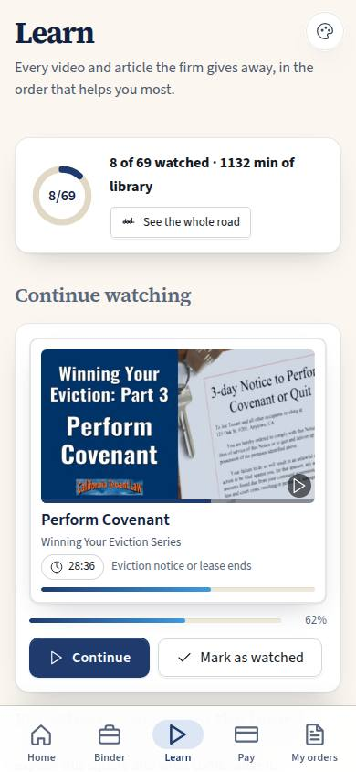
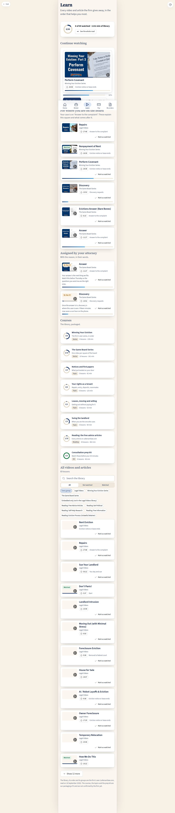

# C-40 · Client learning

## Purpose

The tenant opens one screen and knows what to watch next. Justin's ask was "set up the LMS system from the content like videos and such", and the brief behind it is that **the system knows what a customer has and has not watched, so content is provided throughout their journey**. So this screen is not a playlist: it is where they left off, what matters at the square their case is standing on right now, what their attorney asked them to watch and why, the courses the free library is packaged into, and then the whole library with a search and a watched filter. It replaces C-03 at `/app/learn` (C-03 was the flat list of 36 videos).

`/app/learn/next` is the same page scrolled to the next-up section (the path reserved for C-40 in `src/flows/roleFlows.ts` `PLANNED_PATHS`), so "what do I watch next" is one address a voice controller or an agent can open.

## Screenshots

| 390 | 1280 |
| --- | --- |
|  |  |

Dark: `../screenshots/C-40/390-dark.jpg`. TV: `../screenshots/C-40/3840.jpg`. Captured this pass against the dev server at 360, 390, 1280, 2560 and 3840 plus Spanish + dark at 390; `npm run screenshots -- --codes=C-40,C-41,C-42,L-40,A-11` writes them into `docs/screenshots/` at integration (it needs a build, which module workers do not run).

## Sections (layout order)

1. **PageHeader** — title and the one-line purpose.
2. **Overall progress** — a ring (`8/69`), the watched count and the minutes of library, and a link to the journey (C-41).
3. **Continue watching** — the lesson with the highest watched percentage strictly between 1 and 89, most recently touched first. When nothing is started the section becomes **Start here** with the first unwatched lesson of the consultation prep kit.
4. **For where you are on the board** — lessons whose `teaches_stage_node_ids` contain the case's square or the `board_node_id` of any open order, then lessons whose `teaches_phases` contain one of those phases. Empty state when the case is not on the board yet.
5. **Assigned by your attorney** — `lesson_assignments`, soonest due first, with the reason verbatim and a due badge (danger once it is past).
6. **Courses** — one card per published course for clients: a progress ring of required lessons done / total, the kind (series, topic, reading, kit) and the estimated minutes.
7. **All videos and articles** — search, group chips, a watched / not-watched segmented control, and the list twelve at a time behind a **Show more** button.
8. **Source note** — what is the firm's own and what is our packaging (RULE-LEARN-06).

## Data

| Table | Read / write | Notes |
| --- | --- | --- |
| `lessons` | read | The 36 videos (D-043) and the 33 articles seeded by the learning seed |
| `lesson_progress` | read + write | "Mark as watched" writes 100 % and `completed_at` by id |
| `courses` | read | Published, audience client or public |
| `course_lessons` | read | Order, required, unlock rule |
| `lesson_assignments` | read | What the attorney asked for, with the reason |
| `cases` | read | The square the client is on |
| `orders` | read | Open document orders and their `board_node_id` |
| `illustrations` | read | The firm's own scraped video thumbnails |

## Rules

- `RULE-LEARN-01` — progress is per person and monotonic; "Mark as watched" is a real write, never a local flag.
- `RULE-LEARN-03` — a locked lesson is dimmed with its reason, never hidden.
- `RULE-LEARN-04` — an assignment carries a reason and a due date and is shown in the attorney's words.
- `RULE-LEARN-06` — the library's order is the firm's; our course cut says that it is ours.
- `RULE-LEARN-07` — nothing here is a paywall.

## Actions (manifest)

| Id | Intent | Permission | Params | Live |
| --- | --- | --- | --- | --- |
| `learning.openLesson` | play the video about {lesson} | `lessons.read` | `id: id` | yes |
| `learning.continueWatching` | carry on where I left off | `lessons.read` | — | yes |
| `learning.openCourse` | open the course {course} | `lessons.read` | `id: id` | yes |
| `learning.openJourney` | show me what to watch at each stage of my case | `lessons.read` | — | yes |
| `learning.markWatched` | mark {lesson} as watched | `lessons.read` | `id: id` | yes |
| `learning.search` | find the video about {words} | — | `q: string` | yes |
| `learning.filterGroup` | show only the videos in {group} | — | `group: string` | yes |
| `learning.filterWatched` | show only the ones I have not watched | — | `state: enum` | yes |
| `learning.showMore` | show more of the library | — | — | yes |

## Logic

- Continue watching prefers the most recently updated part-watched row, so coming back lands on the right video.
- "For where you are" is squares first, then the phase, capped at six so the section stays a section.
- A course's ring counts **required** lessons; when a course has none, every lesson counts.
- The all-videos list resets to twelve whenever a filter changes.
- Everything a super admin previewing the client app sees is the demo client's (`usr_client`), exactly as C-01 does.

## Components

`PageHeader`, `Section`, `Card`, `LessonCard` (new), `ProgressRing` (new), `ProgressBar`, `SearchInput`, `SegmentedControl`, `Chip`, `Badge`, `Button`, `EmptyState`, `DocPreview`, `Icon`.

## Placeholders

None on this page. The player's "Ask about this" and transcript are Placeholders on C-42.

## Real vs mock

Real: progress reads and writes, assignments, courses, the thumbnails (bundled from the firm's own scrape). Mocked: nothing on this page is faked; the data is the mock database and moves to Supabase behind the same `DataProvider`.

## Inputs and responsive check (P-01, P-03)

Checked at 360, 390, 768, 1280, 1920, 2560, 3840 (light; 390 also dark and Spanish). One focusable per lesson (picture + title), then its actions; chips and the segmented control are real buttons with `aria-pressed` / `role="radio"`; every target is at least 44 px; nothing is hover-only and nothing is drag-only. At 2560 and 3840 the client app stays the shell's 430 px column and `--scale` lifts type and spacing (the wide-screen treatment lives on C-42, where the video is).

## Changelog

- `docs/changelog/0023-learning.md`

## Resumen en español

Pantalla de aprendizaje del inquilino: dónde se quedó, qué ver según la casilla del tablero en la que está su caso, lo que su abogado le pidió y por qué, los cursos con su progreso, y toda la biblioteca con buscador y filtro de vistos. Sustituye a C-03.
