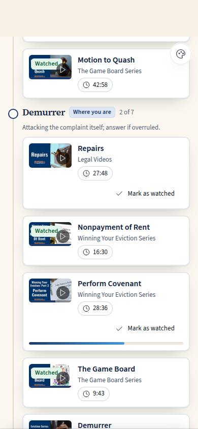
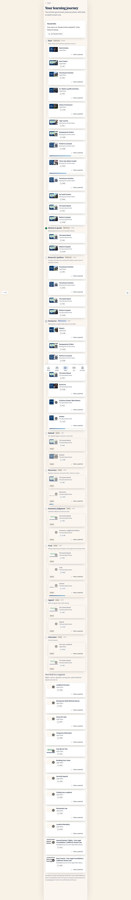

# C-41 · Learning journey

## Purpose

The eviction game board read as a curriculum. Ten phases as one vertical path: what each phase is, what to watch at it, ticks for what is done, dimmed lessons for the phases still ahead with the reason, and the tenant's own phase highlighted and scrolled to on open. It answers the question C-40 cannot: *how long is this road, and where do the videos sit on it.*

## Screenshots

| 390 | 1280 |
| --- | --- |
|  |  |

## Sections (layout order)

1. PageHeader (back to Learn).
2. **You are here** — the square and the phase in plain words, and a link to the game board (GB-01).
3. **The path** — one block per phase in poster order (start, motion to quash, removal / petition, demurrer, default, discovery, summary judgment, trial, appeal, outcomes): the phase label, the board's own description, a done count, and its lessons.
4. **Not tied to a square** — rights, repairs, deposits, moving out: useful whatever square you are on.
5. Source note.

## Data

| Table | Read / write | Notes |
| --- | --- | --- |
| `lessons` | read | `teaches_phases` and `teaches_stage_node_ids` place a lesson on the path |
| `lesson_progress` | read + write | Ticks, and "Mark as watched" |
| `cases` | read | The square that highlights a phase |
| `orders` | read | Open orders' squares also count as "live" |
| `illustrations` | read | Thumbnails |

Phases and squares come from `docs/game-board/nodes.json` (imported at build time; the docs tree stays the single source of truth).

## Rules

- `RULE-LEARN-01` — a tick means a real `lesson_progress` row at 90 % or more.
- `RULE-LEARN-03` — a lesson of a phase the case has not reached is dimmed with the reason and stays clickable.
- `RULE-LEARN-07` — the road is information, not a gate.

## Actions (manifest)

| Id | Intent | Permission | Params | Live |
| --- | --- | --- | --- | --- |
| `learning.openLesson` | play the video about {lesson} | `lessons.read` | `id: id` | yes |
| `learning.openPhase` | show me the videos for the {phase} phase | — | `phase: string` | yes |
| `learning.openBoard` | open the game board | `board.read` | — | yes |
| `learning.markWatched` | mark {lesson} as watched | `lessons.read` | `id: id` | yes |

## Logic

- A lesson belongs to a phase when `teaches_phases` names it or one of `teaches_stage_node_ids` is a square of it; a lesson can appear in more than one phase, because the videos do.
- Phases before the case's phase read "Behind you", the case's phase reads "Where you are" and is scrolled into view, later phases read "Ahead" and dim their lessons.
- With no case open, nothing is dimmed: the whole road is ahead.

## Components

`PageHeader`, `Section`, `Card`, `LessonCard`, `Badge`, `Chip`, `Button`, `Icon`, `DocPreview`.

## Placeholders

None.

## Real vs mock

Real: the phases, the squares, the mapping from video to square (all from the scrape and the board JSON), the progress. Nothing is faked.

## Inputs and responsive check (P-01, P-03)

Checked at 360, 390, 768, 1280, 1920, 2560, 3840. The rail is drawn with a pseudo-element, so the list is still a plain `<ol>` for a screen reader; each lesson is one focusable; the scroll-into-view is `block: 'center'` and never traps focus.

## Changelog

- `docs/changelog/_pending/learning.md`

## Resumen en español

El tablero del desalojo leído como plan de estudios: diez fases en un camino vertical, qué ver en cada una, lo ya visto marcado, lo que aún no toca en gris con el motivo, y la fase actual del caso resaltada.
