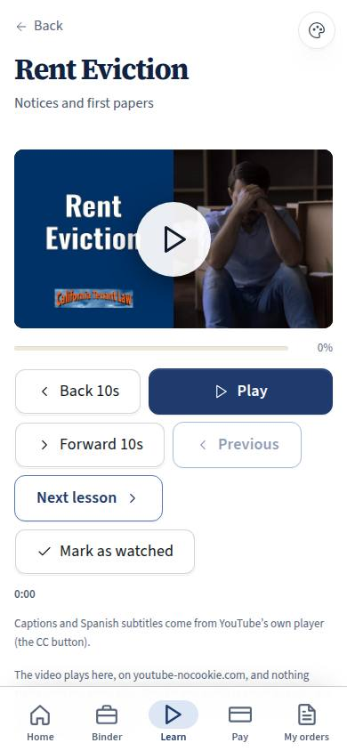
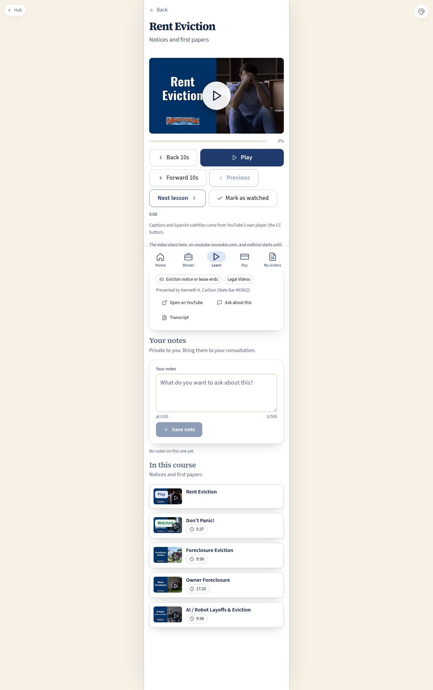

# C-42 · Lesson player

## Purpose

Watch one lesson in the app and have it count. The video plays inside the page on youtube-nocookie.com, the position the person actually reaches is written to `lesson_progress` about every ten seconds, and the next lesson of the course is one large button away — on a phone, at a desk, and on a television across the room.

## Screenshots

| 390 | 1280 |
| --- | --- |
|  |  |

TV: `../screenshots/C-42/3840.jpg`.

## Sections (layout order)

1. PageHeader (back to Learn; the course is the subtitle).
2. **VideoPlayer** — click-to-play since 0.2.0: the lesson's real thumbnail (drawn poster with the title as the fallback) under one large Play button; the youtube-nocookie embed is created only when it is pressed; then a labelled progress bar, and the 10-foot control row: Back 10s · **Play** · Forward 10s · Previous · Next lesson · Mark as watched. An article lesson shows the reading card instead (`DocPreview`, the reading time and the link to the firm's page).
3. **Player note** — where the video plays, that nothing starts on its own, that the watched position is saved, and the keyboard keys.
4. **LessonMeta** — watched badge, length, the board square, the group, the presenter, Open on YouTube, Ask about this (Placeholder), Transcript (Placeholder).
5. **Your notes** — a note pinned to the second the player is at; private to the person who wrote it.
6. **In this course** — the lessons around this one, the current one marked.

## Data

| Table | Read / write | Notes |
| --- | --- | --- |
| `lessons` | read | The video id, length, square, presenter |
| `lesson_progress` | read + write | Written from the player and by the fallback button |
| `lesson_notes` | read + write + delete | Only the signed-in person's own |
| `courses`, `course_lessons` | read | Previous / next and the course list |
| `illustrations` | read | Thumbnails in the course list |

## Rules

- `RULE-LEARN-01` — measured progress, monotonic, `completed_at` at 90 %.
- `RULE-LEARN-05` — nothing autoplays and nothing third-party loads before Play: poster first, youtube-nocookie.com on press, no third-party script loaded (0.2.0 release: was a paused `autoplay=0` iframe, whose storage access threw a console error in a third-party context).
- `RULE-LEARN-03`, `RULE-LEARN-07` — nothing is gated.

## Actions (manifest)

| Id | Intent | Permission | Params | Live |
| --- | --- | --- | --- | --- |
| `learning.play` | play the video | `lessons.read` | — | yes (says how; the player never starts itself) |
| `learning.pause` | pause the video | `lessons.read` | — | yes |
| `learning.markWatched` | mark this lesson as watched | `lessons.read` | `id: id` | yes |
| `learning.nextLesson` | go to the next lesson | `lessons.read` | — | yes |
| `learning.prevLesson` | go back to the previous lesson | `lessons.read` | — | yes |
| `learning.addNote` | note this moment of the video | `lessons.read` | `body: string, seconds: number` | yes |
| `learning.deleteNote` | delete my note | — | `id: id` | yes |
| `learning.openOnYoutube` | open this video on YouTube | — | `id: id` | yes |
| `learning.askAboutLesson` | ask my legal team about this video | `messages.write` | — | stub (Pass 3 messages) |
| `learning.openTranscript` | show the transcript of this video | — | — | stub |

## Logic

- The embed, created on Play (inside the user gesture, so `autoplay=1` is allowed), is `https://www.youtube-nocookie.com/embed/<id>?enablejsapi=1&origin=<origin>&rel=0&modestbranding=1&playsinline=1&autoplay=1&cc_load_policy=1`; before that the player is a poster button (`data-armed="false"`) and Space / the Play button / Back / Forward all start it. A new lesson id resets to its poster.
- The page posts `{"event":"listening"}` to the frame for the first eight seconds; the frame answers with `infoDelivery` / `onStateChange` messages carrying `currentTime`, `duration` and `playerState`. Writes happen at most once per ten seconds of playback, on pause and on end (100 %).
- `watched_pct` never decreases, so re-watching the opening does not undo a finished lesson.
- If the postMessage channel is blocked (a privacy extension, an offline demo, a locked-down network) the player still shows and **Mark as watched** writes the same row: the page is never a dead end.
- Previous / next follow the course in `?course=`, else the course the lesson belongs to, else the library order.
- Space plays and pauses (unless focus is in a field or on another button); the left and right arrows move to the previous and next lesson — the whole player works from a d-pad (P-04).
- An article lesson has no video: it shows the reading card and "Mark as read" writes the same progress row.

## Components

`PageHeader`, `VideoPlayer` (new), `Card`, `Section`, `LessonCard`, `Button`, `Textarea`, `Badge`, `Chip`, `Placeholder`, `DocPreview`, `EmptyState`, `Icon`.

## Placeholders

- **Ask about this** — Pass 3 messages.
- **Transcript** — a later content pass; transcripts are not part of the 2026-09-18 scrape.

## Real vs mock

Real: the embed, the progress writes, the notes, previous / next, the course list. Mocked: nothing; the video itself is YouTube's, so in an offline demo the frame stays empty and the fallback button carries the page.

## Inputs and responsive check (P-01, P-03, P-04)

Checked at 360, 390, 768, 1280, 1920, 2560, 3840. Every control is a labelled `Button` at 44 px or more, 64 px at TV widths; one primary action (Play). **From 1920 up the page steps out of the shell's 430 px phone column and centres on the viewport**, so a television shows the video at full width with one row of large controls — done entirely in this module's CSS (`.lrn-player`), with nothing in `src/app` or `src/components/template` touched, and with the frame height capped so the control row always clears the sticky BottomNav.

## Changelog

- `docs/changelog/0023-learning.md`

## Resumen en español

Reproductor de la lección dentro de la app (youtube-nocookie.com, sin reproducción automática): guarda cuánto se vio de verdad, tiene botones grandes de anterior y siguiente, notas ancladas al segundo del video, y en pantallas de 1920 px o más ocupa todo el ancho para verlo en televisión.

Release 0.2.0 (`docs/changelog/0029-release-0.2.0.md`): click-to-play player, poster from the lesson thumbnail; the QA matrix no longer sees the third-party storage error.
