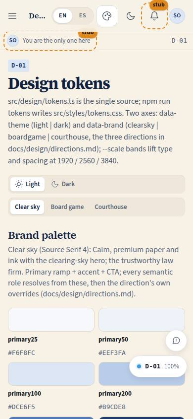
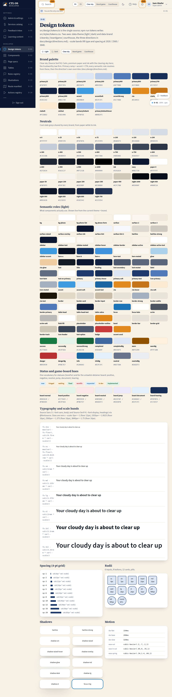

# D-01 · Design tokens

## Purpose

Every design value in one place, live from the current theme and brand: brand palettes (CTL navy & sky, Clear sky teal), neutrals, semantic roles, status and game-board hues, the type scale with its `--scale` bands, spacing, radii, shadows and motion. `src/design/tokens.ts` is the single source; `npm run tokens` writes `src/styles/tokens.css`.

## Screenshots

| 390 | 1280 |
| --- | --- |
|  |  |

Dark and 3840 captures are produced by `npm run screenshots -- --codes=D-01 --dark --widths=390,1280,3840` (screenshot pass pending; folder created by the pass).

## Sections (layout order)

1. PageHeader - theme and brand SegmentedControls
2. Brand palette - primary ramp, accent, CTA swatches of the active brand
3. Neutrals
4. Semantic roles (theme) - every `--color-*` live
5. Status and game-board hues - StatusBadges + board swatches (positive, negative, neutral, jump, document, hearing)
6. Typography and scale bands - the type scale rendered with the firm's tagline
7. Spacing and radii
8. Shadows and motion

## Data

| Table | Read / write | Notes |
| --- | --- | --- |
| `page_layouts` | read | layout order seam (useLayout) |

## Rules

- `RULE-SYS-01`

## Actions (manifest)

| Id | Intent | Permission | Params | Live |
| --- | --- | --- | --- | --- |
| `dev.setTheme` | switch between light and dark | none | `theme: enum:light,dark` | yes |
| `dev.setBrand` | switch the brand palette | none | `brand: enum:ctl,clearsky` | yes |

## Logic

- `buildTokensCss()` renders :root scales, `@media (min-width)` bands for `--scale` / `--fs-floor`, then one block per brand x theme

## Components

PageHeader, Section, Card, SegmentedControl, Badge, StatusBadge

## Placeholders

None.

## Real vs mock

Real; tokens are code.

## Inputs and responsive check (P-01, P-03)

Checked at 360, 390, 768, 1280, 1920, 2560, 3840 in light and dark by `npm run qa:responsive` (foundation pass, 2026-09-18): no horizontal scroll, no console errors, no text under 12 px (16 px at >= 1920). Keyboard: every control is a native button, link or select; visible 3 px focus ring; 44 px targets; tooltips open on focus.

## Changelog

- `docs/changelog/0002-foundation.md` (to be merged into the next numbered entry)

## Resumen en español

Todos los valores de diseño en un solo lugar, en vivo según tema y marca; generados a CSS con `npm run tokens`.
