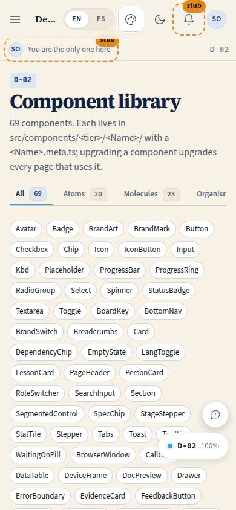

# D-02 · Component library

## Purpose

Every component with its meta: description, props, states, live usages, accessibility notes and the pages that use it, grouped by tier. Rule: no component without a meta, no meta without a usage; `src/design/library.ts` globs `src/components/**/*.meta.ts`.

## Screenshots

| 390 | 1280 |
| --- | --- |
|  |  |

Dark and 3840 captures are produced by `npm run screenshots -- --codes=D-02 --dark --widths=390,1280,3840` (screenshot pass pending; folder created by the pass).

## Sections (layout order)

1. PageHeader - tier Tabs with counts
2. Chip table of contents (jump to a component)
3. Component cards - name, tier, used-by, description, usages, props table, states, a11y

## Data

| Table | Read / write | Notes |
| --- | --- | --- |
| `page_layouts` | read | seam |

## Rules

- `RULE-SYS-01`

## Actions (manifest)

| Id | Intent | Permission | Params | Live |
| --- | --- | --- | --- | --- |
| `dev.filterTier` | show only one tier of components | none | `tier: enum:all,atom,molecule,organism,template` | stub (page state, handler in a later pass) |
| `dev.jumpToComponent` | scroll to a component by name | none | `name: string` | stub (anchor #Name works) |

## Logic

- `componentLibrary` sorted by tier then name; anchor `#Name` scrolls on load

## Components

PageHeader, Tabs, Card, Badge, Chip, Section

## Placeholders

The two declared actions are served by page state and anchors; handlers are registered in the next dev pass.

## Real vs mock

Real; metas are code.

## Inputs and responsive check (P-01, P-03)

Checked at 360, 390, 768, 1280, 1920, 2560, 3840 in light and dark by `npm run qa:responsive` (foundation pass, 2026-09-18): no horizontal scroll, no console errors, no text under 12 px (16 px at >= 1920). Keyboard: every control is a native button, link or select; visible 3 px focus ring; 44 px targets; tooltips open on focus.

## Changelog

- `docs/changelog/_pending/foundation.md` (to be merged into the next numbered entry)

## Resumen en español

Biblioteca de componentes: cada uno con su ficha (props, estados, ejemplos vivos, accesibilidad y páginas que lo usan).
