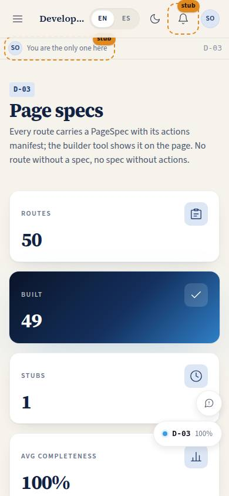
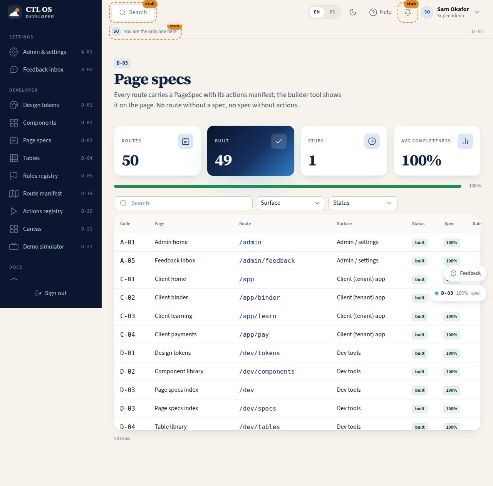

# D-03 · Page specs index

## Purpose

Every route with its page code, surface family, built / stub status, roles, rule count, action count and spec completeness (nine checks including actions); opens the InspectorPanel for any spec.

## Screenshots

| 390 | 1280 |
| --- | --- |
|  |  |

Dark and 3840 captures are produced by `npm run screenshots -- --codes=D-03 --dark --widths=390,1280,3840` (screenshot pass pending; folder created by the pass).

## Sections (layout order)

1. PageHeader
2. StatTiles - routes, built, stubs, average completeness + ProgressBar
3. DataTable - filters by surface family and status; search; row click opens the inspector
4. InspectorPanel (Drawer)

## Data

| Table | Read / write | Notes |
| --- | --- | --- |
| `page_layouts` | read | seam |

## Rules

- `RULE-SYS-01`

## Actions (manifest)

| Id | Intent | Permission | Params | Live |
| --- | --- | --- | --- | --- |
| `dev.openSpec` | open the inspector for a page code | none | `code: string` | yes |

## Logic

- `specCompleteness(spec)`: purpose, layout, data, roles, logic, components, rules, states, actions (an empty `actions: []` passes only with a "no actions" note)
- status = `isStubElement(route.element)` ? stub : built

## Components

PageHeader, StatTile, DataTable, Badge, Button, InspectorPanel, ProgressBar

## Placeholders

None.

## Real vs mock

Real.

## Inputs and responsive check (P-01, P-03)

Checked at 360, 390, 768, 1280, 1920, 2560, 3840 in light and dark by `npm run qa:responsive` (foundation pass, 2026-09-18): no horizontal scroll, no console errors, no text under 12 px (16 px at >= 1920). Keyboard: every control is a native button, link or select; visible 3 px focus ring; 44 px targets; tooltips open on focus.

## Changelog

- `docs/changelog/_pending/foundation.md` (to be merged into the next numbered entry)

## Resumen en español

Índice de todas las rutas con su código, estado, roles y completitud de la especificación; abre el inspector.
