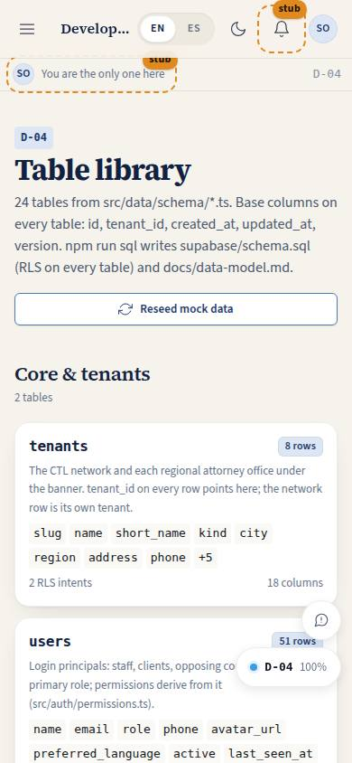
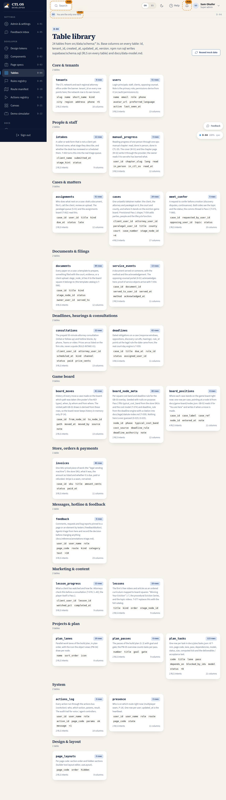

# D-04 · Table library

## Purpose

Every table in the schema grouped by area with live row counts, columns and RLS intent, plus the generic table manager for one table: browse, search, filter by enum, add a row, edit cells in a Drawer, delete with a confirm Modal. Every write goes through the DataProvider and is logged to `actions_log`.

## Screenshots

| 390 | 1280 |
| --- | --- |
|  |  |

Dark and 3840 captures are produced by `npm run screenshots -- --codes=D-04 --dark --widths=390,1280,3840` (screenshot pass pending; folder created by the pass).

## Sections (layout order)

1. PageHeader - reseed button (library) / back, add row (manager)
2. Group Sections with table Cards (library)
3. Breadcrumbs, PageHeader with RLS intents, DataTable, row Drawer, delete Modal (manager)

## Data

| Table | Read / write | Notes |
| --- | --- | --- |
| every table in `tableRegistry` | read / write | generic |
| `actions_log` | write | add / edit / delete are logged |

## Rules

- `RULE-SYS-02` - base columns are read-only; writes by id; tenant_id chosen on insert

## Actions (manifest)

| Id | Intent | Permission | Params | Live |
| --- | --- | --- | --- | --- |
| `dev.reseed` | wipe the mock database and reseed it | `tables.write` | none | yes |
| `dev.addRow` | add a row to the current table | `tables.write` | `table: string` | yes (manager) |
| `dev.deleteRow` | delete a row by id from the current table | `tables.write` | `table: string, id: id` | yes (manager) |

## Logic

- Field editor per column type (text, int / numeric / money, bool, enum, json, date, time, timestamptz, reference select)
- JSON columns are validated before save

## Components

PageHeader, Section, Card, DataTable, Drawer, Modal, Input, Select, Textarea, Checkbox, Button, Badge, Breadcrumbs, EmptyState

## Placeholders

None.

## Real vs mock

Real against MockProvider (localStorage). With Supabase the same page works through the provider; RLS decides what a role sees.

## Inputs and responsive check (P-01, P-03)

Checked at 360, 390, 768, 1280, 1920, 2560, 3840 in light and dark by `npm run qa:responsive` (foundation pass, 2026-09-18): no horizontal scroll, no console errors, no text under 12 px (16 px at >= 1920). Keyboard: every control is a native button, link or select; visible 3 px focus ring; 44 px targets; tooltips open on focus.

## Changelog

- `docs/changelog/_pending/foundation.md` (to be merged into the next numbered entry)

## Resumen en español

Biblioteca de tablas con conteos en vivo y un gestor genérico para ver, añadir, editar y borrar filas de cualquier tabla.
