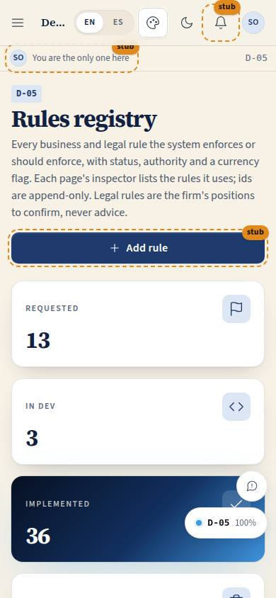
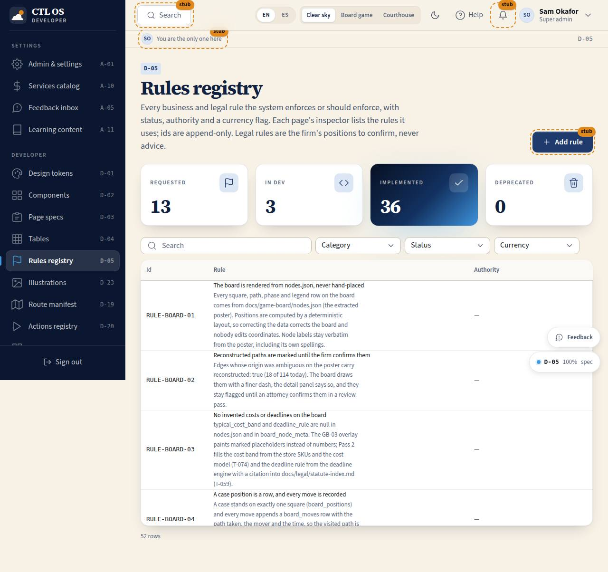

# D-05 · Rules registry

## Purpose

Every business and legal rule the system enforces or should enforce: id, title, description, authority (statute), category, status, the pages that use it and the source. Legal rules seeded from the brief carry a "verify" flag until their currency against 2025-2026 amendments is confirmed in `docs/legal/`; the system shows them as the firm's positions, never as advice.

Access (D-048, 2026-09-20): `super_admin` only (was super_admin, owner, attorney), like every other developer page; attorneys read the legal rules through legal memory (K-10..K-13), where every rule's authority is cited.

## Screenshots

| 390 | 1280 |
| --- | --- |
|  |  |

Dark and 3840 captures are produced by `npm run screenshots -- --codes=D-05 --dark --widths=390,1280,3840` (screenshot pass pending; folder created by the pass).

## Sections (layout order)

1. PageHeader - Add rule (Placeholder until the settings-rules module)
2. StatTiles per status
3. DataTable - filters by category, status and currency; search; status change is a Placeholder for editors

## Data

| Table | Read / write | Notes |
| --- | --- | --- |
| `page_layouts` | read | seam; runtime rules table comes with the settings-rules module |

## Rules

- `RULE-SYS-01`, `RULE-UD-01` and every rule in `src/rules/*.ts` are displayed here

## Actions (manifest)

| Id | Intent | Permission | Params | Live |
| --- | --- | --- | --- | --- |
| `dev.addRule` | request a new rule | `rules.write` | none | yes (returns "not wired yet") |

## Logic

- Code registry merged by id (pages union, most advanced status)

## Components

PageHeader, StatTile, DataTable, Badge, StatusBadge, Button, Placeholder, Tooltip

## Placeholders

Add rule and status change: `Placeholder` with plannedIn "settings-rules module".

## Real vs mock

Rules are code today; a `rules` table for owner-requested rules arrives with the settings-rules module.

## Inputs and responsive check (P-01, P-03)

Checked at 360, 390, 768, 1280, 1920, 2560, 3840 in light and dark by `npm run qa:responsive` (foundation pass, 2026-09-18): no horizontal scroll, no console errors, no text under 12 px (16 px at >= 1920). Keyboard: every control is a native button, link or select; visible 3 px focus ring; 44 px targets; tooltips open on focus.

## Changelog

- `docs/changelog/0002-foundation.md` (to be merged into the next numbered entry)

## Resumen en español

Registro de reglas de negocio y legales con estado, autoridad y bandera de verificación; las reglas legales son posiciones del despacho por confirmar, no asesoría.
