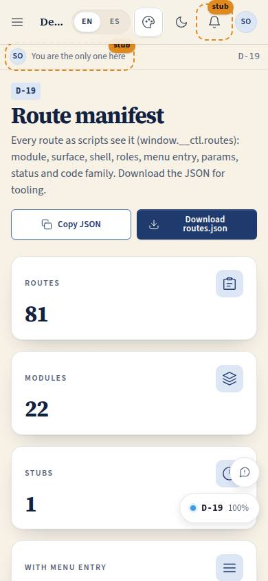
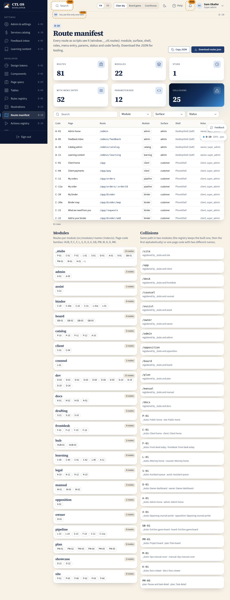

# D-19 · Route manifest

## Purpose

Every route as scripts see it (`window.__ctl.routes`): module, surface, shell, roles, menu entry, params, status and code family; collisions between modules; copy or download the JSON that screenshots and QA read.

## Screenshots

| 390 | 1280 |
| --- | --- |
|  |  |

Dark and 3840 captures are produced by `npm run screenshots -- --codes=D-19 --dark --widths=390,1280,3840` (screenshot pass pending; folder created by the pass).

## Sections (layout order)

1. PageHeader - Copy JSON, Download routes.json
2. StatTiles - routes, modules, stubs, menu entries, parameterised, collisions
3. DataTable with filters (module, surface, status)
4. Modules (routes per module) and Collisions

## Data

| Table | Read / write | Notes |
| --- | --- | --- |
| `page_layouts` | read | seam |

## Rules

- `RULE-SYS-01`

## Actions (manifest)

| Id | Intent | Permission | Params | Live |
| --- | --- | --- | --- | --- |
| `dev.downloadManifest` | download the route manifest as JSON | none | none | yes |
| `dev.copyManifest` | copy the route manifest to the clipboard | none | none | yes |

## Logic

- `buildManifest(routes)`; family check = code prefix's surface matches the route surface (public is exempt)

## Components

PageHeader, StatTile, DataTable, Badge, Button, Chip, Card, Section

## Placeholders

None.

## Real vs mock

Real.

## Inputs and responsive check (P-01, P-03)

Checked at 360, 390, 768, 1280, 1920, 2560, 3840 in light and dark by `npm run qa:responsive` (foundation pass, 2026-09-18): no horizontal scroll, no console errors, no text under 12 px (16 px at >= 1920). Keyboard: every control is a native button, link or select; visible 3 px focus ring; 44 px targets; tooltips open on focus.

## Changelog

- `docs/changelog/0002-foundation.md` (to be merged into the next numbered entry)

## Resumen en español

Manifiesto de rutas tal como lo leen los scripts, con módulo, superficie, shell, roles y colisiones; descarga el JSON.
