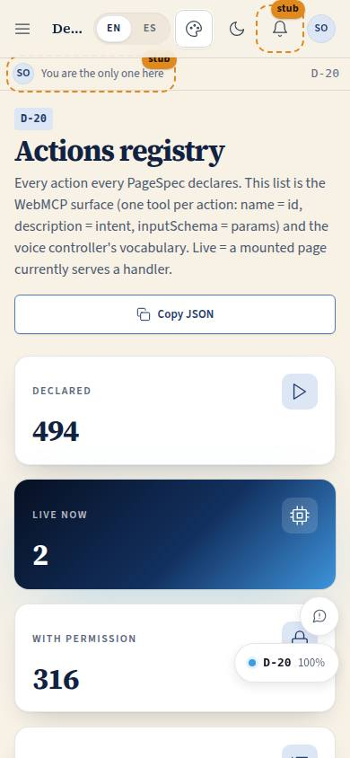
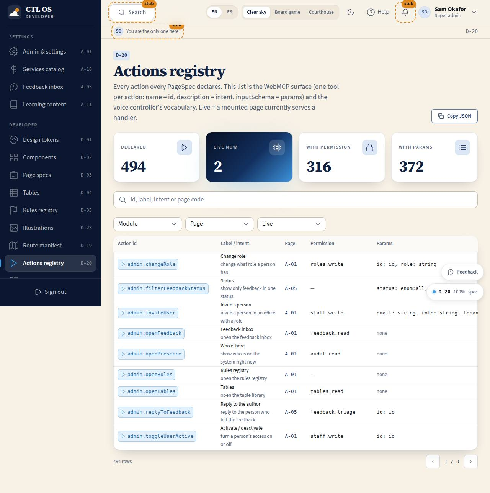

# D-20 · Actions registry

## Purpose

Every action every PageSpec declares: id, label, intent, permission, params, the page that owns it and whether a mounted page currently serves a live handler. Run param-less actions from here; each run is logged to `actions_log`. This list is the WebMCP surface (one tool per action: name = id, description = intent, inputSchema = params) and the voice controller's vocabulary.

## Screenshots

| 390 | 1280 |
| --- | --- |
|  |  |

Dark and 3840 captures are produced by `npm run screenshots -- --codes=D-20 --dark --widths=390,1280,3840` (screenshot pass pending; folder created by the pass).

## Sections (layout order)

1. PageHeader - Copy JSON (actions manifest)
2. StatTiles - declared, live now, with permission, with params
3. SearchInput + DataTable with filters (module, page, live) and a Run button per param-less action
4. Last result Card

## Data

| Table | Read / write | Notes |
| --- | --- | --- |
| `actions_log` | write | one row per run: user, action, params, ok, message, source |

## Rules

- `RULE-SYS-01` - every page's controls are in this list

## Actions (manifest)

| Id | Intent | Permission | Params | Live |
| --- | --- | --- | --- | --- |
| `dev.runAction` | run an action by id with no parameters | `actions.run` | `id: string` | yes |
| `dev.copyActions` | copy the actions manifest to the clipboard | none | none | yes |

## Logic

- `listActions()` = `catalogActions(getRoutes())` + `hasHandler(id)`; re-renders on `onActionsChange`
- `runAction(id, {}, can)` refuses without permission or a live handler and always returns a readable result

## Components

PageHeader, StatTile, DataTable, Badge, Button, SearchInput, DependencyChip, Spinner, Card

## Placeholders

None.

## Real vs mock

Real. WebMCP / voice controllers are planned surfaces (docs/reference/surfaces.md §2).

## Inputs and responsive check (P-01, P-03)

Checked at 360, 390, 768, 1280, 1920, 2560, 3840 in light and dark by `npm run qa:responsive` (foundation pass, 2026-09-18): no horizontal scroll, no console errors, no text under 12 px (16 px at >= 1920). Keyboard: every control is a native button, link or select; visible 3 px focus ring; 44 px targets; tooltips open on focus.

## Changelog

- `docs/changelog/0002-foundation.md` (to be merged into the next numbered entry)

## Resumen en español

Registro de acciones de todas las páginas: id, intención, permiso, parámetros y si hay un manejador activo; ejecuta acciones sin parámetros y registra cada corrida.
