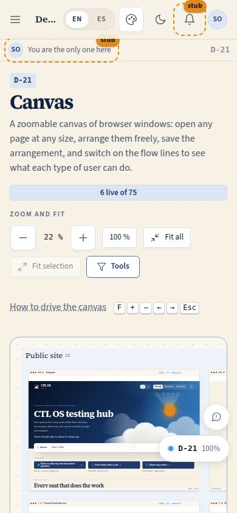
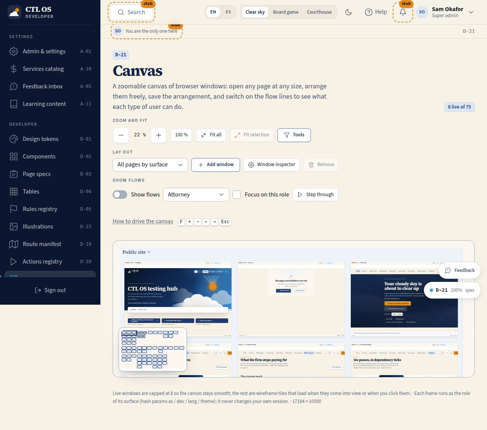

# D-21 · Canvas

## Purpose

Justin, 2026-09-20 (prompt 0006): *"The canvas is supposed to be a zoomable canvas with web browser windows, with adjustable height / width of all the pages/portals. And then even be like a flow chart lines to show the flow of what each type of user can do as a second level of ability in the canvas."*

This is that page (D-049). The canvas is a free-form world you pan and zoom. On it sit **browser windows**: each one is a real page of CTL OS running live in a same-origin iframe, with a title bar, an editable address bar, a role / language / device chip and eight resize handles. You arrange them by hand (or from a preset), size any of them from a 390 px phone to a 3840 px TV, save the arrangement, and switch on the **second level**: the flow of what one type of user can do, drawn as flow-chart lines between the windows in the game board's KEY colours, walkable one step at a time.

It supersedes the shelf-packed viewer built under T-025: that packing survives as the "All pages by surface" preset, and every promise of D-021 (every frame live and usable) still holds.

## Screenshots

| 390 | 1280 |
| --- | --- |
|  |  |

TV: `../screenshots/D-21/3840.jpg` (all 75 windows at 22 % on one 4K frame). The captures are taken shortly after load, so some windows are still booting in them; open the page to see them live.

## Sections (layout order)

1. **PageHeader** — title, live-window counter (`8 live of 75`), page code in dev mode
2. **Toolbar** — three rows on a laptop and up: zoom out / level / zoom in / 100 % / Fit all / Fit selection / **Tools**; preset select / Add window / Window inspector / Remove; Show flows / role / Focus on this role / Step through. The frame controls (live cap, frame language, builder tool) and the saved-layout controls (select, name, Save, Rename, Delete) live in the **Tools** drawer at every width. At 700 px and under only the first row shows inline and everything else moves into the drawer.
3. **Hint row** — "How to drive the canvas" (a tooltip with the pointer, keyboard and per-window-role notes) plus the key chips
4. **Undo bar** — a removed window comes back for 8 seconds
5. **CanvasViewport** — the grid-dot world: group boxes (in the presets), the flows layer, the windows
6. **FlowLegend** — the four KEY colours, top right of the surface
7. **Minimap** — every window plus the viewport rectangle, bottom left; point at it to move the view
8. **Step caption** — the current flow step with Back / Next / Leave, bottom centre
9. **Drawers** — Tools; "Add a page to the canvas" (search, surface, built-only, the whole route list); Window inspector (X, Y, width, height, device, role, language, address, Bring to front, Duplicate, Zoom to, Open the full page, Close)
10. **ListView** — inside a frame the page renders the page list instead of a canvas (a canvas inside a canvas is nonsense)

## Data

| Table | Read / write | Notes |
| --- | --- | --- |
| `canvas_layouts` | read + write | `useTable('canvas_layouts')` lists the viewer's own rows plus the seeded `cvl_pipeline_walkthrough`; Save inserts or updates by id, Rename patches `name`, Delete removes. Columns written: `name`, `owner_user_id`, `viewport {x,y,zoom}`, `windows[]`, `flows_visible`, `role_filter`. |

Windows are also persisted per viewer in `localStorage ctl.canvas.v2` (`viewport`, `windows`, `flows`, `flowRole`, `focusRole`, `cap`, `lang`, `dev`) so reopening the page finds the surface as you left it. The `windows` rows carry `id` and `z` beyond the schema's documented shape; both are optional on read, so a row written by another tool still loads.

The route catalogue itself comes from the manifest (`getRoutes()`), not a table.

## Rules

- `RULE-SYS-01` — every page declares its actions; the canvas registers 36 handlers and the D-20 page runs them.
- Role scoping follows **D-048**: the "Per role" preset and "Focus on this role" read each route's own `roles` array (plus `public`), never a hard-coded list.

## Actions (manifest)

| Id | Intent | Permission | Params | Live |
| --- | --- | --- | --- | --- |
| `canvas.zoomIn` | zoom the canvas in | none | — | yes |
| `canvas.zoomOut` | zoom the canvas out | none | — | yes |
| `canvas.zoomTo` | zoom the canvas to a level | none | `level: number` | yes |
| `canvas.fitAll` | fit every window into the view | none | — | yes |
| `canvas.fitSelection` | fit the selected windows into the view | none | — | yes |
| `canvas.pan` | move the canvas view by an amount | none | `dx: number, dy: number` | yes |
| `canvas.addWindow` | put a page on the canvas as a window, running as a role | none | `code: string, role: enum` | yes |
| `canvas.removeWindow` | take a window off the canvas | none | `id: string` | yes |
| `canvas.duplicateWindow` | copy a window beside itself | none | `id: string` | yes |
| `canvas.moveWindow` | move a window to a position | none | `id: string, x: number, y: number` | yes |
| `canvas.resizeWindow` | set a window's width and height | none | `id: string, w: number, h: number` | yes |
| `canvas.setWindowDevice` | show a window at a device size | none | `id: string, device: enum:phone,tablet,laptop,desktop,tv` | yes |
| `canvas.setWindowRole` | run a window as a different role | none | `id: string, role: enum` | yes |
| `canvas.setWindowLang` | run a window in English or Spanish | none | `id: string, lang: enum:en,es` | yes |
| `canvas.setWindowPath` | point a window at another page | none | `id: string, path: string` | yes |
| `canvas.selectWindow` | select a window | none | `id: string` | yes |
| `canvas.focusWindow` | zoom to one window and put the keyboard in it | none | `id: string` | yes |
| `canvas.bringToFront` | bring a window to the front of the stack | none | `id: string` | yes |
| `canvas.enterWindow` | hand the pointer to the page inside a window | none | `id: string` | yes |
| `canvas.openPage` | leave the canvas and open a window's page for real | none | `id: string` | yes |
| `canvas.preset` | lay the canvas out by surface, per role, or as the pipeline walkthrough | none | `name: enum:surface,role,pipeline` | yes |
| `canvas.saveLayout` | save this arrangement under a name | `canvas.write` | `name: string` | yes |
| `canvas.loadLayout` | load a saved arrangement | none | `id: string` | yes |
| `canvas.renameLayout` | rename a saved arrangement | `canvas.write` | `id: string, name: string` | yes |
| `canvas.deleteLayout` | delete a saved arrangement | `canvas.write` | `id: string` | yes |
| `canvas.toggleFlows` | show or hide the role flow lines | none | `on: boolean` | yes |
| `canvas.setFlowRole` | draw the flow of a particular role | none | `role: enum` | yes |
| `canvas.stepFlow` | walk the flow one step at a time | none | `dir: enum:next,back,start,exit` | yes |
| `canvas.focusRole` | hide every window this role's flow does not touch | none | `role: enum` | yes |
| `canvas.setLiveCap` | set how many windows may be live at once | none | `n: number` (4, 8, 12, 20) | yes |
| `canvas.setFrameLang` | set the language every window runs in | none | `lang: enum:en,es` | yes |
| `canvas.setFrameDev` | turn the builder tool on or off inside the windows | none | `on: boolean` | yes |
| `canvas.find` | search the pages you can put on the canvas | none | `q: string` | yes |
| `canvas.filterSurface` | narrow the page list to one surface | none | `surface: string` | yes |
| `canvas.filterBuilt` | show only pages that are built in the page list | none | `on: boolean` | yes |
| `canvas.undo` | bring back the window you just removed | none | — | yes |

The old `showcase.zoom / fit / pan / focusFrame / closeFrame / openFrame / loadFrame / filter / setLiveCap / setFrameLang / setFrameDev` ids are retired with the shelf viewer; `showcase.*` now belongs to D-22 alone.

## Logic

- **World**: one `translate(...) scale(zoom)` on a world div; windows are absolutely positioned in world pixels. A pan or zoom is one composited transform, not fifty layout passes. Zoom range 0.04–2.
- **Zoom**: buttons, `+` / `−`, the wheel anchored on the cursor (Shift+wheel pans sideways), two-finger pinch, 100 %, Fit all, Fit selection, `F`. All of it goes through `zoomAt` / `fitBox` in `canvasLayout.ts`, which keeps the point under the cursor still.
- **Windows**: `{ id, code, path, x, y, w, h, device, role, lang, z }`. Devices: phone 390×844, tablet 768×1024, laptop 1280×800, desktop 1920×1080, TV 3840×2160 (the window is half size and the page still renders at 3840). The framed page is laid out at the device viewport and transform-scaled into the window body, so a 1280 page in a 400 px window is still a desktop layout.
- **Move and resize**: the title bar and footer drag; eight handles resize; both commit inside a `requestAnimationFrame`, and a mouse gesture prevents the default so a drag never leaves a text selection behind. Minimum 320×240.
- **Capture layer**: a transparent layer covers the body while dragging or resizing and whenever the zoom is under 0.5, so the iframe cannot swallow the gesture. Clicking it — or pressing Enter on the window — "enters" the window: the layer goes away and the page takes the pointer. Under 0.5 the per-window buttons and address field are hidden and out of the tab order (they would be a 7 px target); the toolbar, keyboard and inspector do that work instead.
- **Live windows**: capped (default 8; 4 / 8 / 12 / 20), chosen by distance from the viewport centre once the view settles (180 ms), plus whatever you entered or loaded by hand. Everything else is a wireframe tile (`BrandArt variant="window"`) with a "Load this page" button, and under 0.2 zoom every window is a tile.
- **Presets**: "All pages by surface" (the old shelf packing, generalised, with the labelled group boxes), "Per role" (one row per surface that role can reach), "Pipeline walkthrough" (the seeded `cvl_pipeline_walkthrough` row: L-13, L-14, C-11 in Spanish on a phone, F-12, F-14). A preset window whose path is not built yet is still placed; the frame shows whatever that route renders, honestly.
- **Selection**: click, Shift+click to add, Delete to remove with an 8-second undo (also `Ctrl` -free `canvas.undo`). Escape clears the selection, or leaves the walkthrough first.
- **Flows** (`canvasFlows.ts`): `ROLE_FLOWS[role]` resolved against the windows — a page step draws on the first window with that code; a page step with no window becomes a dashed ghost node with an "Add window" button placed next to its predecessor; an action, decision or hand-off becomes a pill, a diamond or a role tag beside the window of the page it happens on. Edges are cubic curves leaving the side that faces the target, in the KEY colours (`--board-normal/positive/negative/jump-fg`), with the label at the midpoint, an arrowhead, and the target role named on a cross-role hand-off.
- **Step through**: walks `flow.steps` in order — the step's window glows, the rest dim, the caption names it, Fit selection moves the view, `←` / `→` step, Escape leaves. "Focus on this role" hides every window the role's flow does not touch.
- **Per-window session**: every window runs as its own role through the iframe hash (`?as=&lang=&dev=&theme=`), applied by `frameSession.ts` inside that frame only (D-034). The canvas never changes your own session.

## Components

`PageHeader`, `Card`, `Button`, `IconButton`, `Select`, `Input`, `Checkbox`, `Toggle`, `SearchInput`, `Badge`, `StatusBadge`, `Kbd`, `BrandArt`, `Tooltip`, `EmptyState`, `Drawer`, `Toast`, and two new organisms: **`BrowserWindow`** (`src/components/organism/BrowserWindow/`) and **`FlowLayer`** + `FlowLegend` (`src/components/organism/FlowLayer/`). Both have metas and show in `/#/dev/components`.

## Placeholders

None. Every control on this page works: the layout controls write `canvas_layouts` through the `DataProvider`, and there is no button that silently does nothing. Sharing a layout with another viewer is an RLS line in the schema, not a control yet; when it becomes one it gets a `Placeholder` until it is wired.

## Real vs mock

Real: the route catalogue (the live manifest), every framed page (they are the app), the saved layouts (real rows through the provider, `MockProvider` today), the seeded pipeline walkthrough, the role flows (`src/flows/roleFlows.ts`, which the module workers correct as they ship pages). Mock: nothing on this page is faked. When Supabase lands, `canvas_layouts` becomes a real table with the RLS in `src/data/schema/pipeline.ts` and layouts become shareable between viewers; nothing in the page changes.

Known honesty notes: window paths for parameterised routes use the sample ids in `canvasLayout.ts` `SAMPLE_PARAMS` (`ord_0131`, `case_01`, `fbk_seed_01`, `01-front-desk-day`, `T-050`, sku `101`); a flow step whose page is not built shows a dashed ghost node or a window whose frame renders the real route (often a stub page). In `npm run dev` eight live iframes each pull the unbundled module graph, so the dev server can run out of sockets: lower the live cap to 4 while developing, or use `npm run preview`.

## Inputs and responsive check (P-01, P-03)

Checked at **360, 390, 768, 1280, 1920, 2560, 3840** (light; 1280 also dark). No horizontal scroll at any width, no console error, no text under 12 px, and `src/dev/a11yScan.ts` reports **0 findings** at 390 / 1280 / 1920 / 3840.

- **Keyboard, everything**: the surface takes arrows (pan), `+` / `−` (zoom), `F` (fit selection, else all), Delete (remove the selection), Escape (leave the walkthrough, else clear the selection). A focused window takes arrows (move 16 px), Shift+arrows (resize), Alt+arrows (snap to the nearest neighbour edge), `I` (inspector), Enter (enter the page), Delete (remove). `←` / `→` walk the flow. Nothing is drag-only: the inspector drawer sets X, Y, width, height, device, role, language and address as plain numbers and selects.
- **Touch and pen**: drag and pinch work; `touch-action: none` on the surface stops the browser stealing the gesture; on coarse pointers every toolbar, drawer and caption control is at least 44 px tall. The eight resize handles have 14–24 px hit areas that grow with the zoom.
- **Focus**: the surface, every window, every flow node and every control has a visible 3 px ring; the window's accessible name is "Window: L-13 Pipeline board".
- **Small screens**: at 700 px and under the toolbar keeps only zoom / fit / Tools, the tools move into a Drawer, the legend drops below the surface and the caption spans the width. The canvas itself stays a canvas — a phone can pan and pinch it.
- **Big screens**: the chrome scales with the `--scale` bands while the world stays a fixed design surface (`--scale: 1` inside `.cvx-world`), so at 2560 / 3840 the surface gets taller and the whole system fits in one frame.
- **Colour is never alone**: each flow kind has a label in the legend, its own arrowhead and, on the nodes, its own shape (pill, diamond, tag).

## Changelog

- `docs/changelog/0019-canvas.md` (0.2.0-dev, prompt 0006, D-049)

## Resumen en español

El lienzo es una superficie infinita con zoom donde cada página de CTL OS se abre como una ventana de navegador real: barra de título, dirección editable, tamaño ajustable (del teléfono de 390 px a la TV de 3840 px) y la página funcionando de verdad dentro. Las ventanas se colocan a mano o con una disposición predefinida, se guardan con nombre en `canvas_layouts`, y un segundo nivel dibuja con líneas de diagrama lo que puede hacer cada tipo de usuario, con los colores de la CLAVE del tablero, recorrible paso a paso. Todo se puede hacer con el teclado y con el inspector, no solo arrastrando.
