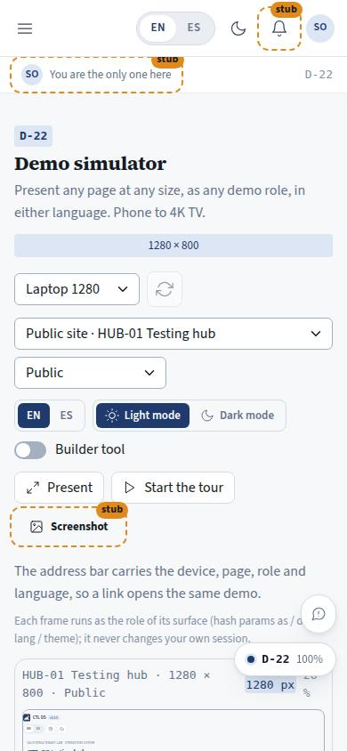
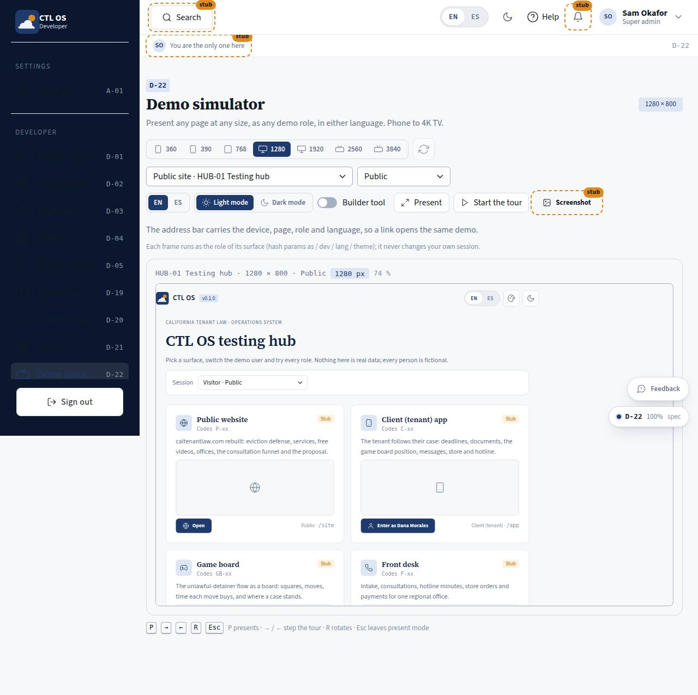

# D-22 · Demo simulator

## Purpose

Justin asked for "a really good way to present everything we build in a demo simulator for mobile and for desktop". This is the presenting surface: pick a device (phone 360 / 390, tablet 768, laptop 1280, desktop 1920, TV 2560 / 3840), pick any page, pick the demo role it runs as, the language, light or dark and whether the builder tool is on, and the page renders in an accurate device frame scaled to fit. Present mode hides the chrome; the Tour walks a scripted sequence; the address bar carries every choice, so a link reopens the same demo.

## Screenshots

| 390 | 1280 |
| --- | --- |
|  |  |

TV: `../screenshots/D-22/3840.jpg`.

## Sections (layout order)

1. PageHeader — title, the current viewport as a badge (`1280 × 800`), page code in dev mode
2. Controls — device (segmented control; a Select under 700 px, where seven presets do not fit), rotate, page select (grouped by surface family), role select, EN / ES, light / dark, builder tool, Present, Start the tour, Screenshot (Placeholder)
3. Share note — what the URL carries, and how the frame's role is set
4. Stage — `DeviceFrame` at the chosen viewport, scaled down to fit
5. Tour — step counter, the step's note, Back / Next / End
6. Shortcut row — `P` `→` `←` `R` `Esc`

## Data

| Table | Read / write | Notes |
| --- | --- | --- |
| `page_layouts` | — | declared: the simulator reads the route manifest; saved demo scripts belong here when tours become editable |
| `users` | read (in the frame) | the framed page reads its own data as the chosen role |

`localStorage` `ctl.simulator` remembers only that the shortcut hint has been seen. Every other choice is in the URL.

## Rules

- `RULE-SYS-01` — the page list, codes and roles come from the route manifest

## Actions (manifest)

| Id | Intent | Permission | Params | Live |
| --- | --- | --- | --- | --- |
| `showcase.setDevice` | show the demo at a device size | none | `device: enum:phone360,phone390,tablet768,laptop1280,desktop1920,tv2560,tv3840` | yes |
| `showcase.setRoute` | show a page in the simulator | none | `path: string` | yes |
| `showcase.setRole` | run the framed page as a demo role | none | `role: enum:super_admin,…,public` | yes |
| `showcase.setLang` | run the framed page in English or Spanish | none | `lang: enum:en,es` | yes |
| `showcase.setTheme` | run the framed page in light or dark | none | `theme: enum:light,dark` | yes |
| `showcase.setDevMode` | turn the builder tool on or off inside the frame | none | `on: boolean` | yes |
| `showcase.rotate` | rotate the phone or tablet frame | none | — | yes |
| `showcase.present` | enter or leave present mode | none | `on: boolean` | yes |
| `showcase.tourStart` | start the scripted demo tour | none | — | yes |
| `showcase.tourNext` | go to the next step of the tour | none | — | yes |
| `showcase.tourBack` | go back one step of the tour | none | — | yes |
| `showcase.tourStop` | end the scripted demo tour | none | — | yes |
| `showcase.screenshot` | save a picture of the framed page | none | — | **stub** (Placeholder) |

## Logic

- **Devices**: seven presets; the iframe really is that wide, so the framed page picks its own `--scale` band and media queries. `DeviceFrame` scales the frame down to the stage width and shows the percentage.
- **Orientation**: rotate swaps width and height, for phones and tablets only (the button is disabled otherwise).
- **Role**: choosing a page sets the role to the natural role of its surface; the role select then overrides it. Role, language, theme and builder tool reach the frame through the iframe hash (`#/app?as=client&dev=0&lang=es&theme=dark`) and are applied **inside the frame only** by `src/modules/showcase/frameSession.ts`, so presenting never changes your own session (see D-21 "Real vs mock").
- **URL**: `?device=&route=&role=&lang=&theme=&dev=&rot=&present=&step=` — every control writes there (replace, so the back button does not fill up), which is what makes a demo shareable.
- **Tour**: hub → client home (phone) → game board → attorney home (1920) → plan → proposal (TV 2560). A step whose page is not in the manifest yet falls back to the hub and says so, so the tour never dead-ends while modules are still landing.
- **Present mode**: a full-window layer with just the frame, the page's identity badges, the tour buttons and an exit; the shortcut card shows once and is remembered.
- **Keyboard**: `P` present, `→` / `←` tour steps, `R` rotate, `Esc` leave present mode (ignored while typing in a field).

## Components

PageHeader, Card, Button, IconButton, Select, SegmentedControl, Toggle, Badge, Kbd, Placeholder, DeviceFrame

## Placeholders

- **Screenshot** (`plannedIn: screenshot pass`) — a page cannot rasterise a same-origin iframe, so the picture comes from `npm run screenshots` (Playwright) or a later browser API.

## Real vs mock

Real routes, real guards, real device widths; mock data. The framed page is the same build, so what you present is what ships.

## Inputs and responsive check (P-01, P-03)

Checked at 360, 390, 768, 1280, 1920, 2560, 3840 in light and dark (`npm run qa:responsive`, 0 failing cells): no horizontal scroll, no console errors, no text under 12 px (16 px at ≥ 1920). Under 700 px the seven device presets become a Select (the segmented control cannot shrink below ~500 px and used to push the document sideways — fixed in this pass).

Keyboard: every control is a native button, select or switch; the shortcuts are listed on the page and in present mode; nothing is hover-only or drag-only; targets are 44 px.

## Changelog

- `docs/changelog/_pending/showcase.md`

## Resumen en español

El simulador presenta cualquier página en cualquier tamaño (del teléfono 360 a la TV 4K), con el rol demo, el idioma, el tema y la herramienta de construcción que elijas, con modo presentación y un recorrido guiado. La URL lleva todas las opciones, así que un enlace abre la misma demostración.
