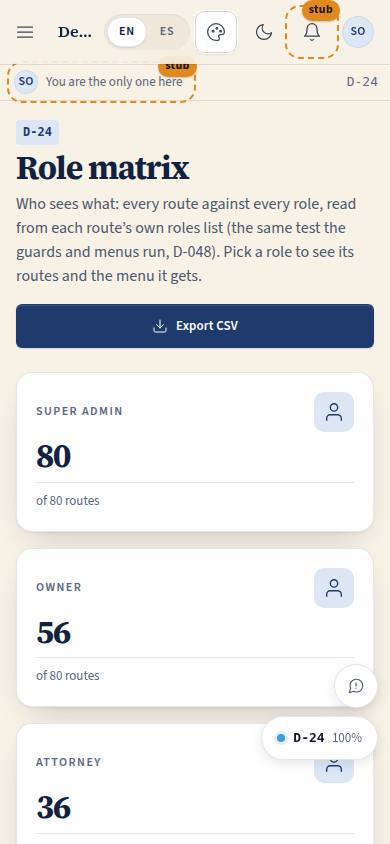
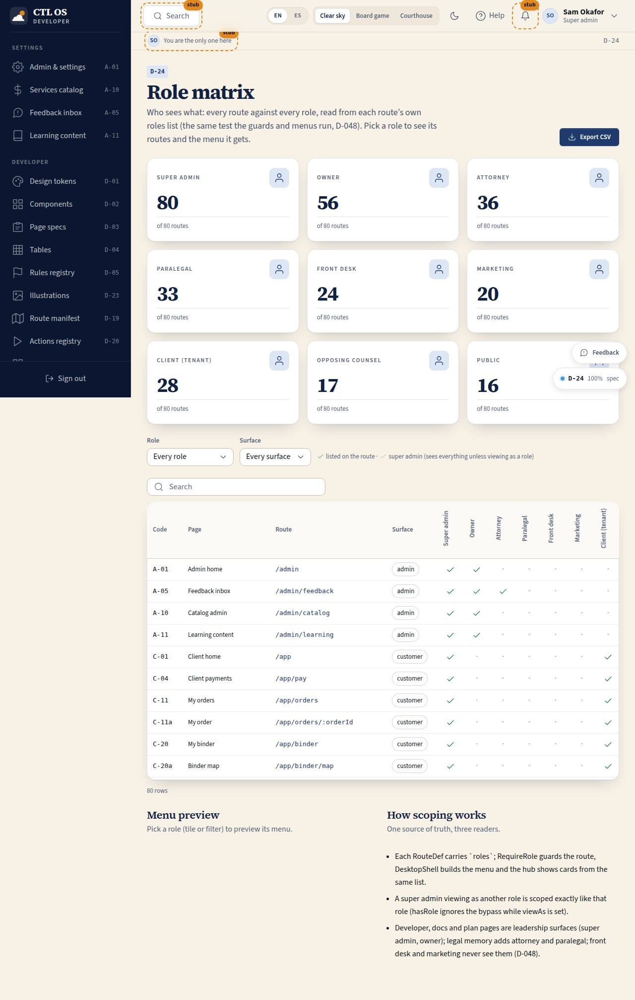

# D-24 · Role matrix

## Purpose

Who sees what, in one grid: every route of CTL OS against every role, read from each route's own `roles` list, which is the single source of truth for the route guard (`RequireRole`), the shell menus (`DesktopShell` / `PhoneShell`) and the hub cards (D-048). A builder or the owner picks a role and sees the routes it can open, how many, and the sidebar menu it gets, so "front desk should not see the developer screens" is a fact on a page, not a belief. Built in Pass 2 wave A (prompt 0006, T-119).

## Screenshots

| 390 | 1280 |
| --- | --- |
|  |  |

Captures are produced by the wave A QA pass (T-135): `npm run screenshots -- --codes=D-24 --dark --widths=390,1280,3840`.

## Sections (layout order)

1. PageHeader - Export CSV
2. StatTiles - one per role with the number of routes it can open; clicking a tile filters the grid to that role (click again to clear)
3. Filters - role select, surface select, legend (listed on the route vs implied for super admin)
4. MatrixTable - code, page (stub badge), route, surface, one check column per role, count of roles
5. MenuPreview - the sidebar groups and entries the chosen role sees in its shell, in menu order
6. HowScopingWorks - the three sentences of D-048

## Data

| Table | Read / write | Notes |
| --- | --- | --- |
| `users` | none directly | Routes come from the registry (`getRoutes()`), not from a table; `users.role` is where a person's role lives and what `hasRole` compares. Listed so the spec's data check names the table the rule depends on. |

## Rules

- `RULE-SYS-01` - every page carries a spec; the matrix reads `route.roles` and `spec.code` from it

## Actions (manifest)

| Id | Intent | Permission | Params | Live |
| --- | --- | --- | --- | --- |
| `dev.filterRole` | show only the routes a role can open | none | `role: enum:super_admin,owner,attorney,paralegal,front_desk,marketing,client,opposing_counsel,public` | yes |
| `dev.filterSurface` | show only the routes of one surface | none | `surface: string` | yes |
| `dev.exportMatrix` | download the role matrix as CSV | none | none | yes |

## Logic

- `roleSees(role, roles)` = `roles` includes `public`, or includes `role`, or `role` is `super_admin`. It is the same test as `SessionProvider.hasRole` for a hypothetical role; the live `hasRole` additionally drops the super-admin bypass while `viewAs` is set, so a super admin viewing as front desk is scoped exactly like front desk.
- A check drawn solid means the role is listed on the route; a faded check means access is implied (super admin only).
- `menuPreview(role)` rebuilds the shell filter: routes with `nav`, whose surface belongs to the shell the role's home lives in (staff shell = frontdesk, counsel, assist, owner, admin, marketing, plan, board, manual, docs; dev shell = dev, docs, admin; docs shell = docs, dev; opposition; customer), that the role may open; grouped by `navGroups.ts` in menu order.
- Catch-all routes (`/docs/*`) are folded out of the grid (their page code is already listed once).
- Filters live in the query string (`?role=&surface=`), so a view is addressable (P-06).

## Components

PageHeader, StatTile, Select, DataTable, Badge, Chip, Button, Icon, Card, Section

## Placeholders

None.

## Real vs mock

Real: the grid is computed from the live route registry at render time, so it can never disagree with the guards. Nothing changes when Supabase lands; when roles become claims from Supabase Auth the same `hasRole` reads them.

## Inputs and responsive check (P-01, P-03)

Checked at 360, 390, 768, 1280, 1920, 2560, 3840 (spec `checkedAt`; QA matrix run in T-135). Under 900 px the role column heads turn horizontal and the DataTable falls back to cards showing the chosen role's column; every control is a native button, link or select with the 3 px focus ring and 44 px targets; nothing hover-only (checks carry titles, the legend is always visible).

## Changelog

- `docs/changelog/0016-foundation-2.md` (to be merged into changelog 0016, release 0.2.0)

## Resumen en español

Matriz de roles: cada ruta frente a cada rol, leída de la lista `roles` de la propia ruta (la misma que usan las guardas y los menús). Filtros por rol y superficie, conteo por rol, vista previa del menú que ve cada rol y exportación CSV. Solo para el superadministrador.
