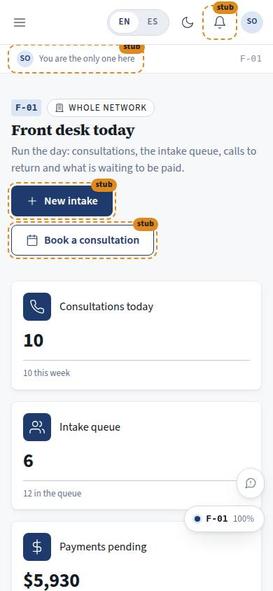
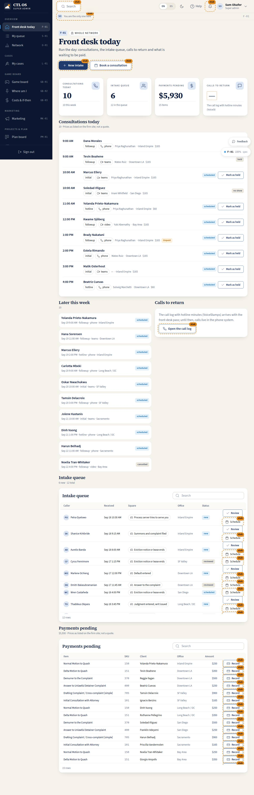

# F-01 · Front desk today

## Purpose

One screen to run the day at an office — and on the wall screen, across the whole network. The consultations booked today (in the order they happen) and later this week, the intake queue with what to review and schedule, the calls to return, and what is waiting to be paid. The front desk is where the firm's funnel actually lands: form → consultation → SKU-priced work.

Access (D-048, 2026-09-20): `front_desk`, `owner` and `super_admin` (was every staff role). Attorneys, paralegals and marketing have their own homes; the wall-screen use stays with the desk and the owner.

## Screenshots

| 390 | 1280 |
| --- | --- |
|  |  |

Dark: `../screenshots/F-01/390-dark.jpg`, `../screenshots/F-01/1280-dark.jpg`. TV: `../screenshots/F-01/3840.jpg`.

## Sections (layout order)

1. PageHeader — office chip, "New intake" and "Book a consultation".
2. StatTiles — consultations today, new intakes, payments pending (amount), calls to return.
3. ConsultationsToday — a timeline: time, client, kind, channel, attorney, price, paid state, status, "Mark as held".
4. ConsultationsThisWeek — the next seven days.
5. CallsToReturn — what the call log will hold.
6. IntakeQueue — DataTable with caller, received, the square they describe, office, status; "Review" and "Schedule" per row.
7. PaymentsPending — DataTable with item, SKU, client, office, amount; "Record" per row.

## Data

| Table | Read / write | Notes |
| --- | --- | --- |
| `consultations` | read / write | `status = held` by id |
| `intakes` | read / write | `status = reviewed` by id |
| `invoices` | read | status `due` |
| `users` | read | client and attorney names |
| `tenants` | read | office short names |
| `cases` | read | to resolve the client behind an invoice |

## Rules

- `RULE-INTAKE-01` — a consultation is a prepaid, time-boxed 30-minute block; hotline blocks are $60 per 10 minutes as listed.
- `RULE-SYS-02` — every write is by id through the provider.

## Actions (manifest)

| Id | Intent | Permission | Params | Live |
| --- | --- | --- | --- | --- |
| `desk.reviewIntake` | mark an intake as reviewed | `intake.write` | `id: id` | yes |
| `desk.scheduleIntake` | book a consultation for someone in the intake queue | `consultations.book` | `id: id` | stub |
| `desk.markConsultationHeld` | mark a consultation as held | `consultations.write` | `id: id` | yes |
| `desk.newIntake` | start a new intake for a caller | `intake.write` | — | stub |
| `desk.bookConsultation` | book a consultation slot for a client | `consultations.book` | `clientId: id, date: date` | stub |
| `desk.openCallLog` | open the call log with hotline minutes | `messages.read` | — | stub |
| `desk.recordPayment` | record a payment against an item on a case | `payments.write` | `id: id` | stub |

## Logic

- Rows are scoped to the signed-in office; owner and super admin are network-wide and the header says so (P-02).
- Today = `scheduled_at` falls on today; this week = the next seven days, excluding today.
- Prices show with the "as listed" caveat wherever they appear.

## Components

PageHeader, StatTile, Section, Card, DataTable, StatusBadge, Badge, Chip, Button, EmptyState, Placeholder, PlaceholderText, Avatar.

## Placeholders

New intake → T-063. Book / schedule → T-064. Call log and the "calls to return" count → T-065. Record a payment → the payments seam.

## Real vs mock

Real: the day's shape, the scoping, the two writes. Mock: the rows; the scheduler, the phone system and payments are all seams.

## Inputs and responsive check (P-01, P-03)

Checked at 360–3840, light and dark. At 360–390 the tables fall back to the card layout and board-square chips ellipsize (`.homes-chip`) instead of pushing the page sideways. The timeline keeps the time column at a fixed width so the eye can scan it from across the room; at 2560 and 3840 `--scale` lifts the type and the two-column band becomes three.

## Changelog

- `docs/changelog/_pending/homes.md`

## Resumen en español

La pantalla del día en recepción: las consultas de hoy en orden, la fila de admisión con lo que hay que revisar y programar, las llamadas por devolver y lo que falta cobrar.
