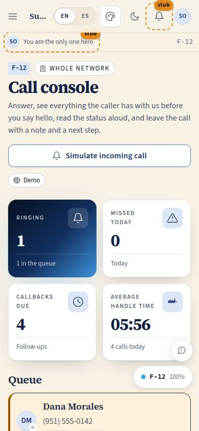
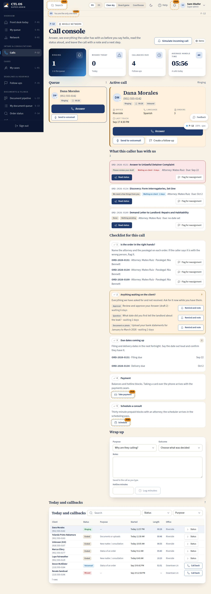

# F-12 · Call console

## Purpose

The screen the front desk lives on while the phone rings. Justin, prompt 0006: *"Front Desk should know the status of any order if the customer calls in. Front desk can have a nice interface for incoming calls, confirming orders are in the hands of the [right person], following up on due dates or things needed from the client, etc."* Three regions answer that in order: the **queue** on the left with one big Answer button, the **active call** in the centre (who is calling, every order they have with whose turn it is, the three lines to read aloud, and a five-point checklist for the call), and **today and callbacks** on the right. The desk reports and records; it never advances a pipeline stage (RULE-PIPE-06).

## Screenshots

| 390 | 1280 |
| --- | --- |
|  |  |

Dark: `../screenshots/F-12/390-dark.jpg`, `../screenshots/F-12/1280-dark.jpg`. TV: `../screenshots/F-12/3840.jpg`.

## Sections (layout order)

1. PageHeader — office chip, "Simulate incoming call" (demo ring) and a Demo chip.
2. Counter strip — ringing, missed today, callbacks due (links to F-15), average handle time today.
3. **Queue** — every `ringing` / `active` / `on_hold` call as a `CallCard`, ringing first, with a large Answer on the ringing one and Hold / Resume / End / Voicemail beside it.
4. **Active call** — a large `CallCard`: name or "Unknown caller", number, direction, live timer, and four caller facts (office, language, open orders, last touch). An unknown number gets a client search with "This is them", plus a Placeholder "Start intake".
5. **What this caller has with us** — the caller's orders as compact rows: `order_ref` (links to F-14), title, the client-facing stage, `WaitingOnPill`, the attorney, the next due date, "Read status" (expands the three-line script) and "Flag for reassignment".
6. **Checklist for this call** — (1) is the order in the right hands, (2) anything waiting on the client, (3) due dates coming up, (4) payment (Placeholder), (5) schedule a consult (Placeholder).
7. **Wrap up** — purpose Select, outcome Select, notes Textarea (autosaved), hotline minutes number + "Log minutes", and "Create a follow-up" once the call has ended.
8. **Today and callbacks** — DataTable of today's calls plus every missed / voicemail row, filterable by status and purpose, with "Call back" per missed row.

## Data

| Table | Read / write | Notes |
| --- | --- | --- |
| `calls` | read / write | status, `handled_by_user_id`, `ended_at`, `duration_seconds`, `purpose`, `notes`, `outcome`, `hotline_minutes_billed`, `matched_user_id`, `matched_order_ids`, `follow_up_id`; inserts for the simulated ring and for a call-back |
| `orders` | read | the caller's orders; never written (RULE-PIPE-06) |
| `order_stage_events` | read | feeds `daysWaiting` / `isLate` |
| `client_requests` | read | what the client still owes us |
| `follow_ups` | read / write | inserts for reassignment flags, reminders and the post-call follow-up |
| `users` | read | phone matching, names, language |
| `tenants` | read | office name and the office phone number |

## Rules

- `RULE-PIPE-02` — whose turn it is comes from the stage, not from a field the desk can edit.
- `RULE-PIPE-03` — the desk reads the client-facing wording aloud; internal stages collapse onto it.
- `RULE-PIPE-06` — the desk records calls and follow-ups and never advances a stage. There is no "move to" control on this page.
- `RULE-SYS-02` — every write is by id through the provider.

## Actions (manifest)

| Id | Intent | Permission | Params | Live |
| --- | --- | --- | --- | --- |
| `desk.selectCall` | open a call in the console | `calls.read` | `id: id` | yes |
| `desk.simulateCall` | simulate an incoming call for a demo | `calls.write` | — | yes |
| `desk.answerCall` | answer the ringing call | `calls.write` | `id: id` | yes |
| `desk.holdCall` | put the call on hold | `calls.write` | `id: id` | yes |
| `desk.resumeCall` | take the call off hold | `calls.write` | `id: id` | yes |
| `desk.endCall` | end the call and log how long it lasted | `calls.write` | `id: id` | yes |
| `desk.sendToVoicemail` | send the ringing call to voicemail | `calls.write` | `id: id` | yes |
| `desk.callBack` | call a missed caller back | `calls.write` | `id: id` | yes |
| `desk.setCallPurpose` | set why the person called | `calls.write` | `id: id, purpose: enum` | yes |
| `desk.saveCallNotes` | save the notes taken during the call | `calls.write` | `id: id, notes: string` | yes |
| `desk.setCallOutcome` | record what was decided on the call | `calls.write` | `id: id, outcome: string` | yes |
| `desk.logHotlineMinutes` | log hotline minutes billed on this call | `calls.write` | `id: id, minutes: number` | yes |
| `desk.linkCaller` | link an unknown caller to a client record | `calls.write` | `id: id, userId: id` | yes |
| `desk.readOrderStatus` | read the status of an order aloud to the caller | `orders.read` | `id: id` | yes |
| `desk.flagForReassignment` | flag an order as being in the wrong hands | `followups.write` | `id: id` | yes |
| `desk.remindClientRequest` | remind the client about something we need and note it | `followups.write` | `id: id` | yes |
| `desk.createFollowUpFromCall` | create a follow-up from this call | `followups.write` | `id: id` | yes |
| `desk.startIntakeForCaller` | start an intake for an unknown caller | `intake.write` | `id: id` | stub |
| `desk.scheduleConsultFromCall` | schedule a consultation for the caller | `consultations.book` | `id: id` | stub |
| `desk.takeCallPayment` | take a payment over the phone | `payments.write` | `id: id` | stub |

`desk.readOrderStatus` returns the script as its `message`, so a voice controller can speak it without opening the page visually (P-06).

## Logic

- **Matching**: a call is matched to a user by the last ten digits of the number (`lib.matchByPhone`), so `+19515550142`, `(951) 555-0142` and `9515550142` are one person. `matched_user_id` from the ring wins; an unmatched number is an unknown caller the desk can search and link by hand.
- **The caller's orders** come from `orders.client_user_id` (`matched_order_ids` is the ring-time snapshot, kept for the record). Each row shows `clientStageFor(stage).clientLabel`, the `WaitingOnPill` (`waitingOnFor` + `daysWaiting` + `slaFor` + `isLate`) and the nearest of `filing_due_at` / `due_at`.
- **The script** is three lines, the same wording the pipeline module uses: "Your &lt;title&gt; is: &lt;client label&gt;." / "It is with &lt;holder&gt;." / "Next: &lt;what has to happen&gt; by &lt;date&gt;." The holder is chosen from the stage's waiting-on: the client, the attorney, the paralegal, the supervisor or the court.
- **Checklist 1** names the attorney and the paralegal on each order; "Flag for reassignment" writes a `check_in` follow-up owned by the assigned attorney, due tomorrow at 9 am.
- **Checklist 2** lists open `client_requests` with days waiting; "Remind and note" writes a `client_review_due` (review / approval), `payment_due` (payment) or `client_item_due` follow-up, due tomorrow.
- **Checklist 3** lists `filing_due_at` / `due_at` inside 14 days; overdue dates render in the danger colour with the word, not only the colour.
- **Call control**: Answer sets `active` and `handled_by_user_id`; Hold / Resume flip `on_hold` / `active`; End writes `ended`, `ended_at` and `duration_seconds` counted from `started_at`, then offers "Create a follow-up"; Send to voicemail writes `voicemail`. "Call back" inserts an **outbound** `active` call to the same number and selects it.
- **Autosave**: the notes textarea writes to the call row 600 ms after typing stops, by id. Nothing on this page is state the provider does not have (P-14).
- **Simulate incoming call** inserts a ringing inbound call from a seeded client three times in four, and from a fictional 555 number otherwise, so the console demonstrates without telephony.
- The selected call is `?call=<id>` in the URL, so a second screen, a test or a voice controller can address it (P-06).

## Components

PageHeader, StatTile, Section, Card, **CallCard** (new organism), **WaitingOnPill**, DataTable, SearchInput, Select, Textarea, Input, Button, Chip, Badge, StatusBadge, EmptyState, Placeholder, Avatar.

## Placeholders

"Start intake" → T-063 (`/desk/intake`, wave B). "Schedule" a consult → T-064. "Take payment" → the payments seam (Stripe / PayPal). Real telephony (ringing, answering, holding, transferring), SMS and email are Pass 3 seams; today the buttons move the `calls` row, which is what the softphone adapter will do.

## Real vs mock

Real: the matching, the caller's orders and their waits, the script, the checklist, every call and follow-up write, the counters. Mock: the ring itself (no telephony), the numbers (555 exchange, D-023), and the reminder that is recorded but not actually sent.

## Inputs and responsive check (P-01, P-03)

Checked at 360, 390, 768, 1280, 1920, 2560, 3840 (light; dark uses the same tokens). One column on a phone in reading order (queue → active call → recent), two at 1200 with the recent table full width underneath, three standing columns from 1700, and wider queue and recent columns from 2560. Every control is a library Button or Select at the 44 px minimum; the queue card is one tab stop for selection with its buttons separately reachable; the ringing pulse is decoration over the word "Ringing" and stops under `prefers-reduced-motion`; nothing is hover-only. At 2560 and 3840 the region headings, the script and the order rows step up a size on top of `--scale` for 10-foot reading. Known degradation: in the narrow recent column the calls table scrolls horizontally inside its own card rather than the page (the page itself never scrolls sideways at any width).

## Changelog

- `docs/changelog/_pending/frontdesk.md`

## Resumen en español

La consola de llamadas de recepción: la cola con un botón grande de Contestar, la llamada en curso con la persona que llama, todos sus pedidos con de quién es el turno y desde hace cuántos días, las tres líneas que se leen en voz alta, y una lista de verificación (¿está en las manos correctas?, ¿falta algo del cliente?, fechas próximas, pago, consulta). A la derecha, las llamadas de hoy y las devoluciones pendientes. Recepción informa y registra; nunca mueve una etapa del pedido.
