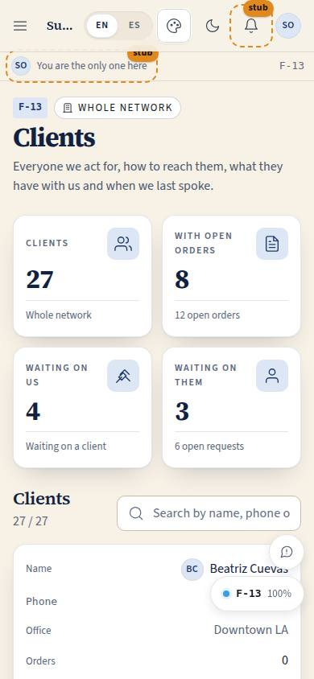
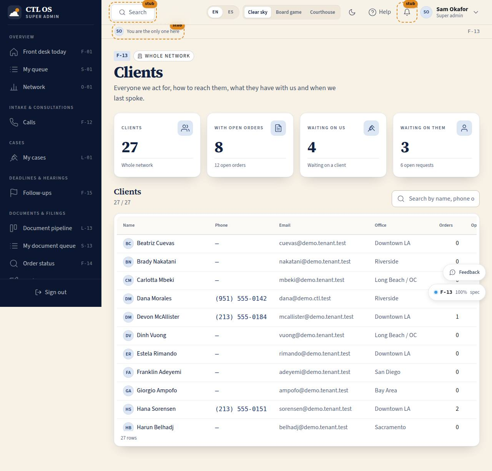

# F-13 · Client directory

## Purpose

Who our clients are, how to reach them and everything the desk needs before picking up the phone. The directory answers "who is this?" and the drawer answers "what do they have with us?" — orders with whose turn it is, recent calls and open follow-ups — so the desk can handle a cold call without interrupting an attorney.

## Screenshots

| 390 | 1280 |
| --- | --- |
|  |  |

Dark: `../screenshots/F-13/390-dark.jpg`, `../screenshots/F-13/1280-dark.jpg`.

## Sections (layout order)

1. PageHeader — office chip.
2. Counter strip — clients, with open orders, waiting on us, waiting on them.
3. Directory — DataTable: name, phone, email, office, open orders, open requests, last touch; search by name, phone or email; "Call" and an open button per row.
4. Client drawer — contact facts, Orders (with `WaitingOnPill`, linking to F-14), Recent calls (as `CallCard`s that open F-12), Open follow-ups; footer Call / Add follow-up / Send message.

## Data

| Table | Read / write | Notes |
| --- | --- | --- |
| `users` | read | `role = client`, scoped to the office |
| `orders` | read | counts, stages, waits |
| `order_stage_events` | read | feeds `daysWaiting` / `isLate` |
| `client_requests` | read | open request count |
| `calls` | read / write | history; "Call" inserts an outbound active call |
| `follow_ups` | read / write | open list; "Add follow-up" inserts a `check_in` due tomorrow |
| `tenants` | read | office label and the office phone number |

## Rules

- `RULE-PIPE-02` — the waiting-on pill comes from the stage.
- `RULE-PIPE-06` — the desk reads order status here and never advances it; every order link goes to F-14.
- `RULE-SYS-02` — writes by id through the provider.

## Actions (manifest)

| Id | Intent | Permission | Params | Live |
| --- | --- | --- | --- | --- |
| `desk.searchClients` | search the client directory by name, phone or email | `clients.read` | `q: string` | yes |
| `desk.openClient` | open everything we have on a client | `clients.read` | `id: id` | yes |
| `desk.callClient` | call a client | `calls.write` | `id: id` | yes |
| `desk.addClientFollowUp` | add a follow-up for a client | `followups.write` | `id: id` | yes |
| `desk.messageClient` | send a client a message | `messages.write` | `id: id` | stub |

## Logic

- The directory is `users` filtered to `role = client` and scoped to the office (owner and super admin see the network). Phone numbers are stored E.164 and formatted for people (`lib.fmtPhone`); search matches a name, an email or the last digits of a number.
- **Open orders** are the client's non-terminal orders; **open requests** are their open `client_requests`; **last touch** is the latest of `orders.last_client_touch_at` and the end of their most recent call.
- "Waiting on us" counts clients with at least one open order whose waiting-on is staff or the supervisor; "waiting on them" counts clients with at least one order waiting on the client.
- **Call** inserts an outbound active call and navigates to F-12 with it open; a client with no number on file gets the disabled button and the reason, never a silent no-op.
- **Add follow-up** writes a `check_in` follow-up due tomorrow at 9 am, owned by whoever is signed in and attached to the client's first open order when there is one.
- The open client is `?client=<id>` in the URL, so the drawer is linkable and drivable (P-06).

## Components

PageHeader, StatTile, Section, DataTable, Drawer, SearchInput, **CallCard**, **WaitingOnPill**, Button, Chip, Badge, Avatar, EmptyState, Placeholder.

## Placeholders

"Send message" → the Pass 3 comms seam (SMS / email / in-app).

## Real vs mock

Real: the directory, the counts, the drawer, the call and the follow-up writes. Mock: the people (fictional, D-023; 555 exchange), and messaging, which is a seam.

## Inputs and responsive check (P-01, P-03)

Checked at 360, 390, 768, 1280, 1920, 2560, 3840. Under 768 the DataTable becomes cards and the email and office columns drop; the drawer is full width on a phone and 560 px elsewhere, closes on Escape and returns focus. Row actions are always visible (never hover-only) and every target is at least 44 px. The drawer's facts are a real description list so "Phone: (951) 555-0142" is read as one item.

## Changelog

- `docs/changelog/0021-frontdesk.md`

## Resumen en español

El directorio de clientes de recepción: nombre, teléfono, correo, oficina, pedidos abiertos, solicitudes pendientes y último contacto, con búsqueda. Al abrir una fila, un panel reúne sus pedidos (con de quién es el turno), sus llamadas recientes y sus seguimientos abiertos, y ofrece Llamar, Añadir seguimiento y Enviar mensaje (pendiente de conectar).
