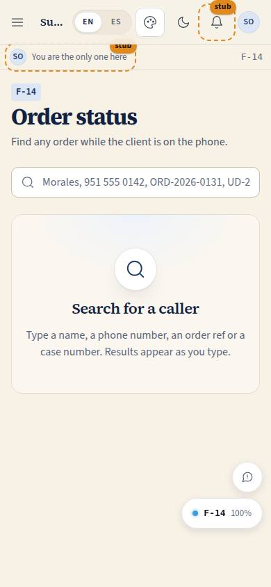
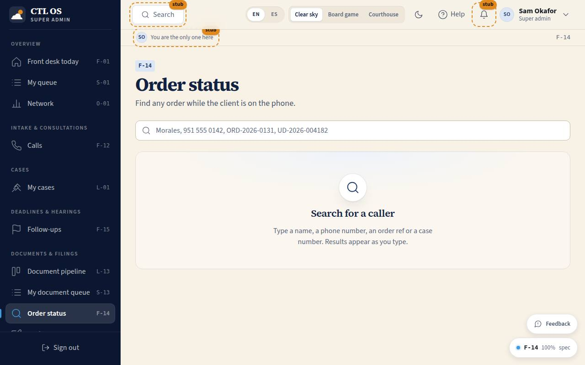

# F-14 · Order status

## Purpose

What the front desk needs the moment a client calls: find any order by name, phone, order number or case number, and read a status card written to be said out loud — what it is, whose turn it is, what we are waiting for and by when — then log the call and set a follow-up. The desk never moves a stage.

## Screenshots

| 390 | 1280 |
| --- | --- |
|  |  |

## Sections (layout order)

1. **PageHeader**
2. **SearchBox** — name, phone, order ref, document title or case number; filters as you type.
3. **ResultsTable** — ref, client, document, stage (staff), what the client is told, waiting-on pill, who has it, next due, last client touch.
4. **StatusCardDrawer** — the three-line script, the open requests to remind the caller about, where it stands, Log this call, Add a follow-up, and a disabled Move-to with a Tooltip.

## Data

| Table | Read / write | Notes |
| --- | --- | --- |
| `orders` | read / update | only `last_client_touch_at` when a call is logged |
| `order_stage_events` | read | the day counts |
| `client_requests` | read | what to remind the caller about |
| `follow_ups` | insert | Add a follow-up |
| `calls` | insert | Log this call |
| `users` | read | names and phone numbers |

## Rules

- `RULE-PIPE-06` — the desk reads every order and advances none. The Move-to control is rendered **disabled with a Tooltip naming who can**, because a missing button teaches nobody.
- `RULE-PIPE-03` — the table and the script say the same words the client reads in their app.
- `RULE-PIPE-02`, `RULE-PIPE-05` — the pill and the late colour come from the domain, same as everywhere else.

## Actions (manifest)

| Id | Intent | Permission | Params | Live |
| --- | --- | --- | --- | --- |
| `desk.searchOrders` | find a caller's order by name, phone, order number or case number | `orders.read` | `q: string` | yes |
| `desk.openStatusCard` | open the status card for this order | `orders.read` | `orderId: id` | yes |
| `desk.closeStatusCard` | close the status card | `orders.read` | — | yes |
| `desk.copyScript` | copy what to say to the caller | `orders.read` | `orderId: id` | yes |
| `desk.logCall` | record this call on the client's file | `calls.write` | `orderId: id, notes: string` | yes |
| `desk.addFollowUp` | remind me to chase this order | `followups.write` | `orderId: id` | yes |
| `desk.moveStage` | move this order to another stage | `orders.advance` | `orderId: id, stage: string` | declared, always refuses |

`desk.moveStage` exists so the disabled control is honest and the actions registry (D-20) states who may advance a stage; the handler always refuses and names RULE-PIPE-06.

## Logic

- The script: "Your **{document}**: {what the client is told}." / "It is with {attorney}." / either "We are waiting on you for: {the open requests}" or "The next step is {the next client-visible stage} by {date}."
- `?q=` and `?order=` are in the URL, so a ringing call on F-12 can deep-link straight to the right status card.
- Logging a call also stamps `last_client_touch_at`, which is the column the board and the follow-up engine read to know when the client was last spoken to.
- The next due is the filing deadline while the document is unfiled, otherwise the client due date — never a filing date that has already been met.

## Components

PageHeader, Section, SearchInput, DataTable, Drawer, Textarea, Button, Badge, Tooltip, EmptyState, DocPreview, **WaitingOnPill**, Icon.

## Placeholders

None. Copying the script uses the browser clipboard; nothing leaves the device.

## Real vs mock

Real: search, the status card, the call record and the follow-up. The telephony itself (a ringing line) is F-12's, built in parallel this pass.

## Inputs and responsive check (P-01, P-03)

Checked at 360, 390, 768, 1280, 1920, 2560, 3840. The table becomes cards under 768 px and the Drawer is full width under 600 px. The script is set in the display face at `--fs-lg`, rising at 2560, so it is readable at arm's length while someone is on the phone. The disabled Move-to keeps its Tooltip on focus as well as hover.

## Changelog

- `docs/changelog/_pending/pipeline.md`

## Resumen en español

Recepción encuentra cualquier pedido por nombre, teléfono, número de pedido o de caso, y lee una ficha escrita para decirla en voz alta: qué es, de quién es el turno, qué falta y para cuándo. Registra la llamada y crea seguimientos; nunca mueve una etapa (RULE-PIPE-06) y el botón aparece desactivado explicando quién sí puede.
