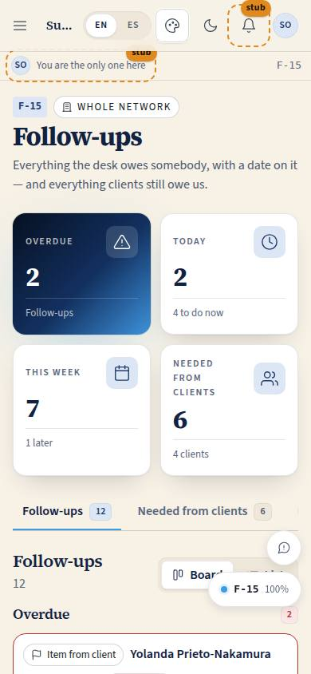
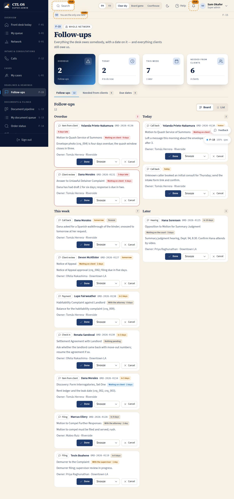

# F-15 · Follow-ups

## Purpose

Everything the desk owes somebody with a date on it, everything clients still owe us, and the filing and delivery dates landing in the next fortnight. Justin, prompt 0006: *"following up on due dates or things needed from the client"*. Three tabs, one job each, and every row ends in an action rather than a note to self.

## Screenshots

| 390 | 1280 |
| --- | --- |
|  |  |

Dark: `../screenshots/F-15/390-dark.jpg`, `../screenshots/F-15/1280-dark.jpg`. TV: `../screenshots/F-15/3840.jpg`.

## Sections (layout order)

1. PageHeader — office chip.
2. Counter strip — overdue, today, this week, needed from clients (links to the second tab).
3. Tabs — Follow-ups · Needed from clients · Due dates, with counts.
4. **Follow-ups** — board / list toggle. Board = four columns (Overdue, Today, This week, Later); list = one DataTable grouped by the same four buckets. Each row: kind chip, client, `order_ref` (links to F-14), the order's title and `WaitingOnPill`, the note, the owner, and Done / Snooze / Cancel.
5. **Needed from clients** — open `client_requests` grouped by client with days waiting and the order they block; Nudge, Call now (when the client has a phone) and Mark received (items only).
6. **Due dates** — orders with a filing or delivery date inside 14 days, soonest first, with whose turn it is.

## Data

| Table | Read / write | Notes |
| --- | --- | --- |
| `follow_ups` | read / write | `status` done / snoozed / cancelled, `due_at`, `done_at`; inserts for a nudge |
| `client_requests` | read / write | `status = received` for `kind = item` only |
| `orders` | read | title, refs, stage, dates; never written (RULE-PIPE-06) |
| `order_stage_events` | read | feeds `daysWaiting` / `isLate` |
| `calls` | write | "Call now" inserts an outbound active call and opens F-12 |
| `users`, `tenants` | read | names, phones, office labels |

## Rules

- `RULE-PIPE-02` — the waiting-on pill on every row comes from the stage.
- `RULE-PIPE-05` — "late" is past the stage target or past a due date; the SLA defaults are unverified until the firm confirms them.
- `RULE-PIPE-06` — chasing is not advancing: nothing here moves a stage.

## Actions (manifest)

| Id | Intent | Permission | Params | Live |
| --- | --- | --- | --- | --- |
| `desk.setFollowUpTab` | switch between follow-ups, needed from clients and due dates | `followups.read` | `tab: enum` | yes |
| `desk.setFollowUpView` | switch the follow-ups between board and list | `followups.read` | `view: enum` | yes |
| `desk.completeFollowUp` | mark a follow-up as done | `followups.write` | `id: id` | yes |
| `desk.snoozeFollowUp` | snooze a follow-up by a day, three days or a week | `followups.write` | `id: id, days: number` | yes |
| `desk.cancelFollowUp` | cancel a follow-up | `followups.write` | `id: id` | yes |
| `desk.nudgeClient` | nudge a client about something we need from them | `followups.write` | `id: id` | yes |
| `desk.callClientNow` | call a client about what we need from them | `calls.write` | `id: id` | yes |
| `desk.markRequestReceived` | mark an item we asked the client for as received | `orders.read` | `id: id` | yes |

`desk.markRequestReceived` is gated on `orders.read` because there is no `requests.*` permission yet and that is the pipeline read right the desk holds; the real guard is the item-only rule below. A dedicated permission is a follow-up for the permissions pass.

## Logic

- **Buckets** (`lib.followUpBucket`): overdue (due before today), today, this week (next seven days), later. Open and snoozed rows are both shown; a snoozed row carries its badge.
- **Done** writes `status = done` and `done_at`. **Snooze** writes `status = snoozed` and a new `due_at` at 9 am in 1, 3 or 7 days — never an open-ended "later". **Cancel** writes `status = cancelled`. All by id.
- **Order links** go to the desk's own read-only lookup `/desk/orders?q=<order_ref>` (F-14), never to the attorney's order page.
- **Nudge** writes a `call_back` follow-up due tomorrow at 9 am, noting what was asked for. Nothing is actually sent: SMS, email and app messages are the Pass 3 comms seam, so the record is the reminder.
- **Call now** inserts an outbound active call to the client and navigates to F-12 with it selected.
- **Mark received** is offered only for `kind = item` and writes `status = received` with `answered_at`. Questions, reviews, approvals and signatures belong to the client to answer in C-21 — the desk confirms receipt of a thing, it never answers for somebody.
- **Due dates** are `filing_due_at` and `due_at` inside 14 days, each as its own row so one order can appear twice with different kinds.
- The tab and the view live in the URL (`?tab=`, `?view=`) so both are linkable and drivable (P-06).

## Components

PageHeader, StatTile, Section, Card, Tabs, SegmentedControl, DataTable, **WaitingOnPill**, Select (snooze), Button, Chip, Badge, Avatar, EmptyState, Placeholder.

## Placeholders

None on this page: everything here writes a real row. The *sending* of a nudge is the Pass 3 comms seam and is described as "noted", never as "sent".

## Real vs mock

Real: the buckets, the three writes, the nudge, the call, the received mark, the fortnight of dates. Mock: the rows themselves and the fact that no message leaves the building.

## Inputs and responsive check (P-01, P-03)

Checked at 360, 390, 768, 1280, 1920, 2560, 3840. The board is one column on a phone, two from 900 and four from 1500; the list view is the same data in a grouped DataTable that falls back to cards under 768. Snooze is a native Select with a visible label, so it works with a keyboard, a screen reader and (later) a d-pad — no hover menu. Done / Snooze / Cancel are 44 px targets and every due state is a word plus a colour. At 2560 and 3840 the notes and pills step up a size on top of `--scale`.

## Changelog

- `docs/changelog/0021-frontdesk.md`

## Resumen en español

Los seguimientos de recepción en cuatro grupos (atrasados, hoy, esta semana, más adelante) en tablero o lista, con Hecho, Posponer (1 día, 3 días, la próxima semana) y Cancelar. La segunda pestaña reúne lo que falta de cada cliente con los días de espera, un recordatorio, un botón para llamar y "marcar como recibido" solo para documentos. La tercera muestra las presentaciones y entregas de los próximos 14 días.
