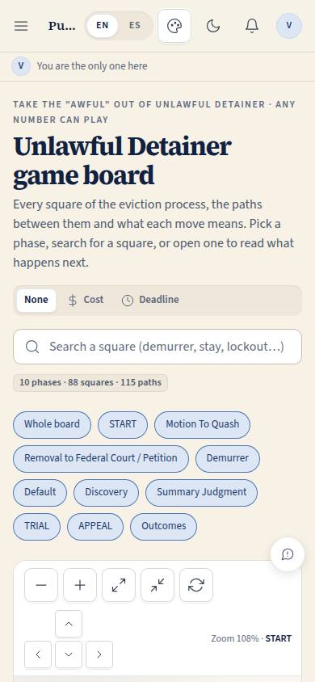
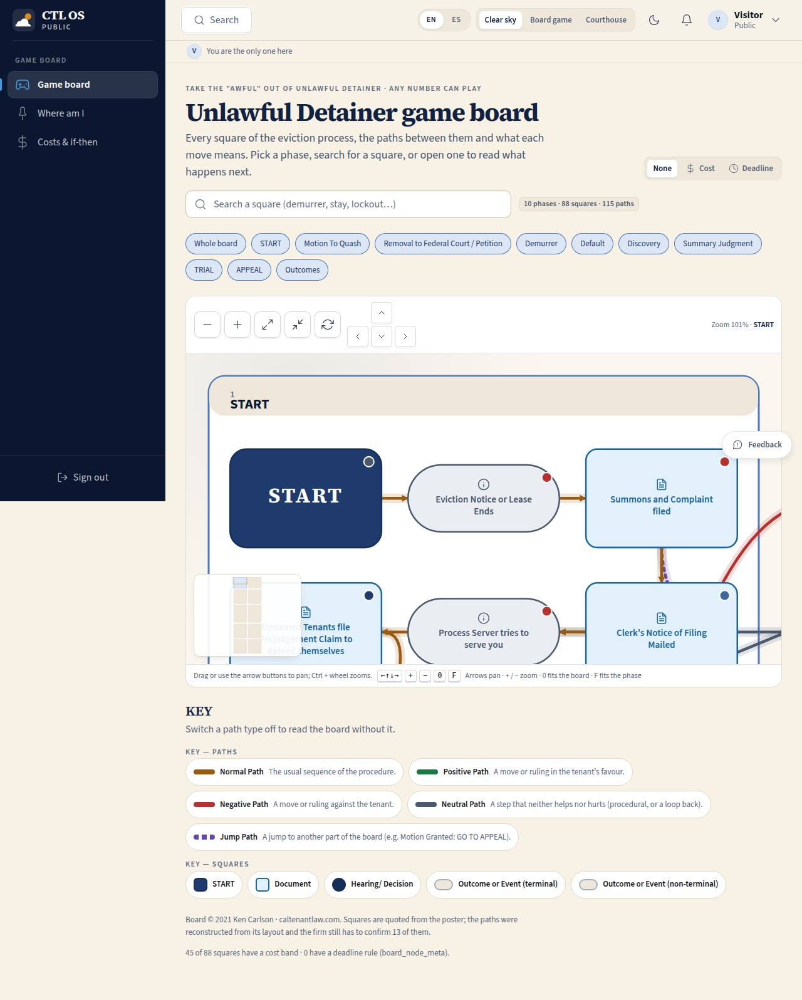

# GB-01 · Eviction game board

## Purpose

The firm's hand-drawn "Unlawful Detainer Game Board" (© 2021 Ken Carlson) as an interactive board. A tenant — signed in or not — can see every square of the eviction process, the paths between them, what each move means and what can follow it; staff use the same page as the shared map of the procedure. It is the teaching tool the firm is known for, and the spine the rest of CTL OS hangs on (a case has a board square; templates, SKUs and deadline rules bind to squares and paths).

## Screenshots

| 390 | 1280 |
| --- | --- |
|  |  |

Dark: `../screenshots/GB-01/390-dark.jpg`, `../screenshots/GB-01/1280-dark.jpg`. TV: `../screenshots/GB-01/3840.jpg`.

## Sections (layout order)

1. **BoardHeader** — tagline from the poster, title, what the page is for, the overlay switch, and the counts (10 phases · 88 squares · 115 paths).
2. **Toolbar** — search by square label or note; the result row opens a square.
3. **Phase chips** — "Whole board" plus one chip per phase; a chip fits the view to that phase region.
4. **GameBoard** — the SVG board: phase regions, squares, paths, pan / zoom controls, minimap, keyboard hint.
5. **BoardKey** — the poster's KEY: five path types (each one an on/off filter) and the shapes; the copyright and the reconstructed-path caveat.
6. **NodeDetail drawer** — opens on a square: phase, kind, who moves, "what this means", documents, possible next moves with their path type, how you get here.

## Data

| Table | Read / write | Notes |
| --- | --- | --- |
| `board_node_meta` | read | Per-square cost band and deadline rule; the KEY section reads the rows to say how many are filled (45 of 88 cost bands today, from the store SKUs; 0 deadline rules). GB-03 paints the empty ones as placeholders |

The board itself is **not** in the database: `docs/game-board/nodes.json` is imported at build time through `src/modules/board/boardData.ts` (RULE-BOARD-01).

## Rules

- `RULE-BOARD-01` — every square and path is rendered from `nodes.json`; positions are computed, never hand-placed.
- `RULE-BOARD-02` — the 13 paths still marked `reconstructed: true` (18 before the 2026-09-20 verification) are drawn with a finer dash and the drawer says the firm must confirm them.
- `RULE-BOARD-03` — no invented cost or deadline appears anywhere on the board.
- `RULE-UD-01`, `RULE-UD-04`, `RULE-UD-05`, `RULE-NOTICE-01` — the procedural rules the squares illustrate (all still `verify: true`; the page states no deadline of its own).
- `RULE-SYS-01` — spec, actions, docs, screenshots, responsive matrix.

## Actions (manifest)

| Id | Intent | Permission | Params | Live |
| --- | --- | --- | --- | --- |
| `board.selectNode` | open the square {id} on the game board | none | `id: string` | yes |
| `board.zoom` | zoom the board in, out, to fit or back to the start | none | `direction: enum:in,out,fit,reset` | yes |
| `board.fitPhase` | show the {phase} phase of the board | none | `phase: string` | yes |
| `board.pan` | pan the board {direction} | none | `direction: enum:up,down,left,right` | yes |
| `board.search` | find the square about {q} | none | `q: string` | yes |
| `board.togglePath` | hide the {type} paths on the board | none | `type: enum:normal,positive,negative,neutral,jump` | yes |
| `board.setOverlay` | show the {overlay} overlay on the board | none | `overlay: enum:none,cost,deadline` | yes |

`board.fitPhase` accepts a phase id or a phase label, so "show me the demurrer phase" resolves without the caller knowing the ids. `board.search` opens the best match, which makes "where is the lockout square" one call.

## Logic

- **Layout (deterministic, from the data).** Phase regions are placed in a serpentine grid — left to right, then right to left — so consecutive phases of the procedure touch and the board reads as one winding path like the poster. Inside a region the phase's squares are ordered topologically (Kahn, ties broken by their order in `nodes.json`) and laid on a serpentine of rows. Paths are curves between the facing sides of the two shapes. Nothing is hand-placed; correcting an edge in `nodes.json` corrects the board.
- **Responsive layout bands.** The number of phase columns and square columns follows the *container* width: under 600 px one winding column of single squares (a phone reads the board as a path), under 780 px two squares per row, under 1200 px two phases per row, under 1920 px three, from 2560 px four. The type band follows the **viewport** instead (the board sits inside a shell, so a 1920 screen gives the surface only ~1536 px): label 15 units below 1920, 17 from 1920, 18 from 2560, and every other string the SVG paints is floored at one unit below that, so nothing is under 12 px anywhere or under 16 px from 1920 up.
- **Shapes and tones from the poster.** Document = rounded rectangle with a file glyph, hearing / decision = circle with a gavel, outcome or event = pill, START is its own square. Outcome and event tones are derived from the path types that reach them (a square reached by a positive path is green), so no square is coloured by opinion.
- **Zoom and fit.** An automatic fit never passes 165 %, so a phase region on a 4K screen fills the view without becoming a poster of five squares; manual zoom goes to 300 %. Labels hide instead of shrinking when zoomed out below legibility, leaving shapes, phase titles and paths — the "from across the room" read of the board.
- **Highlight.** Hovering or focusing a square brightens it, its neighbours and its paths and dims the rest; the same happens from the keyboard, so the highlight is not hover-only.

## Components

`PageHeader`, `GameBoard` (new organism), `BoardKey` (new molecule, in the GameBoard folder), `Drawer`, `SearchInput`, `SegmentedControl`, `Section`, `Chip`, `Badge`, `Button`, `IconButton`, `Kbd`, `Placeholder`, `EmptyState`, `Tooltip`.

## Placeholders

- Documents per square → `Placeholder` "templates come in Pass 2" (T-066 template catalog).
- Typical cost → `Placeholder` (T-074 cost model, from the store SKUs).
- Deadline rule → `Placeholder` (T-059 deadline engine, citing `docs/legal/statute-index.md`).

## Real vs mock

Real today: every square, path, phase and legend row, the layout, pan / zoom / keyboard, search, phase fitting, path filters, the detail drawer. Mock / pending: 13 reconstructed paths await the firm's confirmation (`docs/game-board/verification-2026-09-20.md` says what the poster settles and what it does not); deadlines and document templates are null by design and 43 cost bands are still empty; the square labels are still the poster's English only — a Spanish label per square is a later pass (the page chrome is already bilingual). When Supabase lands nothing changes here: the board is a build-time import, only `board_node_meta` moves to Postgres.

## Inputs and responsive check (P-01, P-03)

Checked at 360, 390, 768, 1280, 1920, 2560, 3840 in light and dark (`npm run qa:responsive -- --codes=GB-01`: 14 cells, 0 failing, 0 a11y findings). Re-checked 2026-09-20 with Playwright at 360 / 390 / 768 / 1280 / 1920 / 3840 in the clearsky, boardgame and courthouse brands, light and dark: 88 squares and 115 paths at every width, no horizontal page overflow, **0 console errors**, smallest painted label 14 px below 1920 and 16 px at 1920 / 17 px at 3840, KEY swatches equal to the painted stroke and arrowhead in every brand and theme, and square-label contrast 4.69:1 or better everywhere (AA). Every square is a `role="button"` with `tabIndex=0` and an aria-label naming its label, phase, kind, who moves and how many paths leave it; Enter or Space opens the drawer; a square that receives focus is panned into view. Pan has four buttons **and** arrow keys as well as pointer drag; zoom has + / − / fit / reset buttons and Ctrl + wheel (a plain wheel scrolls the page, never the board). Nothing is drag-only or hover-only; targets are 44 px; the board never causes horizontal page scroll because the SVG is clipped to its container.

## Changelog

- `docs/changelog/0006-game-board.md`
- `docs/changelog/0017-board-verify.md` (2026-09-20 verification pass)

## Verification (2026-09-20, prompt 0006)

`docs/game-board/nodes.json` was checked square by square and arrow by arrow against `reference/game-board.pdf`
(text layer with coordinates + the page rendered at 2.2x): no square is missing, no label differs, 23 path types and
five endpoints were corrected, one edge was added, and the reconstructed count fell from 18 to 13.
Full table: `docs/game-board/verification-2026-09-20.md`.

## Resumen en español

El tablero del desalojo del despacho (© 2021 Ken Carlson) hecho interactivo: 10 fases, 88 casillas y 115 caminos leídos de `docs/game-board/nodes.json`, con búsqueda, fichas por fase, filtros de la CLAVE y un panel de detalle por casilla. Cualquiera puede leerlo, incluso sin cuenta.
