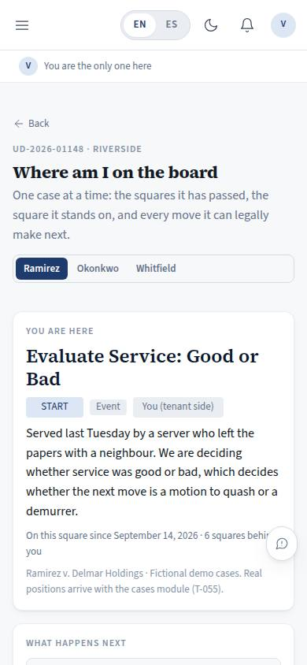
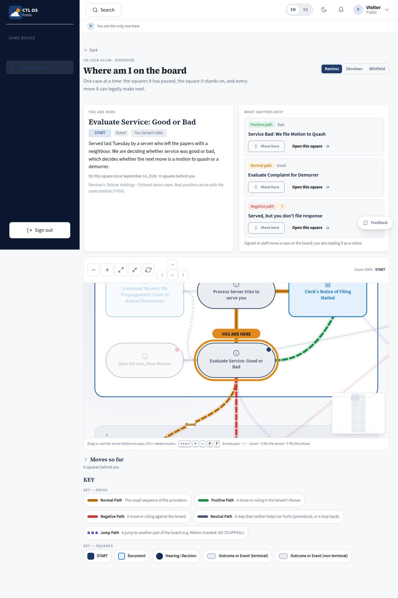

# GB-02 · Where am I on the board

## Purpose

One case on the board. A tenant asking "where is my case and what happens now" gets the square they stand on, the squares behind them, and every move the case can legally make next, in plain English. Staff use the same page to record a move. Three fictional demo cases stand at different points of the procedure so the page can be read before the cases module exists.

## Screenshots

| 390 | 1280 |
| --- | --- |
|  |  |

TV: `../screenshots/GB-02/3840.jpg`.

## Sections (layout order)

1. **CaseHeader** — court reference, title, and the demo-case selector (SegmentedControl; switching navigates to that case's route, so the position is addressable in the URL).
2. **You are here** — the current square, its phase / kind / who-moves badges, the note on the position, when the case arrived, how many squares are behind it.
3. **What happens next** — every possible next move with its path type, a "Move here" button and "Open this square".
4. **GameBoard (case mode)** — visited path drawn thick, current square ringed with a "YOU ARE HERE" flag, possible next paths dashed, everything the case has not reached dimmed (including whole phase regions).
5. **Moves so far** — the move history, collapsed by default.
6. **BoardKey** — the KEY.
7. **NodeDetail drawer** — with "Move here" on each next move when the current square is open.

## Data

| Table | Read / write | Notes |
| --- | --- | --- |
| `board_positions` | read / write | One row per case: `case_id`, `case_label`, `case_ref`, `node_id`, `entered_at`, `note`. A move updates it by id |
| `board_moves` | read / insert | Append-only history: `from_node_id`, `to_node_id`, `path`, `moved_at`, `moved_by`, `source`. The visited path is derived from these rows |

`case_id` is text for now and becomes a reference to `cases.id` when the cases module lands (T-055).

## Rules

- `RULE-BOARD-04` — a case stands on exactly one square and every move appends a row, so the visited path comes from data and two writers cannot silently overwrite each other (P-14).
- `RULE-BOARD-01`, `RULE-BOARD-02` — the board and its reconstructed paths.
- `RULE-UD-01` — the response window the first squares illustrate (`verify: true`; the page states no deadline of its own).
- `RULE-SYS-02` — ids, `updated_at`, `version`, writes by id through the provider.

## Actions (manifest)

| Id | Intent | Permission | Params | Live |
| --- | --- | --- | --- | --- |
| `board.selectNode` | open the square {id} on the game board | none | `id: string` | yes |
| `board.zoom` | zoom the board in, out, to fit or back to the start | none | `direction: enum:in,out,fit,reset` | yes |
| `board.fitPhase` | show the {phase} phase of the board | none | `phase: string` | yes |
| `board.selectCase` | show where case {caseId} is on the board | none | `caseId: id` | yes |
| `board.moveCase` | move case {caseId} to the square {nodeId} | `board.play` | `caseId: id`, `nodeId: string` | yes |

`board.selectCase` also matches on the case name, so "show me the Ramirez case on the board" is one call (P-06). `board.moveCase` refuses a square that is not a real next move's target only in the sense that it records the path as null; the UI offers only legal moves.

## Logic

- The position is a `board_positions` row; `currentId` is its `node_id`. The visited sequence is built from `board_moves` ordered by `moved_at` (first row's `from_node_id`, then every `to_node_id`), with the current square appended if the history is short. Nothing lives in component state.
- Possible next moves are the outgoing paths of the current square in `nodes.json`; each is offered with its path type so a reader sees whether the branch helps or hurts before choosing.
- "Move here" inserts a `board_moves` row (with the path type it took, the mover and the time) and updates the position by id, then refits the board to the new phase. It is a button, reachable by keyboard, never a drag (P-03).
- Without `board.play` the move buttons render disabled with a tooltip that says signed-in staff move a case — never a control that silently does nothing (P-09). The public visitor therefore reads the page fully and moves nothing.
- A terminal square (nothing follows it on the board) says so instead of showing an empty list.
- `/board/case` with no id redirects to the first case that has a position; with no positions at all the page shows an empty state.

## Components

`PageHeader`, `GameBoard`, `BoardKey`, `Drawer`, `SegmentedControl`, `Card`, `Section`, `EmptyState`, `Badge`, `StatusBadge` vocabulary via `Badge`, `Button`, `Placeholder`, `Toast`.

## Placeholders

Documents, cost and deadline rows in the drawer (same as GB-01). The move buttons are real.

## Real vs mock

Real: positions, move history, the move write, the derived visited path, case switching, case mode rendering. Mock: the three demo cases and their people are fictional and seeded (`src/data/seed/board.ts`); real positions arrive with the cases module (T-055), which will link the case detail page (L-10) to this route. A move made in the demo survives a reseed (the mock provider keeps rows it did not seed).

## Inputs and responsive check (P-01, P-03)

Checked at 360, 390, 768, 1280, 1920, 2560, 3840 in light and dark (`npm run qa:responsive -- --codes=GB-02`: 28 cells across both routes, 0 failing, 0 a11y findings). Case selector, move buttons and board squares are all keyboard reachable in a sensible order; the current square is panned into view on load; the "You are here" and "What happens next" cards stack on one column under 900 px.

## Changelog

- `docs/changelog/_pending/board.md`

## Resumen en español

Un caso a la vez sobre el tablero: la casilla actual con el rótulo "ESTÁS AQUÍ", las casillas recorridas, las regiones que el caso no ha alcanzado atenuadas, y cada movimiento posible con su tipo de camino y un botón "Mover aquí" que escribe la posición y el historial por el proveedor de datos.
