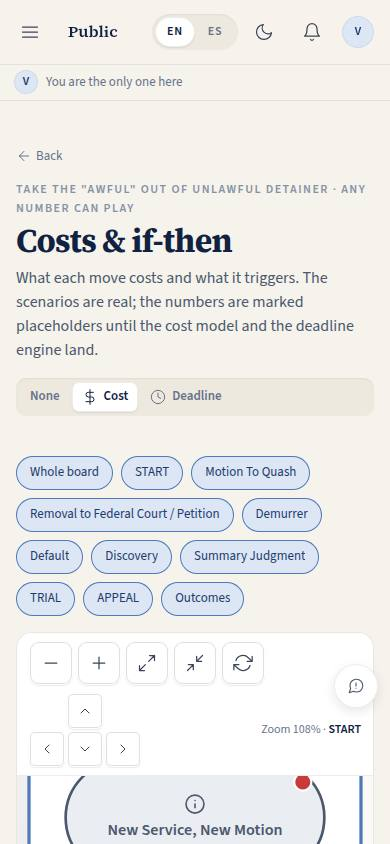
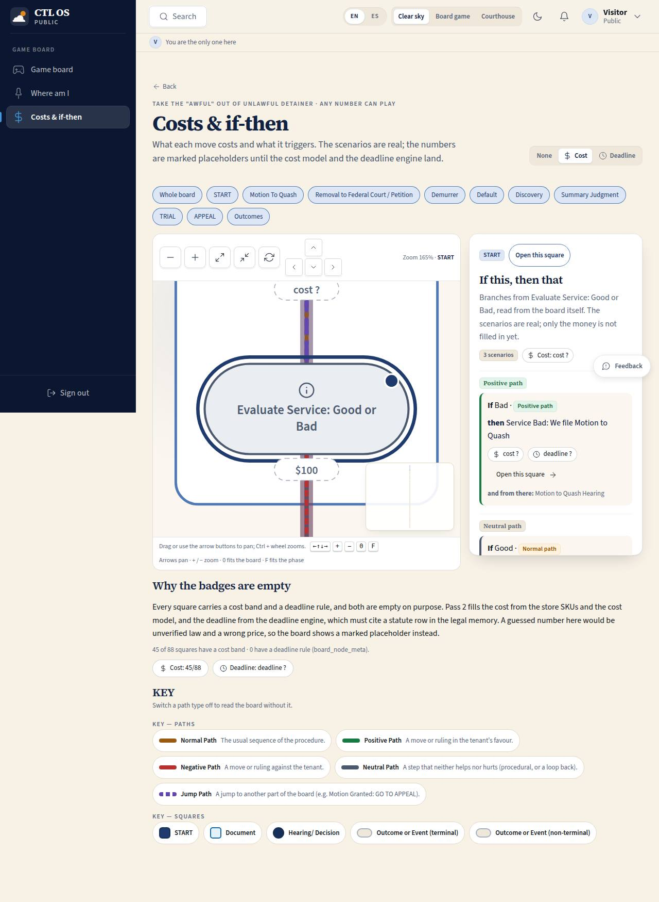

# GB-03 · Board costs & if-then

## Purpose

What each move on the board costs and what it triggers. Two things at once: a cost / deadline overlay that paints one badge per square, and an "If this, then that" reading of the branches out of one square, grouped into positive / negative / neutral scenarios. The scenario tree is real today — it is the board's own paths — and every number is a marked placeholder, because a guessed price is a wrong price and a guessed deadline is unverified law.

## Screenshots

| 390 | 1280 |
| --- | --- |
|  |  |

TV: `../screenshots/GB-03/3840.jpg`.

## Sections (layout order)

1. **OverlayHeader** — title, one-line explanation, and the overlay switch (None / Cost / Deadline).
2. **Phase chips** — fit the board to a phase.
3. **GameBoard with the overlay** — a badge hangs under every square ("cost ?" / "deadline ?"), carrying `data-placeholder` and a tooltip naming the task that will fill it.
4. **IfThenPanel** — the selected square's branches: each one reads "If <branch> · <path type> → then <target>", with a cost and a deadline placeholder chip, "Open this square", and "and from there" naming where the branch leads next.
5. **Why the badges are empty** — the explanation, with the two placeholder chips.
6. **BoardKey** — the KEY with path filters.
7. **NodeDetail drawer**.

## Data

| Table | Read / write | Notes |
| --- | --- | --- |
| `board_node_meta` | read | One row per square. The services catalog seed (order 70, RULE-CATALOG-05) fills `typical_cost_band` and `cost_source` on 45 of them from the store SKUs; `deadline_rule` and `deadline_authority` are null everywhere, with a note saying why. The explanation section reads the rows and states how many are filled |

## Rules

- `RULE-BOARD-03` — no invented costs or deadlines on the board; the overlay renders marked placeholders until T-074 (cost model from the store SKUs) and T-059 (deadline engine citing `docs/legal/statute-index.md`) fill the columns.
- `RULE-UD-01` — the response window the first branch illustrates (`verify: true`).
- `RULE-SYS-01`.

## Actions (manifest)

| Id | Intent | Permission | Params | Live |
| --- | --- | --- | --- | --- |
| `board.selectNode` | open the square {id} on the game board | none | `id: string` | yes |
| `board.zoom` | zoom the board in, out, to fit or back to the start | none | `direction: enum:in,out,fit,reset` | yes |
| `board.pan` | pan the board {direction} | none | `direction: enum:up,down,left,right` | yes |
| `board.fitPhase` | show the {phase} phase of the board | none | `phase: string` | yes |
| `board.setOverlay` | show the {overlay} overlay on the board | none | `overlay: enum:none,cost,deadline` | yes |
| `board.togglePath` | hide the {type} paths on the board | none | `type: enum:normal,positive,negative,neutral,jump` | yes |

## Logic

- The overlay switch sets one prop on the board organism; the badge is drawn in the gap under each shape so it never sits on a label, and it renders the placeholder wording, never a value.
- Scenarios: the selected square's outgoing paths are grouped — `positive` → positive, `negative` → negative, `normal` / `neutral` / `jump` → neutral — and each branch shows the target and up to three of the target's own onward moves, so the reader sees two levels of consequence.
- The page opens on `evaluate-service`, a real three-way branch point (service bad → motion to quash, service good → demurrer, no response → default), so the panel says something useful on first load.
- Cost and deadline chips are the real `Placeholder` atom: tooltip on hover **and** focus, a "not wired yet" toast on activation, a dashed outline and badge in dev mode, and `data-placeholder` so QA can count them (P-09).

## Components

`PageHeader`, `GameBoard`, `BoardKey`, `IfThenPanel` (module), `NodeDetail` (module), `Drawer`, `SegmentedControl`, `Card`, `Section`, `Badge`, `Chip`, `Placeholder`, `EmptyState`.

## Placeholders

Every deadline chip and badge, and the cost badge on the 43 squares with no band in `board_node_meta`. A band the catalog has already filled is printed as it stands — the drawer used to show a placeholder even there, which is fixed. Counted by `data-placeholder`; each names its task (T-074, T-059) in dev mode.

## Real vs mock

Real: the overlay mechanism, the `board_node_meta` table and its rows, the 45 cost bands the store already prices, the scenario tree, the two-level "and from there" reading. Mock: nothing is mocked — the missing numbers are absent, which is the point. T-076 turns this page into the real cost overlay once the cost model and deadline engine exist, and adds the 3D object view (GB-04) on the same data.

## Inputs and responsive check (P-01, P-03)

Checked at 360, 390, 768, 1280, 1920, 2560, 3840 in light and dark (`npm run qa:responsive -- --codes=GB-03`: 14 cells, 0 failing, 0 a11y findings). Re-checked 2026-09-20 with Playwright at 1280: 88 badges, 45 carrying a real band and 43 plus every deadline rendered as a marked `data-placeholder`; no number is invented; 0 console errors. Board and panel sit side by side from 1200 px and stack below it; the panel scrolls independently on wide screens. The narrower board container drops to a two-square layout band so labels stay legible next to the panel.

## Changelog

- `docs/changelog/_pending/board.md`
- `docs/changelog/_pending/board-verify.md` (2026-09-20 verification pass)

## Verification (2026-09-20, prompt 0006)

`docs/game-board/nodes.json` was checked square by square and arrow by arrow against `reference/game-board.pdf`
(text layer with coordinates + the page rendered at 2.2x): no square is missing, no label differs, 23 path types and
five endpoints were corrected, one edge was added, and the reconstructed count fell from 18 to 13.
Full table: `docs/game-board/verification-2026-09-20.md`.

## Resumen en español

La capa de costos y plazos sobre el tablero y la lectura "si esto, entonces aquello" de las ramas de una casilla, agrupadas en escenarios positivo / neutral / negativo. El árbol de escenarios es real; los números son marcadores señalados hasta que lleguen el modelo de costos (T-074) y el motor de plazos (T-059).
