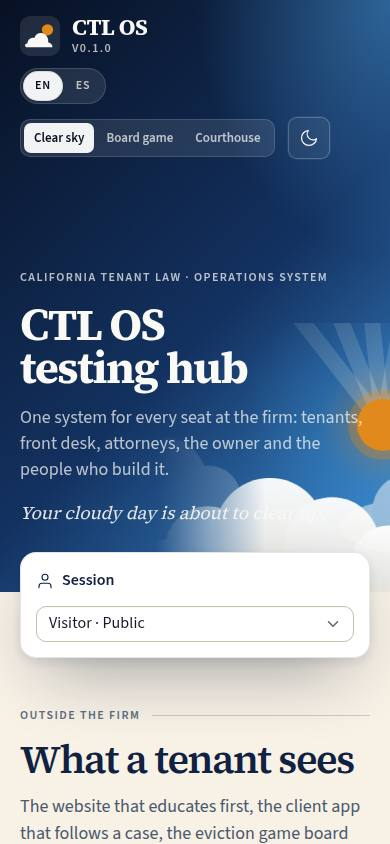
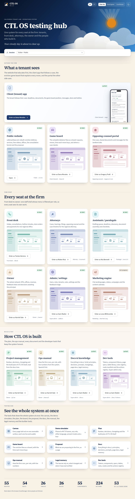

# HUB-01 · Testing hub

## Purpose

First screen for the team: open any surface family as the right demo role, switch demo user and view-as, toggle language, brand, theme and the builder tool, and see what the system holds (routes, tables, rules, components, actions, plan tasks). Not customer-facing. Justin: "from the hub, choose who we're logging in as" and "turn on and off developer mode… see the specs for every single page".

Restyled by the design pass (`docs/design/design-system.md`, changelog 0003): ink hero band with the clearing-sky illustration, display headline, promise and tagline, a floating session bar, cards grouped by audience (Outside the firm / Firm staff / Build & test) with per-surface hue medallions, one Enter button per card, developer codes only in dev mode, and a stat-strip footer.

Fixed in 0.1.2 (prompt 0005, `docs/changelog/_pending/hubfix.md`): Justin saw "a mobile thumbnail in a wide space" on a wide monitor in dark mode. The previews now render their page at a 1280 x 800 desktop viewport and fill a 16:10 frame edge to edge (`DeviceFrame` `viewport` / `aspect` / `edge`; the global `iframe { max-width: 100% }` had been shrinking the iframe into a phone layout), a not-live card shows a window wireframe in its hue instead of a lone icon, the session bar renders outside the ink band so it is never clipped, group heads are no longer sticky, and the client-app phone stays inside its card, cropped at the bottom only.

Enriched by T-024 (changelog 0008): every surface card now carries a **live preview of its home page running as that family's demo role**, an explicit "Enter as <demo person>" button and a built / stub / planned badge from the route manifest; a **Testing hub** row opens the canvas (D-21), the simulator (D-22), the plan, the board, the proposal, the docs, the manual, the legal memory and the builder tools.

## Screenshots

| 390 | 1280 |
| --- | --- |
|  |  |

Dark: `../screenshots/HUB-01/390-dark.jpg`, `../screenshots/HUB-01/1280-dark.jpg`. TV: `../screenshots/HUB-01/3840.jpg` (+ `3840-dark.jpg`). Produced by `npm run screenshots -- --codes=HUB-01 --dark --widths=390,1280,3840`. Previews load when they scroll into view (at most six live), so cards below the fold show the static window wireframe in their hue in a capture.

## Sections (layout order)

1. HubHeader (on the ink band) - BrandMark lockup with the version, LangToggle, brand cycle, theme toggle, builder-tool Toggle (super admin only)
2. Hero - eyebrow, display title, promise, tagline, BrandArt sky illustration; then the floating session bar (rendered after the band, overlapping its bottom edge) with RoleSwitcher (demo user + view as) and the dev-mode hint with Kbd Ctrl + .
3. SurfaceGrid - three audience groups (Outside the firm: app, site, board, opposition / Firm staff: desk, counsel, assist, owner, admin, marketing / Build & test: plan, manual, docs, dev), each with an eyebrow, title and body on the left and the cards on the right. A card: hue medallion, built / in-progress / planned chip from the manifest, "You are here" chip for the current role, name, purpose, a live preview of the family home as its demo role (a scaled PhoneFrame for the client app, fully inside the card and cropped at the bottom only; a DeviceFrame at a 1280 x 800 viewport scaled to fill a 16:10 box for the rest; a window wireframe in the card's hue while the frame is not live), "Enter as <demo name>" (the one control) with role, path and, in dev mode, the code range
4. TestingHub - Canvas, Demo simulator, Plan, Game board, Proposal, Docs, Ops manual, Legal memory, Dev tools as compact interactive cards; a path with no route yet is a Placeholder, never a dead link
5. Footer - stat strip: routes, built, tables, rules, components, actions, plan tasks done (of total, linking to /plan); mock-data note

## Data

| Table | Read / write | Notes |
| --- | --- | --- |
| `users` | read | demo users are also seed rows (SessionProvider resolves non-demo ids) |
| `tenants` | read | via the shells; the hub itself only counts tables |

Plan counts come from `docs/plan/tasks.json`, imported as JSON at build time (not a table).

## Rules

- `RULE-SYS-01` - every route listed here has a spec with actions; counts come from the registries

## Actions (manifest)

| Id | Intent | Permission | Params | Live |
| --- | --- | --- | --- | --- |
| `hub.enterAs` | open a surface as its demo role | none | `surface: enum:site,app,desk,...`, `role: enum:super_admin,...,public` | yes |
| `hub.openCanvas` | open the canvas with every page laid out | none | none | yes |
| `hub.openSimulator` | open the demo simulator | none | none | yes |
| `hub.openTool` | open one of the testing-hub tools | none | `tool: enum:canvas,simulator,plan,board,proposal,docs,manual,legal,dev` | yes |
| `hub.toggleDevMode` | turn the builder tool on or off | `dev.tools` | none | yes |
| `hub.setLang` | switch the interface language | none | `lang: enum:en,es` | yes |
| `hub.toggleTheme` | switch between light and dark | none | none | yes |
| `hub.setBrand` | switch the visual direction (clear sky, board game or courthouse) | none | `brand: enum:clearsky,boardgame,courthouse` | yes |
| `hub.cycleBrand` | cycle the brand palette | none | none | yes |

## Logic

- `enter(surface)` = `switchUser(role)` then `navigate(to ?? ROLE_HOME[role])`
- Each card's preview is an iframe of the family home whose hash carries `?as=<role>&dev=0&lang=<lang>&theme=<theme>`; `src/modules/showcase/frameSession.ts` applies those inside the frame only, so a preview never changes your own session (see `docs/pages/D-21.md`, "Real vs mock")
- Previews load only once they scroll into view (IntersectionObserver) and at most six are live at a time, the six highest on the page; a not-live card shows the `BrandArt` `window` wireframe; inside a frame the hub shows the wireframes only, so frames never nest
- Desktop previews render at `PREVIEW_VIEWPORT` 1280 x 800 (`DeviceFrame viewport`, `aspect` 16:10, `caption` off, `edge` on) so the framed page is a desktop page scaled down, never a phone layout in a wide box; the phone preview scale is `0.4 x --scale` (`useUiScale`)
- Status badges come from the manifest: no route at a path yet -> `planned` and the card is wrapped in `Placeholder` with the module that will build it
- Dev toggle renders only for super_admin; theme and brand persist in `ctl.theme`, language in `ctl.lang`, session in `ctl.session`; `?brand=clearsky|boardgame|courthouse` on the hash sets the visual direction on load (docs/design/directions.md) and the hero art follows it (sky / board / ledger)
- Counts: `getRoutes()`, `tables`, `rules`, `componentLibrary`, `listActions()` and `docs/plan/tasks.json`

## Components

Card, Button, Toggle, Badge, Icon, IconButton, Kbd, Placeholder, BrandMark, BrandArt, RoleSwitcher, LangToggle, PhoneFrame, DeviceFrame

## Placeholders

Testing-hub cards whose route does not exist are wrapped in `Placeholder` with the module that will build them (none after Pass 1 integration: `/site/proposal` and `/legal` are built). Everything else is live; every stub the cards lead to shows its own planned actions as Placeholders.

## Real vs mock

All real against the mock provider: the previews are the real pages, the badges and counts the real manifest, the task counts the real plan file. Version comes from package.json through `__APP_VERSION__`.

## Inputs and responsive check (P-01, P-03)

Checked at 360, 390, 768, 1280, 1920, 2560, 3840 in light and dark by `npm run qa:responsive -- --codes=HUB-01` (re-run for 0.1.2: 14 cells, 0 failing, 0 a11y findings): no horizontal scroll, no console errors, no text under 12 px (16 px at >= 1920), with the previews live. 0.1.2 also looked at 1440 / 1920 / 2560 / 3840 x light / dark x clearsky / boardgame / courthouse with the whole page in one viewport and the frames booted: previews fill their 16:10 frames at a desktop layout, static tiles match the live ones, the session bar is whole, rows keep one card layout and size per group (three columns for the audience groups, four for the build band). Keyboard: every control is a native button, link or select; the surface cards are no longer clickable containers, so the "Enter as" button is the one focusable action per card (no nested interactive elements); visible 3 px focus ring; 44 px targets; tooltips open on focus. At >= 2560 the preview boxes and the tool grid grow with `--scale`.

## Changelog

- `docs/changelog/0002-foundation.md` (base page)
- `docs/changelog/0003-design-system.md` (visual redesign)
- `docs/changelog/0008-showcase.md` (T-024 enrichment)
- `docs/changelog/0010-pass-1-integration-and-release-0.1.0.md` (the two hub versions combined)
- `docs/changelog/_pending/hubfix.md` (0.1.2: previews at a desktop viewport filling their frames, session bar unclipped, static tiles)

## Resumen en español

Pantalla inicial del equipo: abre cualquier superficie con el rol demo correcto, cambia de usuario, idioma, marca, tema y herramienta de construcción, y muestra cuántas rutas, tablas, reglas, componentes, acciones y tareas tiene el sistema. Cada tarjeta trae una vista previa viva de su superficie con su rol demo, y la fila "Centro de pruebas" abre el lienzo, el simulador, el plan, el tablero, la propuesta, la documentación, el manual y la memoria legal. No es una pantalla para clientes.
