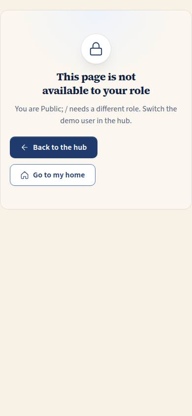
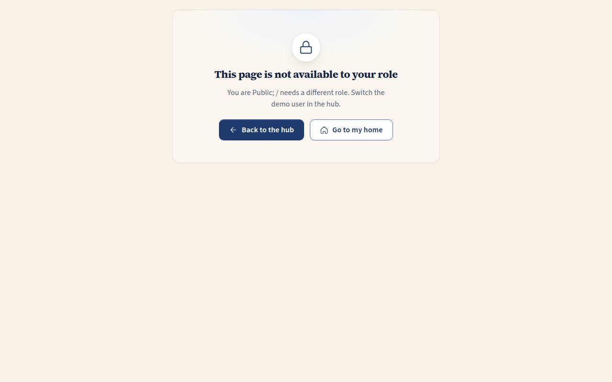

# HUB-02 · No access

## Purpose

Friendly page when the current role cannot open a route. RequireRole redirects here with `?from=<path>`; the page names the role and the route and offers the hub (to switch demo user) or the role's home.

## Screenshots

| 390 | 1280 |
| --- | --- |
|  |  |

Dark and 3840 captures are produced by `npm run screenshots -- --codes=HUB-02 --dark --widths=390,1280,3840` (screenshot pass pending; folder created by the pass).

## Sections (layout order)

1. EmptyState - lock icon, title, body with role label (en/es) and the target route
2. Actions - Back to the hub (Link), Go to my home (ROLE_HOME[role])

## Data

| Table | Read / write | Notes |
| --- | --- | --- |
| `users` | read | effective role from the session |

## Rules

- `RULE-SYS-01` - guards stay real while identity is mocked

## Actions (manifest)

| Id | Intent | Permission | Params | Live |
| --- | --- | --- | --- | --- |
| `hub.goHome` | go to the home page of my current role | none | none | yes |

## Logic

- `hasRole(roles)`: public routes pass everyone; super admin not viewing-as passes everything

## Components

EmptyState, Button

## Placeholders

None.

## Real vs mock

Real. Until Supabase Auth, roles come from demo users.

## Inputs and responsive check (P-01, P-03)

Checked at 360, 390, 768, 1280, 1920, 2560, 3840 in light and dark by `npm run qa:responsive` (foundation pass, 2026-09-18): no horizontal scroll, no console errors, no text under 12 px (16 px at >= 1920). Keyboard: every control is a native button, link or select; visible 3 px focus ring; 44 px targets; tooltips open on focus.

## Changelog

- `docs/changelog/_pending/foundation.md` (to be merged into the next numbered entry)

## Resumen en español

Página amable cuando el rol actual no puede abrir una ruta; ofrece volver al centro o ir al inicio del rol.
