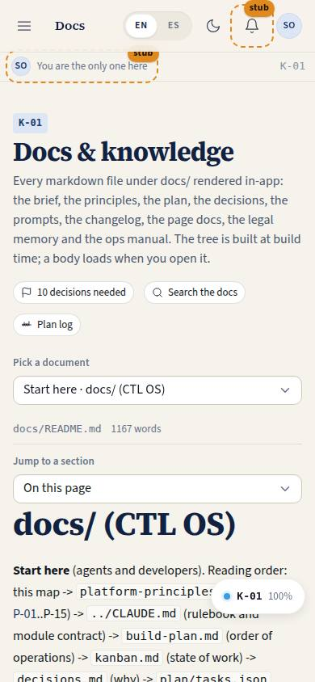
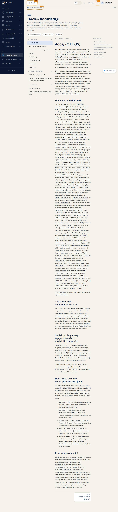

# K-01 · Docs viewer

## Purpose

Every markdown file under `docs/` rendered inside the product, so the project's memory is part of the system instead of a folder on someone's disk. A reader gets the folder tree in reading order, the document with its links and captures resolved, a heading outline, prev / next and the count of pending decisions. Adding a doc needs no code: the `?docmeta` Vite plugin indexes it at build time and the body arrives as a lazy `?raw` chunk.

Access (D-048, 2026-09-20): `super_admin` and `owner` (was every staff role). Docs are a leadership surface; front desk, paralegals, attorneys and marketing get the ops manual (M-xx) instead, and the legal team gets legal memory (K-10..K-13).

## Screenshots

| 390 | 1280 |
| --- | --- |
|  |  |

A long document with the outline rail: `../screenshots/K-01/1280-doc.jpg`, `../screenshots/K-01/390-doc.jpg`.

## Sections (layout order)

1. PageHeader - title, the "N decisions needed" chip, links to K-02 and K-03
2. Tree - groups in reading order (start here, prompts, changelog, page docs, reference, legal memory, game board, ops manual, plan data, QA reports, screenshots) with counts; a `Select` replaces it under 900 px
3. Document - path, word count, version / date badges, the body
4. Outline - `##` headings as scroll buttons (right rail from 1280 px, dropdown below)
5. PrevNext - previous / next document in the tree's reading order

## Data

| Table | Read / write | Notes |
| --- | --- | --- |
| `page_layouts` | read | section order (builder tool) |

Content comes from `docs/**/*.md` through `src/docs/docsIndex.ts`, not from a table.

## Rules

- `RULE-SYS-01` - the docs tree is the memory system; it is rendered, not duplicated

## Actions (manifest)

| Id | Intent | Permission | Params | Live |
| --- | --- | --- | --- | --- |
| `docs.open` | open a docs file by path | `docs.read` | `path: string` | yes |
| `docs.jumpToHeading` | scroll to a section of the open document | none | `id: string` | yes |
| `docs.toggleGroup` | collapse or expand a folder in the docs tree | none | `group: string` | yes |

## Logic

- Groups in `GROUP_ORDER`; `docs/` root files ordered README, platform principles, build plan, kanban, decisions, brief, then alphabetically; prompts and changelog newest first.
- Relative links between docs resolve to `/#/docs/<path>`; ops-manual chapters resolve to `/#/manual/<lang>/<slug>`.
- Bare page-code mentions (`PM-03`) become links when the route manifest has that code. The `P-` prefix is skipped in `platform-principles.md`, where `P-01..P-15` are principles, not pages.
- `[screenshot: CODE — caption]` renders the real capture from `docs/screenshots/<CODE>/` or a dashed box naming the code with a link to the live page.
- `> DECISION NEEDED:` and the other callouts render as styled asides.
- Heading ids are assigned to the rendered `h2` / `h3` after each render, so the outline, the phone dropdown and `docs.jumpToHeading` scroll to the same node (no `#` anchors, which would fight the HashRouter).

## Components

PageHeader, MarkdownViewer, Select, Badge, Chip, Icon, Spinner, EmptyState.

## Placeholders

None on this page. A `{{directive}}` written in a doc renders as a code chip here; the ops manual (M-02) is where directives render live.

## Real vs mock

Real: every document, every heading, every capture. Nothing is mocked. When Supabase lands nothing changes: the docs tree stays a build-time import.

## Inputs and responsive check (P-01, P-03)

Checked at 360, 390, 768, 1280, 1920, 2560, 3840 in light and dark. Tree collapses to a labelled `Select` under 900 px; the outline becomes a dropdown under 1280 px. Outline entries and tree rows are buttons / links at least 32 px tall inside 44 px rows, keyboard reachable in reading order, focus ring from the token. Nothing hover-only.

## Changelog

- `docs/changelog/_pending/knowledge.md`

## Resumen en español

Visor de toda la documentación del proyecto dentro de la app: árbol de carpetas en orden de lectura con contadores, el documento renderizado con sus enlaces y capturas resueltos, índice de encabezados, anterior / siguiente y el contador de decisiones pendientes. Añadir un documento no requiere código.
