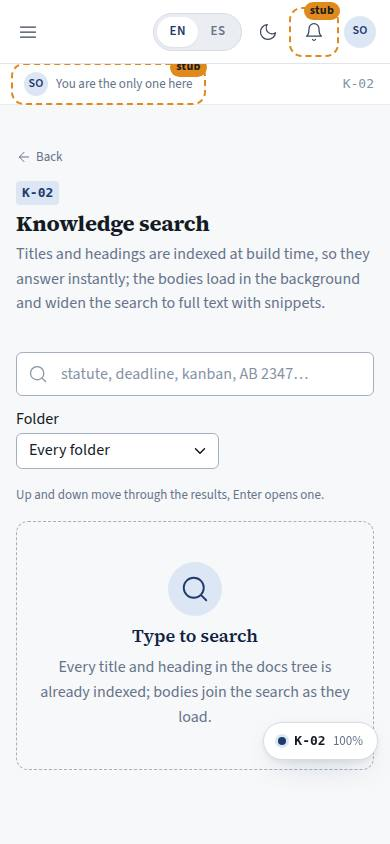
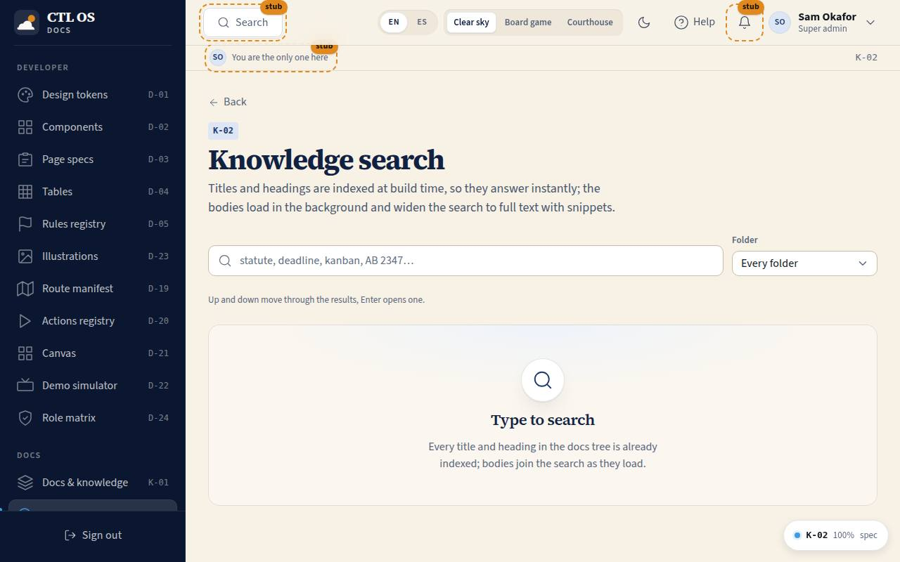

# K-02 · Knowledge search

## Purpose

Find anything the project has written down. Titles, header metadata and `##` headings are indexed at build time so they answer as you type; the bodies load in batches in the background and widen the search to full text with snippets. A folder filter narrows it, and the results are navigable from the keyboard.

Access (D-048, 2026-09-20): `super_admin` and `owner` (was every staff role).

## Screenshots

| 390 | 1280 |
| --- | --- |
|  |  |

## Sections (layout order)

1. PageHeader
2. SearchInput + folder `Select`
3. Body-load progress ("full text ready for N of M documents")
4. Results - title, where it matched (title / heading / body), path, snippet with the query highlighted

## Data

| Table | Read / write | Notes |
| --- | --- | --- |
| `page_layouts` | read | |

## Rules

- `RULE-SYS-01` - a doc that is not written is a feature that does not exist; search makes the tree usable

## Actions (manifest)

| Id | Intent | Permission | Params | Live |
| --- | --- | --- | --- | --- |
| `docs.search` | search every doc for a phrase | `docs.read` | `q: string` | yes |
| `docs.filter` | show results from one folder only | none | `folder: string` | yes |
| `docs.openResult` | open the selected search result | none | `path: string` | yes |

## Logic

- Query words are normalised (lowercase, accents stripped) and every word must match. Title hits rank above heading hits above body hits.
- Bodies load only once a query of two characters or more exists, in batches of eight, through `loadDoc()`; a ref guards the loader so the effect never re-enters on its own writes.
- The snippet is the first body line that holds every word, trimmed around the first match.
- `q` and `folder` live in the URL query, so a search is shareable and survives a reload (P-06: addressable state).
- Arrow up / down move the selection, Enter opens it; hover and focus also select, so mouse, keyboard and touch agree.

## Components

PageHeader, SearchInput, Select, Badge, ProgressBar, EmptyState.

## Placeholders

None.

## Real vs mock

Real search over the real tree. No index service: the eager part is the docmeta index in the bundle, the lazy part is the same `?raw` chunks the viewer uses.

## Inputs and responsive check (P-01, P-03)

Checked at 360, 390, 768, 1280, 1920, 2560, 3840 in light and dark. The search row wraps under 600 px; results are single-column cards with 44 px minimum height. The results list is a `listbox` with `aria-selected`; the keyboard hint is on the page.

## Changelog

- `docs/changelog/_pending/knowledge.md`

## Resumen en español

Búsqueda en toda la documentación: títulos y encabezados vienen del índice de compilación y responden al instante; los cuerpos se cargan por lotes y añaden fragmentos con la coincidencia resaltada. Filtro por carpeta, navegación con flechas y Enter, y la consulta queda en la URL.
