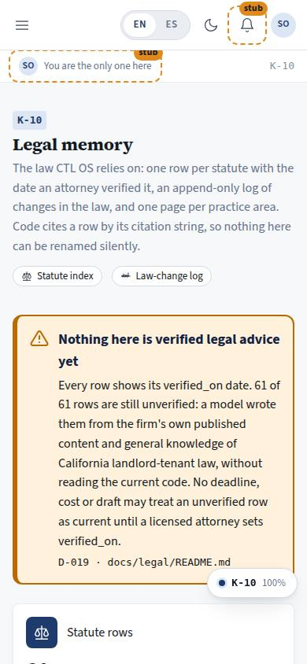
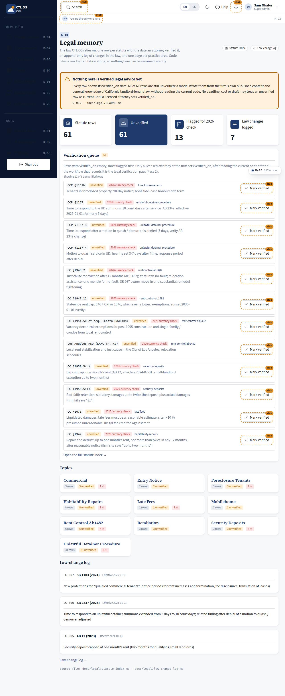

# K-10 · Legal memory

## Purpose

The front door of the firm's legal memory. It says, unmistakably and in both languages, that **nothing here is verified legal advice yet**, shows how many statute rows are still unverified, lists the verification queue (the rows an attorney has to read the current code for), the practice-area topics and the newest changes in the law. Code cites a row by its citation string, so a rename is a log entry and never a silent edit.

## Screenshots

| 390 | 1280 |
| --- | --- |
|  |  |

## Sections (layout order)

1. Banner - "Nothing here is verified legal advice yet" with the counts and D-019; not dismissible while any row is unverified
2. StatTiles - statute rows, unverified, flagged for the 2026 currency check, law changes logged
3. VerificationQueue - unverified rows, flagged ones first, each with a "Mark verified" Placeholder
4. Topics - one card per practice area with its row count, unverified count and flag count
5. RecentChanges - the three newest law-change entries, then a link to K-12

## Data

| Table | Read / write | Notes |
| --- | --- | --- |
| `page_layouts` | read | |

The law itself comes from `docs/legal/statute-index.md` and `docs/legal/law-change-log.md`, parsed from their lazy `?raw` bodies by `parseLegal.ts`. The markdown files stay the single source of truth (docs/legal/README.md rule 1).

## Rules

- `RULE-SYS-01` - the docs tree is the memory; the viewer renders it
- `RULE-UD-01` - the unlawful-detainer response period, shown with its verification state, never as settled advice

## Actions (manifest)

| Id | Intent | Permission | Params | Live |
| --- | --- | --- | --- | --- |
| `legal.openTopic` | open the legal topic page for a practice area | `docs.read` | `slug: string` | yes |
| `legal.markVerified` | record that an attorney verified a statute row today | `rules.write` | `citation: string` | stub (Placeholder) |

## Logic

- A row is verified only when `verified_on` holds a date; `⚠` in the flag column means a 2026 currency check is required, `◆` means the row was added because the game board needs it.
- The banner turns green only when every row has a date - today 61 of 61 rows are unverified, so it stays a warning.
- The queue sorts flagged rows first and shows the first twelve, with a link to the full index.

## Components

PageHeader, StatTile, Card, Badge, Chip, Button, **Placeholder**, Icon, Spinner, EmptyState.

## Placeholders

- **Mark verified** - "record verified_on, verified_by and the code text an attorney read for this citation", planned in the *legal verification workflow, Pass 2*. Setting `verified_on` is the firm's attorney's act; no agent and no button here may fake it (D-019).

## Real vs mock

Real rows from the real files. No legal content is invented by this page; it only reports what the files say and how unverified they are.

## Inputs and responsive check (P-01, P-03)

Checked at 360, 390, 768, 1280, 1920, 2560, 3840 in light and dark. The banner is a bordered warning region with an icon *and* text (never colour alone) and stays legible at 3840 through the `--scale` bands. Queue rows wrap; the Placeholder button is 44 px and announces itself on hover, focus and activation. Topic cards are 1 / 2 / 3 / 5 columns as the screen grows.

## Changelog

- `docs/changelog/_pending/knowledge.md`

## Resumen en español

Portada de la memoria legal: el aviso de que nada aquí es asesoría legal verificada (con los contadores y D-019, no se puede cerrar mientras haya filas sin verificar), los totales, la cola de verificación con el botón «Marcar verificada» como marcador (solo un abogado pone `verified_on`), los temas y los cambios de ley más recientes.
