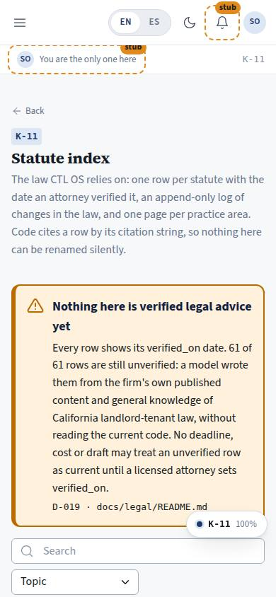
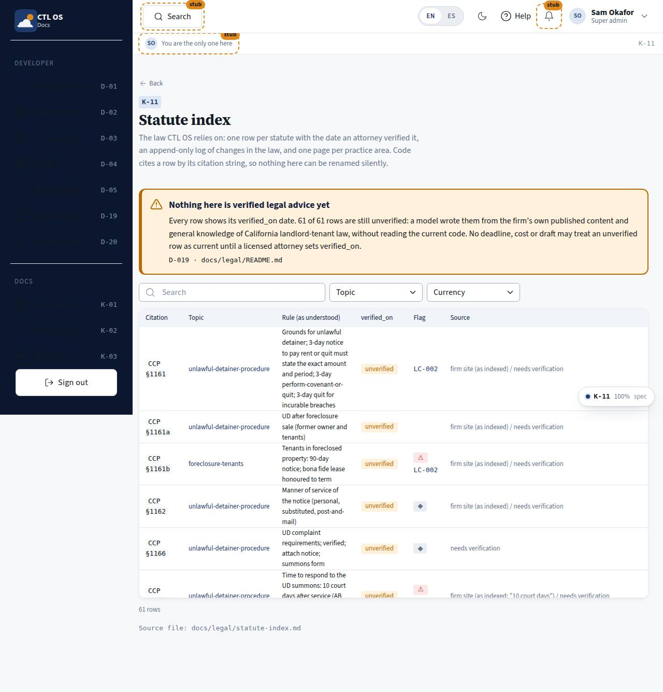

# K-11 · Statute index

## Purpose

Every statute the product cites, as one sortable, searchable table: the citation string code uses as the key, the topic, the rule as we understand it, `verified_on`, the source it was written from, and the currency flags. Filters by topic and by "flagged for the 2026 currency check" or "unverified only", so an attorney can work the list down.

## Screenshots

| 390 | 1280 |
| --- | --- |
|  |  |

## Sections (layout order)

1. PageHeader (back to K-10)
2. Banner - the unverified warning
3. DataTable - citation, topic, rule, `verified_on`, flags (⚠ / ◆ / the `LC-nnn` entries that touch the row), source, section

## Data

| Table | Read / write | Notes |
| --- | --- | --- |
| `page_layouts` | read | |

Rows parsed from `docs/legal/statute-index.md`; change entries from `docs/legal/law-change-log.md`.

## Rules

- `RULE-SYS-01`, `RULE-UD-01`

## Actions (manifest)

| Id | Intent | Permission | Params | Live |
| --- | --- | --- | --- | --- |
| `legal.filterTopic` | show the statutes of one topic | none | `topic: string` | yes |
| `legal.filterCurrency` | show only flagged or only unverified rows | none | `flag: enum:all,flagged,unverified` | yes |

## Logic

- The table is the library `DataTable` (never hand-rolled): search across citation, rule and topic; sort per column; card layout under 768 px.
- `?topic=` in the URL preselects the topic filter, which is how K-12 and K-13 link into this page.
- Each row links to its topic page, and the `LC-nnn` ids beside it are the logged law changes that name its citation.

## Components

PageHeader, DataTable, Badge, Tooltip, Select, Spinner, EmptyState.

## Placeholders

None on this page (marking a row verified lives on K-10 so there is one place for that act).

## Real vs mock

Real. 61 rows today, every one `verified_on: null`.

## Inputs and responsive check (P-01, P-03)

Checked at 360, 390, 768, 1280, 1920, 2560, 3840 in light and dark. Under 768 px each row becomes a labelled card; citations wrap instead of forcing a horizontal scroll (fixed after the first QA pass). Flags carry a tooltip that shows on focus as well as hover, and a text badge, never colour alone.

## Changelog

- `docs/changelog/_pending/knowledge.md`

## Resumen en español

Índice de leyes como tabla: cita (la clave que usa el código), tema, regla según se entiende, `verified_on`, fuente y banderas, con filtros por tema y por «marcada para revisión 2026» o «sin verificar».
