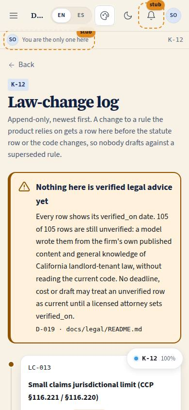
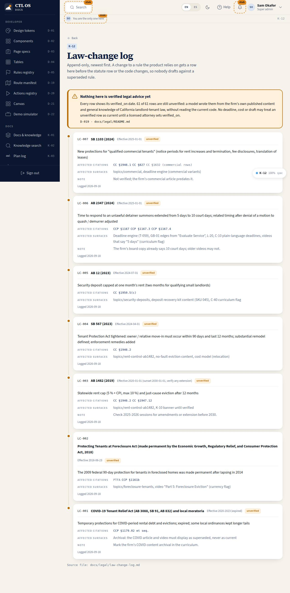

# K-12 · Law-change log

## Purpose

The changes in California law that touch a rule the product relies on, as a vertical timeline newest first: the instrument (bill, decision, ordinance), when it took effect, what changed, which citations and which product surfaces it affects, and whether anyone has verified it. The log is append-only and a change is logged **before** the statute row or the code changes, so nobody drafts against a superseded rule.

Access (D-048, 2026-09-20): `super_admin`, `owner`, `attorney` and `paralegal` (was every staff role); front desk and marketing never see the law-change log.

## Screenshots

| 390 | 1280 |
| --- | --- |
|  |  |

## Sections (layout order)

1. PageHeader (back to K-10)
2. Banner - the unverified warning
3. Timeline - one card per `LC-nnn`: instrument, effective date, verification badge, what changed, affected citations (links into K-11), affected surfaces, note, logged date

## Data

| Table | Read / write | Notes |
| --- | --- | --- |
| `page_layouts` | read | |

Rows parsed from `docs/legal/law-change-log.md`.

## Rules

- `RULE-SYS-01`

## Actions (manifest)

| Id | Intent | Permission | Params | Live |
| --- | --- | --- | --- | --- |
| `legal.openChange` | open the statute row a law change affects | none | `citation: string` | yes |

## Logic

- Ids are permanent; the list sorts by id numerically, newest first, matching the file.
- Each affected citation resolves to a statute row and links into K-11 filtered to that row's topic.
- The dot on the rail is amber until the entry has a `verified_on` date, then green - with the same information in a text badge beside it.

## Components

PageHeader, Card, Badge, Spinner, EmptyState.

## Placeholders

None.

## Real vs mock

Real: LC-001..LC-007 today (COVID-era rules expired, PTFA made permanent, AB 1482, SB 567, AB 12, AB 2347, SB 1103), all unverified.

## Inputs and responsive check (P-01, P-03)

Checked at 360, 390, 768, 1280, 1920, 2560, 3840 in light and dark. The "effective" value can be a sentence, so it renders as wrapping text rather than a fixed badge (fixed after the first QA pass); definition rows collapse to one column under 600 px.

## Changelog

- `docs/changelog/_pending/knowledge.md`

## Resumen en español

Registro de cambios de ley como línea de tiempo (solo se añade, más reciente primero): instrumento, fecha de vigencia, qué cambió, citas y superficies afectadas, y estado de verificación. Cada cita enlaza con su fila en el índice.
