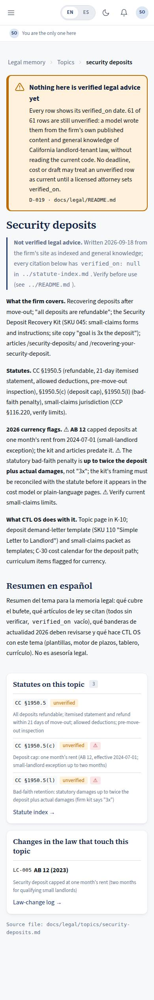
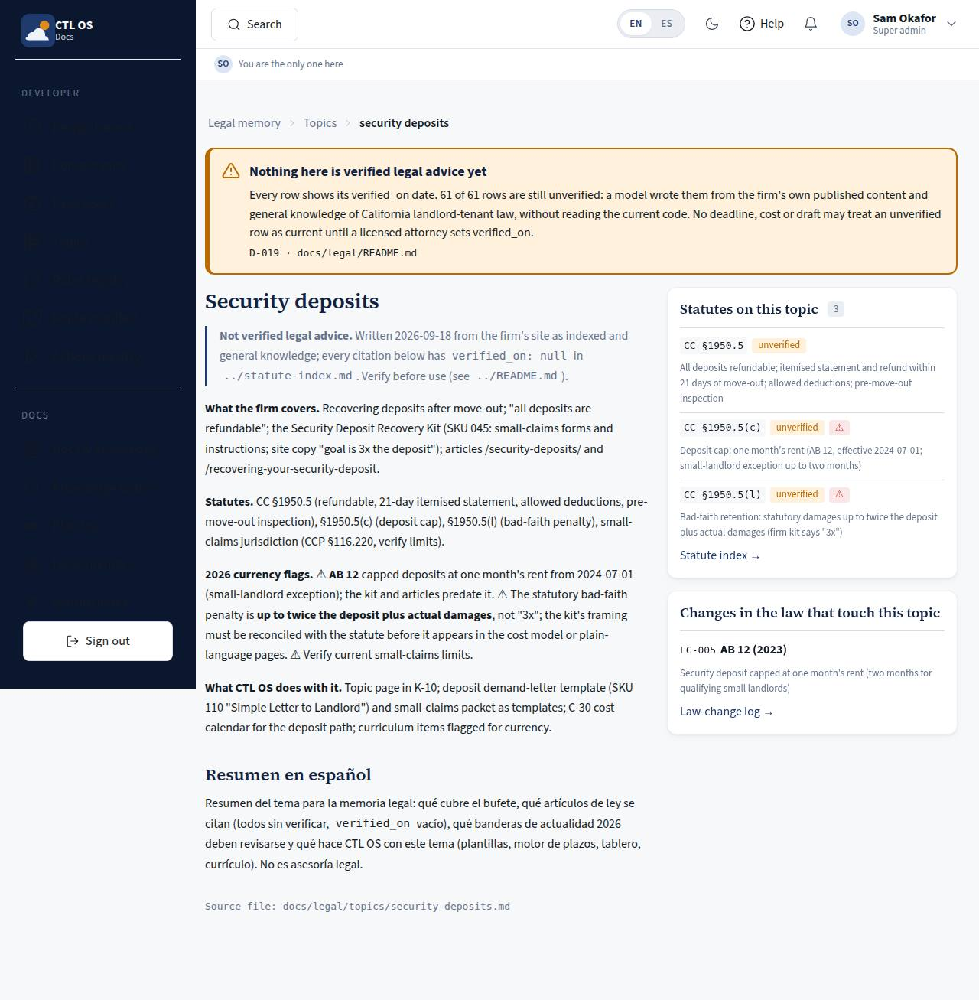

# K-13 · Legal topic

## Purpose

One practice area from `docs/legal/topics/`: what the firm covers, the statutes it relies on, the 2026 currency flags and what CTL OS does with it - with the related statute rows and the law changes that touch them in a rail beside the text, so a reader can see the rule and its verification state at the same time.

## Screenshots

| 390 | 1280 |
| --- | --- |
|  |  |

The plain `390.jpg` / `1280.jpg` captures show the **unknown-topic** state, because `scripts/qa-lib.mjs` fills `:slug` with `eviction`; that state lists every topic instead of erroring.

## Sections (layout order)

1. Breadcrumbs - legal memory › topics › this topic
2. Banner - the unverified warning
3. Topic - the markdown body with its links resolved into the docs viewer
4. RelatedStatutes - the rows whose topic column equals this slug, each with `verified_on` and its flag
5. RelatedChanges - the logged law changes that name one of those citations or this topic file

## Data

| Table | Read / write | Notes |
| --- | --- | --- |
| `page_layouts` | read | |

Body from `docs/legal/topics/<slug>.md`; rows from the statute index and the change log.

## Rules

- `RULE-SYS-01`, `RULE-UD-01`

## Actions (manifest)

| Id | Intent | Permission | Params | Live |
| --- | --- | --- | --- | --- |
| `legal.openStatute` | open the statute index filtered to this topic | none | `topic: string` | yes |

## Logic

- Ten topics today: unlawful-detainer procedure, security deposits, AB 1482 rent control, habitability and repairs, retaliation, late fees, entry notice, foreclosure tenants, mobilehome, commercial.
- An unknown slug renders the topic list rather than an error.
- Relative links inside a topic file (`../statute-index.md`, `../README.md`) resolve into the docs viewer.

## Components

Breadcrumbs, MarkdownViewer, Card, Badge, Spinner, EmptyState.

## Placeholders

None.

## Real vs mock

Real topic files. Every related row shows `unverified` until an attorney sets the date.

## Inputs and responsive check (P-01, P-03)

Checked at 360, 390, 768, 1280, 1920, 2560, 3840 in light and dark. The rail sits under the text below 1100 px and sticks beside it above; related-row citations wrap; prose is capped so a 4K screen gains columns, not line length.

## Changelog

- `docs/changelog/_pending/knowledge.md`

## Resumen en español

Página de un tema legal: el texto del archivo del tema, más las leyes relacionadas con su estado de verificación y los cambios de ley que las afectan. Un tema inexistente muestra la lista de temas en vez de un error.
