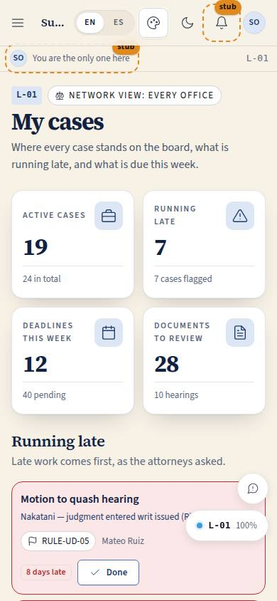
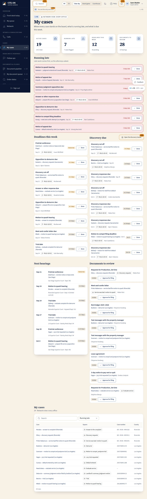

# L-01 · Attorney home

## Purpose

The regional attorney's first screen of the day. Late work comes first, because that is what the page is opened for (tester annotation `fbk_homes_01`, triaged `fix`). Then the deadlines of the next seven days, the discovery coming due, the documents waiting for a signature-level review, the hearings ahead, and the whole caseload with the board square each case sits on.

## Screenshots

| 390 | 1280 |
| --- | --- |
|  |  |

Dark: `../screenshots/L-01/390-dark.jpg`, `../screenshots/L-01/1280-dark.jpg`. TV: `../screenshots/L-01/3840.jpg`.

## Sections (layout order)

1. PageHeader — whose caseload is shown (mine, or the network view).
2. StatTiles — active cases, running late, deadlines this week, documents to review.
3. RunningLate — missed deadlines and pending ones past due, in red, each with the case and a "Done" control.
4. DeadlinesThisWeek.
5. DiscoveryDue — with a link to the discovery tracker.
6. NextHearings — a dated timeline.
7. DocumentsToReview — with "Approve for filing".
8. MyCases — DataTable: case, board square, case number, county, office, paralegal, next due, status; filter by "running late"; row actions open the board or assign.

## Data

| Table | Read / write | Notes |
| --- | --- | --- |
| `cases` | read | `attorney_user_id = me`, or every case in scope for owner / super admin |
| `deadlines` | read / write | `status = done` by id |
| `documents` | read / write | `status = filed` by id when approved |
| `users` | read | names of assignees and paralegals |
| `tenants` | read | office short names |

## Rules

- `RULE-UD-01` — the response window.
- `RULE-UD-02` — trial set within 20 days of the answer; drives the hearings list.
- `RULE-UD-03` — discovery cut-off five days before trial; drives "discovery due".
- `RULE-UD-05` — no default while a quash or writ is pending.

## Actions (manifest)

| Id | Intent | Permission | Params | Live |
| --- | --- | --- | --- | --- |
| `counsel.openCase` | open a case on the game board | `cases.read` | `caseId: id` | yes |
| `counsel.completeDeadline` | mark a deadline as done | `deadlines.write` | `id: id` | yes |
| `counsel.approveDocument` | approve a document for filing | `documents.sign` | `id: id` | yes |
| `counsel.assignToParalegal` | assign work on a case to a paralegal | `cases.assign` | `caseId: id` | stub |
| `counsel.openDiscovery` | open the discovery tracker for a case | `cases.read` | `caseId: id` | stub |

## Logic

- Late = a deadline with status `missed`, or a pending deadline whose `due_at` has passed; the case-level `late` flag drives the badge in the table.
- Discovery due = pending deadlines carrying `RULE-UD-03` or naming discovery. The real court-day engine (holidays, service-method extensions) is T-059; until then these are seeded dates, not computed ones.
- Next hearings = pending deadlines naming a hearing, trial or conference.
- Approving a document writes `status = filed`. That is provisional: filing is a court act, and T-066 / e-filing will split "approved" from "filed".

## Components

PageHeader, StatTile, Section, Card, DataTable, StatusBadge, Badge, Chip, Button, EmptyState, Placeholder.

## Placeholders

Assign to a paralegal → T-062. Discovery tracker → T-073.

## Real vs mock

Real: the sorting, the late logic, the two writes, the board links. Mock: the rows, and the deadline dates are seeded rather than computed from the rules.

## Inputs and responsive check (P-01, P-03)

Checked at 360–3840, light and dark. At 360–390 the case table becomes cards and the board-square chip ellipsizes. The four middle sections are a one / two / three column band at 360 / 1100 / 2200 px, so 4K gains columns rather than whitespace; the "running late" rows use a red border and a badge, never colour alone.

## Changelog

- `docs/changelog/0007-role-homes.md`

## Resumen en español

La pantalla del abogado regional: primero lo atrasado, después los plazos de la semana, el descubrimiento por vencer, los documentos por revisar, las audiencias y todos sus casos con la casilla del tablero.
