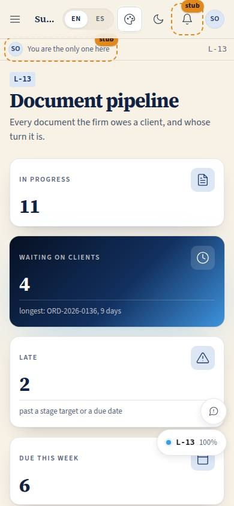
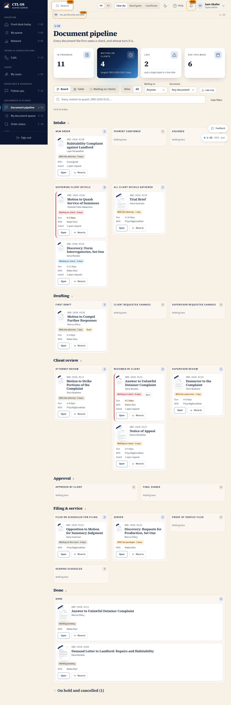

# L-13 · Document pipeline

## Purpose

The attorney's one view of every document the firm owes a client. Which stage each order is in, whose turn it is and for how long, what is late, and — the fact Justin singled out — exactly which clients we are waiting on and what we asked them for. Three views of the same set: a board of stage columns, a sortable table, and a "waiting on clients" list that is the chase list for the week.

## Screenshots

| 390 | 1280 |
| --- | --- |
|  |  |

Dark: `../screenshots/L-13/390-dark.jpg`, `../screenshots/L-13/1280-dark.jpg`. TV: `../screenshots/L-13/3840.jpg`. (Captured to the scratchpad during the build at 390, 1280 and 2560; `npm run screenshots -- --codes=L-13` writes the committed set.)

## Sections (layout order)

1. **PageHeader** — title and the one-line promise.
2. **StatTiles** — orders in progress, waiting on clients (with the longest wait named), late, due this week. The waiting tile jumps to the waiting view; the late tile toggles the late filter.
3. **ViewSwitch** — Board / Table / Waiting on clients (SegmentedControl, `?view=`).
4. **Filters** — Mine · All, waiting on, document kind, late only, client search, clear.
5. **BoardGroups** — six headings (Intake, Drafting, Client review, Approval, Filing & service, Done) over one column per main-track stage.
6. **SideStates** — on hold and cancelled in a collapsed Section under the board.
7. **OrdersTable** — the same rows as a sortable DataTable.
8. **WaitingOnClientsList** — longest wait first, with the open requests and a Nudge.

## Data

| Table | Read / write | Notes |
| --- | --- | --- |
| `orders` | read | tenant-scoped; the board never writes a stage directly |
| `order_stage_events` | read / insert | inserted only by `applyTransition` through `useAdvance` |
| `client_requests` | read | the open ones per order in the waiting view |
| `follow_ups` | read / insert | the Nudge writes one (`client_review_due` or `client_item_due`) |
| `users` | read | client and assignee names |
| `cases` | read | the case an order belongs to |

## Rules

- `RULE-PIPE-01` — the Move-to menu offers only `nextStages(order.stage)`; `applyTransition` refuses anything else.
- `RULE-PIPE-02` — the WaitingOnPill is derived from the stage, never typed; the day count comes from the event history.
- `RULE-PIPE-04` — a card in supervisor review cannot be moved without `orders.supervise`; the menu says who can.
- `RULE-PIPE-05` — late = past the stage target or a due date; the targets are unverified defaults.
- `RULE-PIPE-07` — the waiting view shows the open requests that are the reason an order waits on a client.
- `RULE-PIPE-08` — a move writes the `orders` patch and the event together, or writes nothing.

## Actions (manifest)

| Id | Intent | Permission | Params | Live |
| --- | --- | --- | --- | --- |
| `pipeline.setView` | show the pipeline as a board, a table, or the clients we are waiting on | `orders.read` | `view: enum:board,table,waiting` | yes |
| `pipeline.setScope` | show only my orders or the whole office | `orders.read` | `scope: enum:mine,all` | yes |
| `pipeline.filterWaiting` | show only the orders waiting on the client | `orders.read` | `waitingOn: enum:any,client,attorney,paralegal,supervisor,court` | yes |
| `pipeline.toggleLateOnly` | show only the late orders | `orders.read` | — | yes |
| `pipeline.filterKind` | show only the motions | `orders.read` | `kind: enum:any,pleading,motion,discovery,letter,form,agreement,other` | yes |
| `pipeline.search` | find an order by client, document or order number | `orders.read` | `q: string` | yes |
| `pipeline.clearFilters` | show the whole pipeline again | `orders.read` | — | yes |
| `pipeline.toggleSideStates` | open or close the on-hold and cancelled row | `orders.read` | — | yes |
| `pipeline.openOrder` | open one document order | `orders.read` | `orderId: id` | yes |
| `pipeline.openMoveMenu` | show where this order can move next | `orders.advance` | `orderId: id` | yes |
| `pipeline.moveStage` | move this order to the next stage | `orders.advance` | `orderId: id, stage: string` | yes |
| `pipeline.nudgeClient` | ask the front desk to chase this client | `followups.write` | `orderId: id` | yes |

## Logic

- Columns are the main-track stages grouped by `kind`; `service` folds into the Filing & service heading and `cancelled` leaves the board for the side row.
- The stats count everything in scope before the filters, so turning on "late only" does not change the late number it came from.
- The waiting pill is neutral, then amber past half the stage target, then red once `isLate()` is true.
- Every filter and the view live in the query string, so a board state is a link and an agent can set it.
- Sorting inside a column is oldest wait first: the thing stuck longest reads first.

## Components

PageHeader, Section, StatTile, SegmentedControl, Select, SearchInput, Chip, Button, Badge, DataTable, Modal, EmptyState, Tooltip, Placeholder, DocPreview, **OrderCard**, **WaitingOnPill**, Icon.

## Placeholders

- "SMS / email" in the waiting list — the reminder itself; the Nudge that creates the desk's follow-up is real. Planned: Pass 3 comms seam.

## Real vs mock

Real: every order, event, request and follow-up, read and written through the provider by id. Mocked: nothing on this page is faked. When Supabase lands the same calls run against Postgres with the RLS lines already written in `src/data/schema/pipeline.ts`.

## Inputs and responsive check (P-01, P-03)

Checked at 360, 390, 768, 1280, 1920, 2560, 3840. Under 900 px the columns stack into one list per stage with the stage name as a rule; at 2560 and above the columns widen and the type scales for a wall board. Each card is one tab stop (Enter opens, "M" opens Move to) and carries real Open and Move buttons at the 44 px minimum, so nothing is drag-only or hover-only. The filters are native Select and Chip controls; the search is a labelled input.

## Changelog

- `docs/changelog/0020-pipeline.md`

## Resumen en español

El tablero del abogado: cada documento que el bufete debe a un cliente, en columnas por etapa, con quién lo tiene y desde hace cuántos días, qué está atrasado y qué clientes nos deben algo. Tres vistas (tablero, tabla, esperando a clientes) y un recordatorio que crea el seguimiento de recepción.
