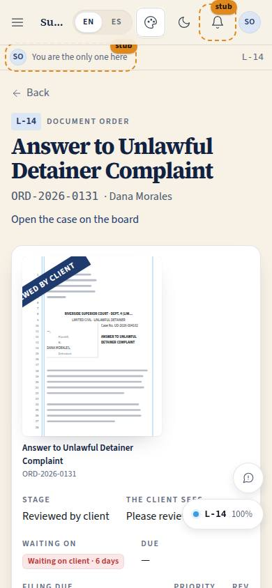
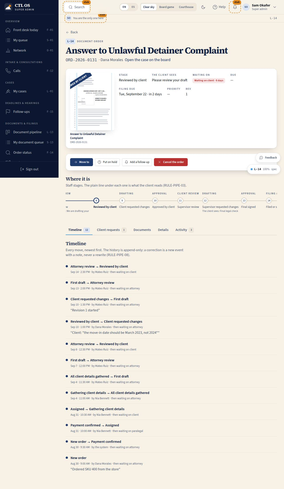

# L-14 · Order detail

## Purpose

One document order, end to end: where it sits on the pipeline, every move that got it there, what we have asked the client for, the draft and the filed copies, who is on it, and the buttons that move it on. The page an attorney lives on while a document is in flight.

## Screenshots

| 390 | 1280 |
| --- | --- |
|  |  |

Dark: `../screenshots/L-14/1280-dark.jpg`.

## Sections (layout order)

1. **PageHeader** — ref, client, case link back to the board.
2. **Header card** — DocPreview at md, stage, what the client sees, the WaitingOnPill, due and filing dates, priority, revision.
3. **ActionsBar** — Move to, Send draft to the client, Mark filed / served / proof of service / hearing set, Put on hold or Resume, Add a follow-up, Cancel.
4. **StageStepper** — the whole main track with the collapsed client wording under each internal stage.
5. **Tabs** — Timeline · Client requests · Documents · Details · Activity.

## Data

| Table | Read / write | Notes |
| --- | --- | --- |
| `orders` | read / update | assignments, notes, client summary and every stage patch, by id |
| `order_stage_events` | read / insert | append-only; the timeline |
| `client_requests` | read / insert | the ask form |
| `follow_ups` | read / insert | the ask form and Add a follow-up |
| `calls` | read | the activity tab |
| `users`, `cases` | read | names, the case link |

## Rules

- `RULE-PIPE-01` / `RULE-PIPE-08` — every button in the actions bar is one `applyTransition` writing the patch and the event together.
- `RULE-PIPE-03` — the stepper shows the client wording under each internal stage; `notes` are labelled staff-only.
- `RULE-PIPE-04` — leaving supervisor review needs `orders.supervise`; without it the Move control is disabled with a Tooltip naming who can.
- `RULE-PIPE-07` — the ask form creates the open request that makes the order wait on the client, and offers the move to `gathering_client_details` when the order is in `assigned` or `details_complete`.

## Actions (manifest)

| Id | Intent | Permission | Params | Live |
| --- | --- | --- | --- | --- |
| `pipeline.setTab` | show the timeline, requests, documents, details or activity | `orders.read` | `tab: enum:timeline,requests,documents,details,activity` | yes |
| `pipeline.openMoveMenu` | show where this order can move next | `orders.advance` | `orderId: id` | yes |
| `pipeline.moveStage` | move this order to a stage | `orders.advance` | `orderId: id, stage: string` | yes |
| `pipeline.sendDraftToClient` | send the draft to the client for review | `orders.advance` | `orderId: id` | yes |
| `pipeline.holdOrder` | pause this order | `orders.advance` | `orderId: id` | yes |
| `pipeline.resumeOrder` | resume this order at a stage | `orders.advance` | `orderId: id, stage: string` | yes |
| `pipeline.cancelOrder` | cancel this order | `orders.advance` | `orderId: id` | yes |
| `pipeline.markFiled` | mark it filed or scheduled for filing | `orders.advance` | `orderId: id` | yes |
| `pipeline.markServed` | mark it served on the other side | `orders.advance` | `orderId: id` | yes |
| `pipeline.markProofOfService` | record that the proof of service is filed | `orders.advance` | `orderId: id` | yes |
| `pipeline.markHearingSet` | record that the court set a hearing | `orders.advance` | `orderId: id` | yes |
| `pipeline.askClient` | ask the client a question, a document, a review, an approval, a signature or a payment | `orders.write` | `orderId: id, kind: enum:question,item,review,approval,signature,payment, prompt: string, via: enum:app,email,sms,call` | yes |
| `pipeline.addFollowUp` | put this order on the follow-up list | `followups.write` | `orderId: id` | yes |
| `pipeline.assign` | put an attorney, paralegal or supervisor on it | `orders.write` | `orderId: id, field: enum:attorney,paralegal,supervisor, userId: id` | yes |
| `pipeline.saveNotes` | save the staff notes | `orders.write` | `orderId: id, notes: string` | yes |
| `pipeline.saveClientSummary` | change the plain sentence the client reads | `orders.write` | `orderId: id, text: string` | yes |
| `pipeline.openDrafting` | open this document in the drafting studio | `drafts.read` | `orderId: id` | yes |
| `pipeline.uploadFiledCopy` | add the conformed copy from the court | `documents.write` | `orderId: id` | stub |
| `pipeline.openCase` | open the client's case on the game board | `board.read` | `caseId: id` | yes |

The ask form's detail text and due date are optional fields on the form and are deliberately not required params of the action, so a voice or agent caller can ask with the prompt alone.

## Logic

- "Send the draft to the client" is two writes in one action: the move to `client_review` and a `review` request, so the order never sits in a client stage without an open request (RULE-PIPE-07).
- Mark filed / served / proof / hearing only render when that move is legal from the current stage, so a letter never offers "file it".
- Notes and the client summary are edited locally and saved by id on demand, so a second editor is not silently overwritten (P-14).
- The timeline is read-only: a correction is a new move with a note.

## Components

PageHeader, Section, Tabs, Card, Modal, Select, Input, Textarea, Button, Chip, Badge, EmptyState, Tooltip, Placeholder, DocPreview, **StageStepper**, **WaitingOnPill**, Icon.

## Placeholders

- "Upload the filed copy" — the conformed-copy upload. Planned: the binder module, this pass.

## Real vs mock

Real: every read and write. The drafting link is a plain link to `/assist/drafting?order=<id>`, the route the drafting worker owns this pass. E-sign behind "final signed" is a seam (T-094).

## Inputs and responsive check (P-01, P-03)

Checked at 360, 390, 768, 1280, 1920, 2560, 3840. The header card is a two-column grid that becomes one column under 640 px; the stepper scrolls horizontally and keeps the current stage in view, and stacks to a vertical list under 640 px. The tabs scroll horizontally on a phone. Every control is a real button, select or textarea with a label; the Move-to menu is a dialog with full-width buttons, so a stage change never needs a pointer.

## Changelog

- `docs/changelog/_pending/pipeline.md`

## Resumen en español

Un pedido de documento completo: en qué etapa está, todo su historial, lo que le pedimos al cliente, el borrador y las copias presentadas, quién lo lleva y los botones que lo mueven. Cada movimiento pasa por `applyTransition` y escribe el evento junto con el cambio.
