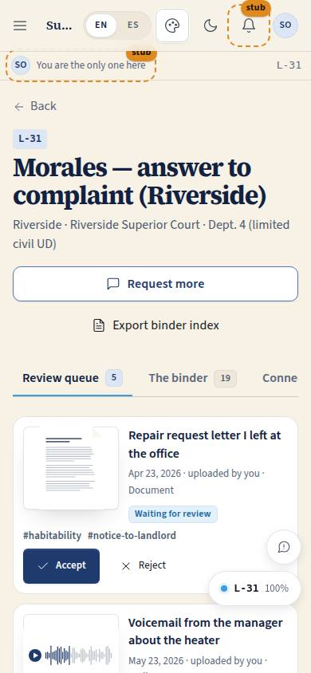
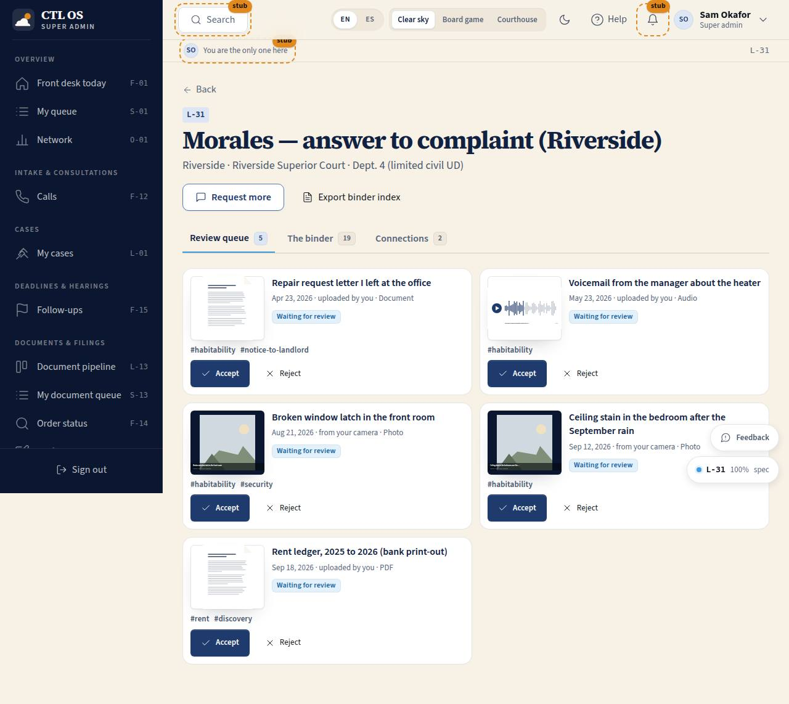

# L-31 · Client binder (staff), with the index L-31a

## Purpose

Where the firm turns what a client sent into exhibits: review what arrived, accept it with a letter and a board square or send it back with a reason the client can act on, read the imported email and text threads verbatim, see the chain of custody, ask for what is still missing, and print the exhibit index for trial. **L-31a** at `/counsel/binder` lists the cases that have evidence with the number of new items, the number of exhibits and when the last thing arrived; it is the "Client binders" entry in the Documents & filings menu.

## Screenshots

| 390 | 1280 |
| --- | --- |
|  |  |

Working shots this pass: `binder/l31-1280.png`, `binder/l31-dark-1280.png`, `binder/l31-2560.png`, `binder/l31-accept-1280.png`, `binder/l31-export-1280.png`, `binder/l31idx-1280.png`.

## Sections (layout order)

1. **PageHeader** — the case, its county and court, with "Request more" and "Export binder index".
2. **Tabs** — Review queue (count), The binder (count), Connections (count).
3. **Review queue** — `EvidenceCard` rows with Accept and Reject under each.
4. **The binder** — search, phase chips, and the phase sections of everything (client evidence and firm documents).
5. **Connections** — the client's channels, their consent date and how many items each produced.
6. **Item drawer** — the drawing, the metadata, the thread viewer, the chain of custody, Accept / Reject and a download Placeholder.
7. **Modals** — accept (exhibit letter + board square), reject (the note the client reads), request more, and the printable index.

## Data

| Table | Read / write | Notes |
| --- | --- | --- |
| `evidence_items` | read + update | status, exhibit label, board square, reviewer, appended chain of custody |
| `evidence_messages` | read | the thread viewer |
| `evidence_connections` | read | the connections tab |
| `client_requests` | insert | "Request more" |
| `documents` | read | the firm's own papers in the same sections |
| `cases`, `users` | read | whose binder this is |

## Rules

- `RULE-EVID-02` — nothing is an exhibit until it is accepted here; accepting sets the letter, rejecting writes the note and clears any letter.
- `RULE-EVID-03` — the thread viewer shows each message verbatim with its sender and date; nothing is edited.
- `RULE-EVID-04` — every accept or reject appends a chain-of-custody step; the drawer shows the whole chain and the hash.
- `RULE-EVID-01` — staff read their own tenant (L-31a filters by `tenant_id` when the session has one); owners and super admins see every office.
- `RULE-EVID-06` — a request created here appears on C-20 and C-21 immediately.

## Actions (manifest)

| Id | Intent | Permission | Params | Live |
| --- | --- | --- | --- | --- |
| `binder.openStaffItem` | open that photo from the client | `evidence.read` | `id: id` | yes |
| `binder.acceptItem` | accept this as exhibit G | `evidence.write` | `id: id, exhibitLabel: string, boardNodeId: string` | yes (writes directly when a letter is given, otherwise opens the panel) |
| `binder.rejectItem` | send this back to the client with a note | `evidence.write` | `id: id, note: string` | yes |
| `binder.openThread` | show me the texts with the landlord | `evidence.read` | `id: id` | yes |
| `binder.requestMore` | ask the client for the envelope photo | `orders.write` | `prompt, detail, dueAt, sentVia` | yes |
| `binder.exportIndex` | print the exhibit index for trial | `evidence.read` | — | yes (browser print) |
| `binder.downloadItem` | download the original file | `evidence.read` | `id: id` | stub (T-072) |
| `binder.filterStaffPhase` | show only the discovery exhibits | `evidence.read` | `phase: string` | yes |
| `binder.searchStaff` | find the lease in this binder | `evidence.read` | `q: string` | yes |
| `binder.openCaseBinder` (L-31a) | open the Morales binder | `evidence.read` | `caseId: id` | yes |

## Logic

- The queue is `status = new` for this case, oldest first.
- Accept defaults to the next free exhibit letter for the case (A, B, … Z, AA) and to the case's current board square; both are editable before confirming.
- Reject requires a note, because the client reads it as "Needs your attention" on C-20.
- "Request more" writes a `client_requests` row of kind `item` with the prompt, the reason, a due date and the channel; the pipeline's follow-up engine keys off `due_at`.
- The index prints the exhibits in letter order with the date each thing happened and where it came from; a print stylesheet hides everything except the index.

## Components

`PageHeader`, `Tabs`, `Card`, `SearchInput`, `Chip`, `Badge`, `StatusBadge`, `Button`, `Input`, `Select`, `Textarea`, `Drawer`, `Modal`, `DataTable` (L-31a), `EmptyState`, `Placeholder`, `Toast`, `Icon`, **`EvidenceCard`**, `DocPreview`, and the shell's `FeedbackButton`.

## Placeholders

- "Download the original" in the drawer and the item detail — T-072 file storage (Pass 3).

## Real vs mock

Real: the queue, accept and reject with letters, squares, notes and chain of custody, the thread viewer, the request, the print view. Mock: the original files do not exist yet, so a download cannot be offered; sending a request by email or SMS records the channel but does not send anything (Pass 3 comms seam).

## Inputs and responsive check (P-01, P-03)

Checked at 360, 390, 768, 1280, 1920, 2560, 3840, light and dark. The queue is a responsive grid; each card is one button with Accept and Reject as separate buttons outside it, so the keyboard never enters a nested control. Modals trap focus and close on Escape; the drawer is full width under 600 px. Status is always a word as well as a colour.

## Changelog

- `docs/changelog/_pending/binder.md`

## Resumen en español

L-31 es el lado del bufete: revisar lo que envió el cliente, aceptarlo como prueba con su letra y su casilla o devolverlo con una nota clara, leer los hilos de correo y de mensajes tal cual llegaron, ver la cadena de custodia, pedir lo que falta e imprimir el índice de pruebas. L-31a lista los casos con cuántos elementos esperan revisión.
