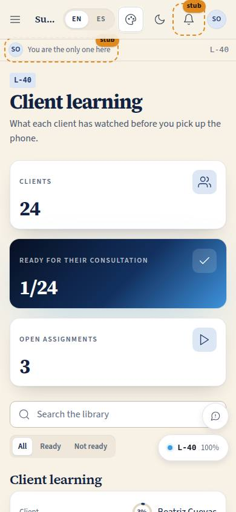
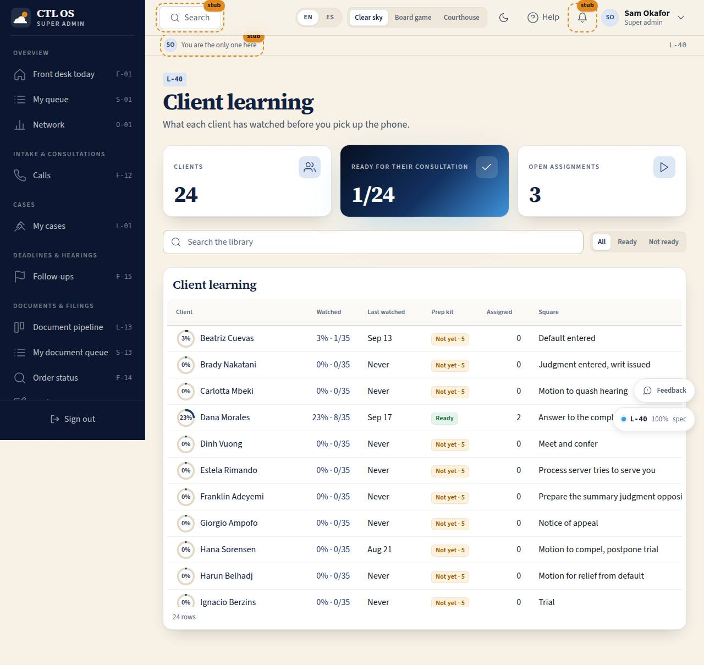

# L-40 · Client learning (counsel)

## Purpose

Before the attorney picks up the phone, this screen says what the client has actually watched: how far through the client curriculum they are, when they last watched anything, whether they have done the consultation prep kit, and what has been assigned to them. And it is where the next thing gets assigned, with the reason in words the client will read and a date.

## Screenshots

| 390 | 1280 |
| --- | --- |
|  |  |

## Sections (layout order)

1. PageHeader with three stat tiles: clients, ready for their consultation, open assignments.
2. Search and a readiness filter (all / ready / not ready).
3. **Clients table** — client (with a progress ring), watched % and count, last watched, prep kit, open assignments, the board square. Row action: Assign.
4. **Client drawer** — the ring, last watched, the square, Assign a lesson, the prep-kit state (and what is missing), the assignments with their reasons and due badges, and everything the client has watched.
5. **Assign modal** — course, lesson, reason, due date.

## Data

| Table | Read / write | Notes |
| --- | --- | --- |
| `cases` | read | Scopes the client list (RULE-LEARN-02) |
| `users` | read | Client names |
| `lesson_progress` | read | Never written here: staff do not mark lessons watched for people |
| `lesson_assignments` | read + write + delete | Assign and cancel |
| `courses`, `course_lessons`, `lessons` | read | The denominator, the prep kit, the pick lists |

## Rules

- `RULE-LEARN-02` — an attorney or paralegal sees only clients on a case they are on; the owner and a super admin see the network. A client's own `lesson_notes` are never listed here, and the drawer says so.
- `RULE-LEARN-04` — every assignment carries a reason and a due date.
- `RULE-LEARN-01` — progress shown here is the client's own measured progress, read-only.

## Actions (manifest)

| Id | Intent | Permission | Params | Live |
| --- | --- | --- | --- | --- |
| `learning.openClient` | what has {client} watched | `lessons.read` | `id: id` | yes |
| `learning.assignLesson` | ask {client} to watch {lesson} before {date} | `lessons.assign` | `clientId, lessonId, courseId, reason, dueAt` | yes |
| `learning.unassignLesson` | cancel that assignment | `lessons.assign` | `id: id` | yes |
| `learning.searchClients` | find the client {name} | — | `q: string` | yes |
| `learning.filterReadiness` | show only the clients who are not ready for their consultation | — | `state: enum` | yes |

## Logic

- Watched % counts lessons at 90 % or more over the lessons of the **client-audience** courses, so nobody is measured against the public reading room or staff material.
- "Ready for their consultation" = every required lesson of the consultation prep kit is at 90 % or more; otherwise the drawer lists exactly what is left.
- Last watched is the newest `completed_at` or `updated_at` on the client's progress rows.
- Assigning inserts one `lesson_assignments` row by id (tenant of the client's case, `assigned_by_user_id` = the signed-in user); cancelling removes that row. Both need `lessons.assign` (attorney, owner, super admin).

## Components

`PageHeader`, `StatTile`, `DataTable`, `Drawer`, `Modal`, `SearchInput`, `SegmentedControl`, `ProgressRing`, `LessonCard`, `Select`, `Input`, `Textarea`, `Button`, `Badge`, `EmptyState`, `DocPreview`, `FeedbackButton` (from the shell).

## Placeholders

None.

## Real vs mock

Real: every number, every write. The demo attorney (Mateo Ruiz, Downtown LA) sees his four clients; a super admin sees all 24 and Dana Morales' two assignments from the Inland attorney.

## Inputs and responsive check (P-01, P-03)

Checked at 360, 390, 768, 1280, 1920, 2560, 3840. Under 768 the DataTable falls back to cards; the drawer is full width under 600; the modal traps focus and closes on Escape; every control is a library component at 44 px or more.

## Changelog

- `docs/changelog/0023-learning.md`

## Resumen en español

Antes de llamar al cliente, el abogado ve qué ha visto: porcentaje, última vez, si completó el kit de preparación para la consulta y qué tiene asignado; y asigna la siguiente lección con el motivo y la fecha.
