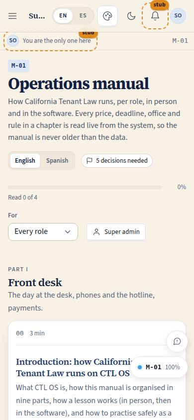
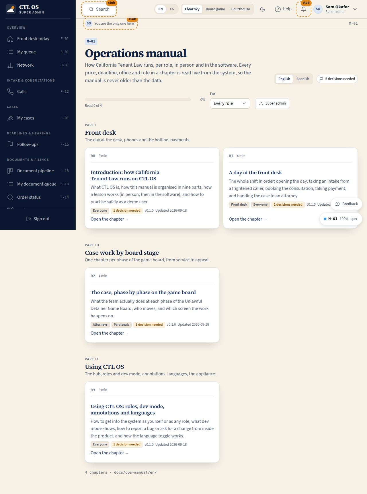

# M-01 · Ops manual cover

## Purpose

The manual's front door: parts I-IX with every chapter as a card, a language toggle (English source, Spanish mirror), a role filter so a person sees their own reading path first, and reading progress stored per person per chapter. Chapters are markdown files under `docs/ops-manual/{en,es}/NN-slug.md`; dropping a file in gives it a card, a route and a header.

## Screenshots

| 390 | 1280 |
| --- | --- |
|  |  |

## Sections (layout order)

1. PageHeader - language segmented control, "N decisions needed" chip to M-03
2. Toolbar - progress bar (chapters read), role filter, "my role" shortcut
3. PartSections - one section per part (I-IX) with its lead line and its chapter cards (number, read badge, reading time, summary, audiences, pending decisions, version, updated)

## Data

| Table | Read / write | Notes |
| --- | --- | --- |
| `manual_progress` | read / write | one row per person per chapter (`read`, `in_person`, `in_ctl_os`, `read_at`) |
| `users` | read | the reader (through the session) |

## Rules

- `RULE-SYS-01` - the manual is generated from the docs tree, never a second copy

## Actions (manifest)

| Id | Intent | Permission | Params | Live |
| --- | --- | --- | --- | --- |
| `manual.setLang` | read the manual in English or Spanish | none | `lang: enum:en,es` | yes |
| `manual.openChapter` | open a manual chapter by slug | `manual.read` | `slug: string` | yes |
| `manual.filterRole` | show the chapters written for one role | none | `role: string` | yes |

## Logic

- Front matter gives title, role (a comma list of audiences), part, version, updated and summary; `summary` is the card line and is searched.
- The role filter maps audience words (`all staff`, `front desk`, `attorney`, `paralegal`, `owner`, `marketing`) to roles; a chapter with no `role:` addresses everyone.
- Reading time is words / 200, never under one minute.
- Progress is read live from the provider, so a second tab shows the same state.

## Components

PageHeader, SegmentedControl, Select, Button, Card, Badge, Chip, ProgressBar, EmptyState.

## Placeholders

None. (A chapter's `{{pricing}}` block is a Placeholder on M-02.)

## Real vs mock

Real chapters; progress is real rows in the mock database (localStorage) and will be the same rows in Postgres.

## Inputs and responsive check (P-01, P-03)

Checked at 360, 390, 768, 1280, 1920, 2560, 3840 in light and dark. The chapter grid is one column on phones, two from 700 px, three from 1600 px and four from 2400 px, so a 4K wall screen fills with columns rather than whitespace. Every card title and "open" link is a real link; the language control is a `SegmentedControl` with pressed state, not colour alone.

## Changelog

- `docs/changelog/0009-knowledge.md`

## Resumen en español

Portada del manual: partes I-IX con una tarjeta por capítulo, interruptor de idioma, filtro por rol y progreso de lectura por persona y capítulo guardado en `manual_progress`. Los capítulos son archivos markdown; añadir uno no requiere código.
