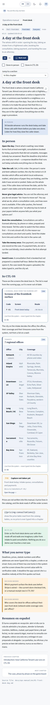
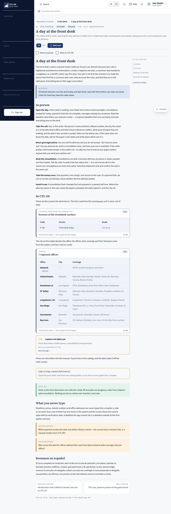

# M-02 · Manual chapter

## Purpose

One chapter of the operations manual: the front-matter header (part, audiences, reading time, version, updated), the body with **live blocks** where the chapter quotes the system, styled callouts, capture figures, a heading outline, the two halves of the lesson (in person / in CTL OS) recorded as progress, and prev / next. The rule the chapter obeys: a number the system owns is never typed into a chapter.

## Screenshots

| 390 | 1280 |
| --- | --- |
|  |  |

Spanish chapter: `../screenshots/M-02/1280-chapter-es.jpg`. The plain `390.jpg` / `1280.jpg` captures show the **chapter-picker** state, because `scripts/qa-lib.mjs` has no `:lang` parameter and fills `:slug` with `eviction`; the integrator can add `':lang': 'en'` and a chapter slug to `PARAMS`.

## Sections (layout order)

1. Breadcrumbs - manual › part › chapter
2. ChapterHeader - number, part, audiences, reading time, version, updated, title, summary, language control, "mark read"
3. Steps - "done in person" and "done in CTL OS" checkboxes
4. FallbackNotice - when the chosen language has no mirror yet
5. Body - markdown runs, live blocks, callouts, captures
6. Outline - `##` headings (right rail from 1280 px, dropdown below)
7. PrevNext + the source file path

## Data

| Table | Read / write | Notes |
| --- | --- | --- |
| `manual_progress` | read / write | `read`, `in_person`, `in_ctl_os`, `read_at`, written by row id |
| `users` | read | the reader (through the session) |

Every live block reads its own source: the route manifest, the role list, the schema registry, the rules registry and the `tenants` table.

## Rules

- `RULE-SYS-01` - the manual renders the docs tree; nothing is copied

## Actions (manifest)

| Id | Intent | Permission | Params | Live |
| --- | --- | --- | --- | --- |
| `manual.markRead` | mark this chapter read for me | `manual.read` | `slug: string` | yes |
| `manual.markStep` | record that I did the in-person or the in-CTL-OS half | `manual.read` | `slug: string`, `step: enum:in_person,in_ctl_os` | yes |
| `manual.setChapterLang` | read this chapter in the other language | none | `lang: enum:en,es` | yes |
| `manual.jumpToSection` | scroll to a section of this chapter | none | `id: string` | yes |

## Logic

- The body loads as a lazy `?raw` chunk, loses its front matter and its duplicate `# Title`, and is split by `segmentMarkdown` into markdown runs, `{{directives}}`, `[screenshot: ...]` lines and `> LABEL:` callouts.
- Directives render through the `LiveBlock` organism: `{{roles}}`, `{{routes:<surface>}}`, `{{tables}}`, `{{table:<name>}}`, `{{rules}}` (optionally a category), `{{offices}}`, `{{demo-users}}`. `{{pricing}}` and any unknown directive render as a `Placeholder` that names itself and says which pass wires it.
- Callouts `DECISION NEEDED` / `DECISIÓN PENDIENTE`, `IN PERSON`, `IN CTL OS`, `NOTE`, `TIP`, `WARNING` (and their Spanish labels) are styled and collected for M-03.
- The language switch goes to the same chapter in the other language by slug, or by chapter **number** when the file names differ (`00-introduction` / `00-introduccion`); with no mirror at all it shows the English source and says so.
- An unknown slug renders a chapter picker rather than an error, so a stale link is still useful.

## Components

Breadcrumbs, SegmentedControl, Button, Checkbox, Select, Badge, Card, Icon, Spinner, EmptyState, MarkdownViewer, **LiveBlock** (new organism), Placeholder.

## Placeholders

- `{{pricing}}` / `{{pricing:consultations}}` - "show the price table read from the catalog tables", planned in the store & payments pass (T-063, T-074).
- Any directive the block does not know (e.g. `{{board:phase:start}}` in the intro) - names itself and points at `docs/ops-manual/README.md`.
- `[screenshot: CODE — caption]` with no capture yet - a dashed figure naming the code, with a link to the live page.

## Real vs mock

Chapters and live blocks are real. Progress rows are real rows in the mock provider. No chapter text is duplicated in code.

## Inputs and responsive check (P-01, P-03)

Checked at 360, 390, 768, 1280, 1920, 2560, 3840 in light and dark. Outline rail appears at 1280 px and becomes a labelled dropdown below it; live-block tables scroll horizontally inside their own frame instead of breaking the page; progress checkboxes and buttons are at least 44 px; the language control keeps a pressed state. Prose is capped at 80ch and the `--scale` bands lift it on 2560 / 3840.

## Changelog

- `docs/changelog/_pending/knowledge.md`

## Resumen en español

Un capítulo del manual: encabezado con parte, audiencias, versión y fecha; el cuerpo con bloques en vivo que leen el sistema (roles, rutas, tablas, reglas, oficinas), avisos con estilo, figuras de captura, índice de encabezados, las dos mitades de la lección como progreso, y anterior / siguiente. Ningún dato que el sistema posee se escribe a mano.
