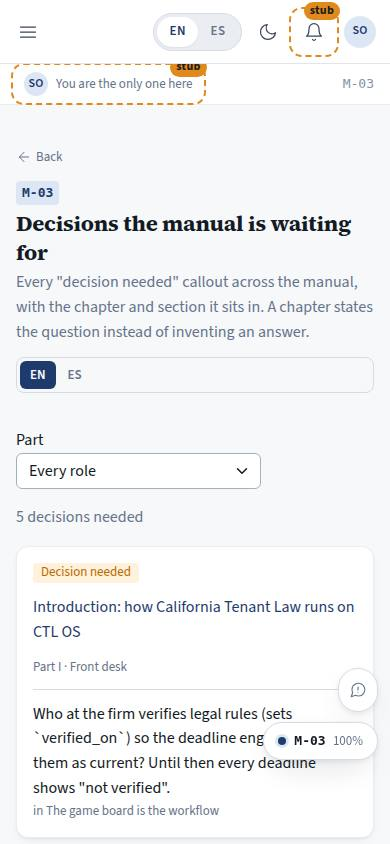
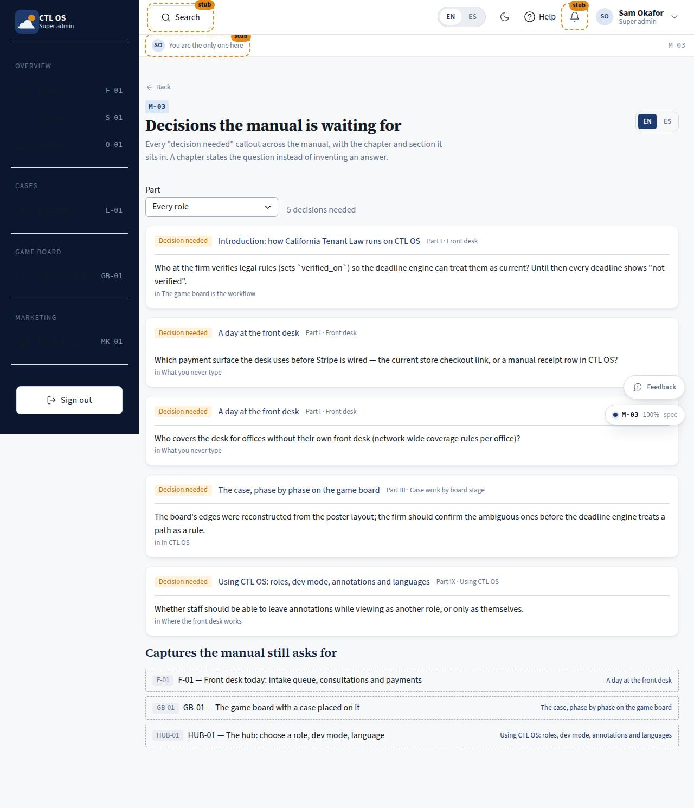

# M-03 · Manual decisions

## Purpose

Every "decision needed" callout across the manual in one list, with the chapter and the section it sits in, plus the captures the manual still asks for. A chapter states the question instead of inventing an answer; this page is where those questions are visible so Justin or the firm can settle them.

## Screenshots

| 390 | 1280 |
| --- | --- |
|  |  |

## Sections (layout order)

1. PageHeader - language control, back to the cover
2. Filter - part (I-IX) and the count
3. DecisionList - one card per callout: the question, the chapter link, the part, the section
4. CaptureGaps - `[screenshot: ...]` lines with no capture in `docs/screenshots`

## Data

| Table | Read / write | Notes |
| --- | --- | --- |
| `page_layouts` | read | |

## Rules

- `RULE-SYS-01` - open questions are recorded, not remembered

## Actions (manifest)

| Id | Intent | Permission | Params | Live |
| --- | --- | --- | --- | --- |
| `manual.openDecision` | open the chapter a decision sits in | `manual.read` | `slug: string` | yes |
| `manual.filterPart` | show the pending decisions of one part | none | `part: string` | yes |

## Logic

- Callouts come from the build-time index, which records each callout with the nearest `##` heading, so no chapter body is fetched to draw this page.
- A capture gap is a `[screenshot: CODE — caption]` line whose `CODE` has no folder under `docs/screenshots`.

## Components

PageHeader, SegmentedControl, Select, Card, Badge, EmptyState.

## Placeholders

None. Answering a decision is an edit to the chapter and a row in `docs/decisions.md`, not a button here.

## Real vs mock

Real, from the chapters.

## Inputs and responsive check (P-01, P-03)

Checked at 360, 390, 768, 1280, 1920, 2560, 3840 in light and dark. Cards are single-column and wrap their headers; the part filter is a labelled `Select`.

## Resumen en español

Todas las decisiones pendientes del manual en una lista, con capítulo, parte y sección, más las capturas que el manual todavía pide. Filtro por parte e idioma.
