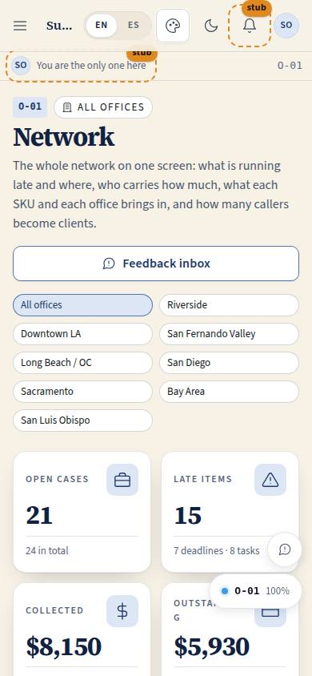
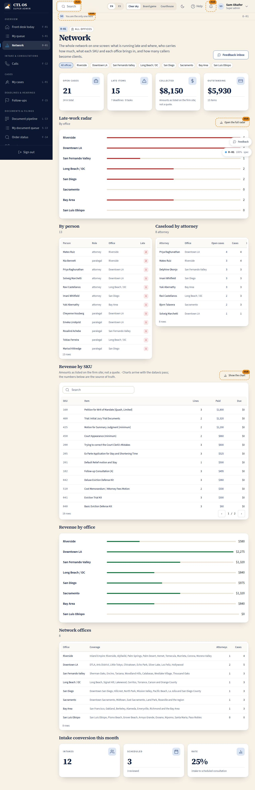

# O-01 · Owner dashboard

## Purpose

The principal's one screen over the whole network of regional offices: the late-work radar by office and by person, the caseload each attorney carries, what every SKU and every office brings in, the offices themselves, and how many callers this month became scheduled clients. Built to be read from across the room on a wall screen as well as up close on a 4K monitor.

## Screenshots

| 390 | 1280 |
| --- | --- |
|  |  |

TV: `../screenshots/O-01/3840.jpg`.

## Sections (layout order)

1. PageHeader — office filter chips (all offices, then each office), and the feedback inbox.
2. StatTiles — open cases, late items, collected, outstanding.
3. LateRadarByOffice — one labelled bar per office.
4. LateRadarByPerson — table of people with late items.
5. CaseloadByAttorney — open, total, late per attorney.
6. RevenueBySku — SKU, item, lines, paid, due.
7. RevenueByOffice — one labelled bar per office.
8. NetworkOffices — the offices with coverage, attorneys, cases, late, collected, outstanding; clicking a row filters the page.
9. IntakeConversion — intakes this month, scheduled, rate.

## Data

| Table | Read / write | Notes |
| --- | --- | --- |
| `cases` | read | grouped by attorney and office |
| `deadlines` | read | missed or pending past due |
| `assignments` | read | late or past due while not done |
| `invoices` | read | paid and due, summed by SKU and office |
| `intakes` | read | current calendar month |
| `users` | read | attorney and assignee names |
| `tenants` | read | the network and the seven offices |
| `feedback` | read | the inbox link |

## Rules

- `RULE-SYS-02` — one provider, one tenant column, every number derived from rows rather than typed in.
- `RULE-INTAKE-01` — what "converted" means: a scheduled, prepaid consultation.

## Actions (manifest)

| Id | Intent | Permission | Params | Live |
| --- | --- | --- | --- | --- |
| `owner.filterOffice` | show one office instead of the whole network | `reports.read` | `tenantId: id` | yes |
| `owner.openFeedbackInbox` | open the feedback inbox to triage what testers reported | `feedback.read` | — | yes |
| `owner.openLateRadar` | open the full late-work radar | `reports.read` | — | stub |
| `owner.showRevenueChart` | show the revenue chart | `reports.financial` | — | stub |

## Logic

- Owner and super admin are network-wide; the office chips narrow every section at once, and the header says which scope is active.
- Late = cases flagged late, deadlines missed or pending past due, and assignments late or past due while not done. The two radars count the same rows, once by office and once by the person they are assigned to.
- Revenue = invoices with status `paid`, summed by SKU and by tenant; outstanding = status `due`. Every amount carries the "as listed" caveat.
- Intake conversion = intakes submitted in the current calendar month, `scheduled / submitted`.
- Charts are Placeholders until the dataviz pass; the bars here are labelled `ProgressBar`s from the library, and the tables carry the numbers.

## Components

PageHeader, StatTile, Section, Card, DataTable, ProgressBar, Badge, Chip, Button, EmptyState, Placeholder.

## Placeholders

Full radar with escalation → T-061. Revenue chart → the dataviz pass.

## Real vs mock

Real: every aggregate, the filter, the office table, the conversion rate. Mock: the rows. When Stripe lands, `invoices` stops being the only record of money.

## Inputs and responsive check (P-01, P-03)

Checked at 360–3840, light and dark. Bars drop to a two-line layout under 520 px; each bar is a labelled progressbar for screen readers and never relies on colour alone (the count sits next to it). At 2560 and 3840 the tables gain columns and `--scale` lifts the type so the tiles read from ten feet.

## Changelog

- `docs/changelog/0007-role-homes.md`

## Resumen en español

El tablero del propietario: radar de trabajo atrasado por oficina y por persona, carga de casos por abogado, ingresos por SKU y por oficina, las oficinas de la red y la conversión de admisiones del mes.
